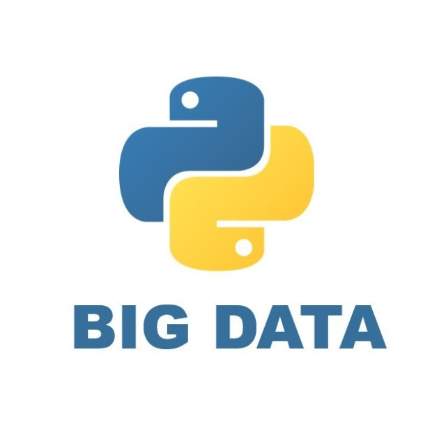

# 5个适合新手练习的Python刷题网站

<a id="profileBt"></a><a id="js_name"></a>python数据分析之禅 *2022-05-12 12:35* *Posted on <a id="js_ip_wording"></a>北京*

The following article is from Python大数据分析 Author 朱卫军

<a id="copyright_info"></a>[<br>**Python大数据分析** .<br>分享python编程、可视化设计、大数据分析、机器学习等技术以及数据分析案例，包括但不限于pandas、numpy、spark、matplotlib、sklearn、tensorflow、keras、tableau等](#)

知乎上有人问，有没有适合新手练习 Python 的做题类网站？

根据我刷题找资料的经验，推荐以下5个Python练习网站，都很良心

## 1、Github

这不是一个专门的刷题网站，而是代码托管平台，里面有数百万个Python项目，其中不乏优秀的Python学习类资源，比如说：

- Python面试题集合，14.6star
    


作者收集了上百个Python面试真题，包括语言特性、操作系统、数据库、网络编程等

举个例子，迭代器和生成器。

这里有个关于生成器的创建问题， 问：将列表生成式中\[\]改成() 之后数据结构是否改变？答案：是，从列表变为生成器

```
`>>> L = [x*x for x in range(10)]
>>> L
[0, 1, 4, 9, 16, 25, 36, 49, 64, 81]
>>> g = (x*x for x in range(10))
>>> g
<generator object <genexpr> at 0x0000028F8B774200>
`
```

答：通过列表生成式，可以直接创建一个列表。但是，受到内存限制，列表容量肯定是有限的。

而且，创建一个包含百万元素的列表，不仅是占用很大的内存空间，如：我们只需要访问前面的几个元素，后面大部分元素所占的空间都是浪费的。

因此，没有必要创建完整的列表（节省大量内存空间）。在Python中，我们可以采用生成器：边循环，边计算的机制—>generator

还有其他不错的刷题项目，比如：

- 剑指offer里的Python面试题实现，有语法、算法、案例等
    


leetcode刷题攻略，教你如何刷题，包含了Python解法


## 2、leetcode

Leetcode是一个专业的刷题网站，题目数量非常之多，你可以用Python等多种语言去解题，也有会相应参考答案，其中不乏大厂面试真题。


大家可以按照类别去刷题，比如说字符串，那么字符串下面的所有题都可以自己写一遍，这样对该类知识的掌握会更加深刻。


每一题内部都会有解题提示，告诉你用哪块的知识去解


然后在网页上编写Python代码解题即可


## 3、牛客网

牛客网和leetcode类似，也是针对面试笔试场景的刷题网站，里面有腾讯、字节、阿里等各个大厂的面试真题，适合有这方面需求的同学去针对性刷题。


还有针对知识点的专题练习，比如我们选择python方向


就会有专业的Python习题考察，你可以计时完成规定的题目


牛客网总的来说更加专注于面试场景，题量也很客观

## 4、实验楼

实验楼不同于leetcode和牛客网，它是一个实操代码项目的练习网站，提供了包括Python在内的各种编程语言练习项目，包括像Python入门、Django web编程、Pandas数据分析、自动化运维等，适合对项目练习有需求的同学。


我觉得实验楼的好处在于可以在项目练习中去学习Python语法，他提供了基于浏览器的编程环境，你可以对照的教程自己敲代码，非常便捷。


进入课程实操界面，左边为教程，右边为代码环境，可以自行编程


## 5、和鲸社区

这是一个数据科学社区，其中以Python环境为主，主要是提供了各式各样的数据科学项目，你可以在其中启动notebook环境，进行代码练习，这对学习Python也是很好的场景。


比如说项目：客户价值分析--用python实现RFM模型

作者提供了用python实现RFM模型的各个细节，而且是真实的数据来举例，其中的步骤也是非常的详细，适合做项目练习。


## 小结

这里只是列举了5个平常我会用到的刷题、练习网站，适合新手入门，也适合资深玩家去巩固知识。当然还有其他很多不错的Python学习网站，比如kaggle、W3C、stackoverflow等，大家都可以去探索探索，对学习很有帮助。

People who liked this content also liked

像Python一样玩C/C++

...

光城

不看的原因

- 内容质量低
- 不看此公众号

Python 全自动解密解码神器 — Ciphey

...

Python实用宝典

不看的原因

- 内容质量低
- 不看此公众号

四行代码秒解微积分！Python这个模块神了！

...

快学Python

不看的原因

- 内容质量低
- 不看此公众号


Scan to Follow