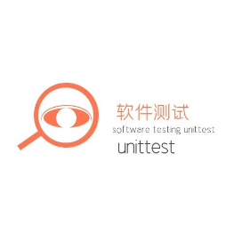

# Python unittest单元测试框架及断言方法

软件测试unittest 软件测试unittest *2022-03-07 10:20*

收录于话题

#unittest框架 38 个

#接口自动化 18 个

#单元测试 18 个

#软件测试 41 个

#python 19 个

**软件测试unittest**

资源无限有，每天分享资源python，java，PHP，前端，ios，数据库，AI人工智能，C++，大数据，安卓开发，架构师，区块链，云计算，黑客网络安全，运维，软件测试自动化测试，每天分享实战技术文章，关注即可免费领取最新资料哦！

21篇原创内容

Official Account

这篇文章主要介绍了Python unittest单元测试框架及断言方法,文中通过示例代码介绍的非常详细，对大家的学习或者工作具有一定的参考学习价值,需要的朋友可以参考下

**1、单元测试的几个重要概念**

（1）Test Case

一个Test Case实例是一个测试用例，完整的测试流程包括测试前准备环境的搭建（setUp）、实现测试过程的代码（run）、以及

测试后环境的还原（tearDown）。

（2）Test Suite

Test Suite用来组装单个测试用例，可以将多个测试用例集合再一起来执行，通过addTest加载TestCase到TestSuit实例中。

（3）Test Runner

执行测试，执行结果。unittest单元测试框架中，通过TextTestRunner类提供的run()方法来执行test suit和test case，test runner可以使用图形界面，文本界面，或返回一个特殊的值等方式来表示测试执行的结果。

（4）Test fixture

对于一个测试用例环境的搭建和销毁，就是一个fixtrue，通过覆盖testcase的setup()和teardown()方法来实现。

setup()：比如建立数据库连接进行初始化

teardown()：比如清除数据库产生的数据，关闭连接。该方法很重要，要为下一个test case留下一个干净的环境

**2、断言方法**

1.  assertEqual(first,second,msg=None)：断言第一个参数与第二个参数是否相等，如果不相等泽测试失败，第三个参数打印测试失败时的信息。
    
2.  assertNotEqual(first,second,msg=None)：与assertEqual()相反，断言是否不相等，不相等则继续执行，相等则打印失败信息
    
3.  assertTrue(expr, msg=None)：测试表达式是否为TRUE
    
4.  assertFalse(expr, msg=None)：测试表达式是否为false
    

以上就是本文的全部内容，希望对大家的学习有所帮助，也希望大家多多支持"软件测试unittest"。

**您可能感兴趣的文章:**

**[Python unittest单元测试框架实现参数化](http://mp.weixin.qq.com/s?__biz=MzkwNTI3MjM5Mg==&mid=2247483956&idx=1&sn=aea049a1f7512bc0b4fb022f6e52e1c1&chksm=c0fb0f13f78c860581cd3e594c3b59c0e0d30b29964893886bbb5b91198a20879538b1c55592&scene=21#wechat_redirect)
**

**[Python编写单元测试代码实例](http://mp.weixin.qq.com/s?__biz=MzkwNTI3MjM5Mg==&mid=2247483947&idx=1&sn=a66fc4a0a3913732c245f295f86b66f6&chksm=c0fb0f0cf78c861affc78f390e95c411bab3cf8c1f83abe4a66c202153f5733987e6945e278e&scene=21#wechat_redirect)
**

**[全面介绍python中很常用的单元测试框架unitest](http://mp.weixin.qq.com/s?__biz=MzkwNTI3MjM5Mg==&mid=2247483937&idx=1&sn=d0e3b81547787e46dfa4d4a0a2f703d9&chksm=c0fb0f06f78c861024c6594a3dbf35ab3999ab694870d40a06239bd24ce0c58258bb4d7bd398&scene=21#wechat_redirect)
**

**[Python+unittest+requests+excel实现接口自动化测试框架](http://mp.weixin.qq.com/s?__biz=MzkwNTI3MjM5Mg==&mid=2247483918&idx=1&sn=ed71fffe8d1042e60bde8028bff4ffa6&chksm=c0fb0f29f78c863f6b47688ed2d282c05b583b2dc6317a702d715ff93cc7e59987f851cea923&scene=21#wechat_redirect)
**

**[基于Python的接口自动化unittest测试框架和ddt数据驱动详解](http://mp.weixin.qq.com/s?__biz=MzkwNTI3MjM5Mg==&mid=2247483903&idx=1&sn=8add391950cc5b3bc6a9e1fd743ab302&chksm=c0fb0cd8f78c85ce114547b04d390d9b5cf63d828dbe5b5c806d89c71ef3a425efa2ec2c822e&scene=21#wechat_redirect)
**

**[Python单元测试框架unittest使用方法讲解](http://mp.weixin.qq.com/s?__biz=MzkwNTI3MjM5Mg==&mid=2247483891&idx=1&sn=8bda88973de301d6ff24bff22434d474&chksm=c0fb0cd4f78c85c2feeea9115e7a5e49d4e29ec72e0ff8693ecc12368a9f229e120bd6a4d0d8&scene=21#wechat_redirect)
**

**[python单元测试unittest实例详解](http://mp.weixin.qq.com/s?__biz=MzkwNTI3MjM5Mg==&mid=2247483891&idx=2&sn=4f460a8f299fcf0fd8164e0a2378f874&chksm=c0fb0cd4f78c85c2ba85080aba05a1a901a0422fa3b1e14755bf4853e294ab245a1e400214e9&scene=21#wechat_redirect)
**

**[Python中unittest用法实例](http://mp.weixin.qq.com/s?__biz=MzkwNTI3MjM5Mg==&mid=2247483891&idx=3&sn=0e49826631b65777be12f413ec748d9a&chksm=c0fb0cd4f78c85c2d1192012f9a61ea78a54ef82da1740a0961de4375a20ccafe886ccb0d64e&scene=21#wechat_redirect)
**

**[Python+request+unittest实现接口测试框架集成实例](http://mp.weixin.qq.com/s?__biz=MzkwNTI3MjM5Mg==&mid=2247483891&idx=4&sn=1ea316ed84996d215ae3b375f7e8ab03&chksm=c0fb0cd4f78c85c2cc25195b14b6d75849bd19582aee9865b1f87bbfb5fa7826651aeba9a2cd&scene=21#wechat_redirect)
**

**[python中如何打包用户自定义模块](http://mp.weixin.qq.com/s?__biz=MzkwNTI3MjM5Mg==&mid=2247483782&idx=1&sn=883903afeff43620b20d4ff85d542bd6&chksm=c0fb0ca1f78c85b735bfafcf6e8c2d015105ec03d375abba245129f2ad2a3e8294fdca2ca9d7&scene=21#wechat_redirect)
**

**[详解Python yaml模块](http://mp.weixin.qq.com/s?__biz=MzkwNTI3MjM5Mg==&mid=2247483772&idx=1&sn=ff843f8cd05a3c0f32f932e5c12609f1&chksm=c0fb0c5bf78c854dccfc90f0927bbe2d6ee05dc2402f6c34314ab832710441cf08d18554dfbe&scene=21#wechat_redirect)
**

**[python用Configobj模块读取配置文件](http://mp.weixin.qq.com/s?__biz=MzkwNTI3MjM5Mg==&mid=2247483763&idx=1&sn=ae75bc1d75ff9711c1261002b8af8ce1&chksm=c0fb0c54f78c8542a9fc312ff0a976f617d76bdfb5af13e9b901242e601cb4f89611449adeff&scene=21#wechat_redirect)
**

**[Python中fnmatch模块的使用详情](http://mp.weixin.qq.com/s?__biz=MzkwNTI3MjM5Mg==&mid=2247483749&idx=1&sn=ad75166433f3a2882316cd540f6b8f5f&chksm=c0fb0c42f78c85543d36b4ba27992a5d29e698c1a869dfe0b5bcd1607de5e5d62919bfc82883&scene=21#wechat_redirect)
**

**[Python unittest装饰器实现原理及代码](http://mp.weixin.qq.com/s?__biz=MzkwNTI3MjM5Mg==&mid=2247483740&idx=1&sn=c76829c7a165e625de29379aadbda6f8&chksm=c0fb0c7bf78c856d5496a94b5d566421a2bd9d3ca78195f9f75d0dc57f1319153cedc30bdeff&scene=21#wechat_redirect)
**

[**对python的unittest架构公共参数token提取方法详解**](http://mp.weixin.qq.com/s?__biz=MzkwNTI3MjM5Mg==&mid=2247483732&idx=1&sn=567078f8dc5d74e2e9e1d57d6fcdae4b&chksm=c0fb0c73f78c85654a6a380f5c8f90f9059e279ef76780297cc3d1d93c2e80b9313e5f9b37e0&scene=21#wechat_redirect)

[**Python单元测试工具doctest和unittest详细使用解析**](http://mp.weixin.qq.com/s?__biz=MzkwNTI3MjM5Mg==&mid=2247483724&idx=1&sn=0e5a757934d99d289fadc1580a5ca88a&chksm=c0fb0c6bf78c857d5b69969c7b6d7224022d7010ef5b57b71223a848b89783ea5ff4c31baad9&scene=21#wechat_redirect)

[**Python + Requests + Unittest接口自动化测试实例分析**](http://mp.weixin.qq.com/s?__biz=MzkwNTI3MjM5Mg==&mid=2247483714&idx=1&sn=11467087fd7e23828447e2fe8d45dbe9&chksm=c0fb0c65f78c8573deacafd83860bc32f55bb680f5788eeb39c560bdbe25c5d5993374fb945e&scene=21#wechat_redirect)

**[python pytest进阶之fixture详解](http://mp.weixin.qq.com/s?__biz=MzkyOTE4NjE3NQ==&mid=2247484499&idx=1&sn=23c8e76fc5dc55c3ddb00de232d9feed&chksm=c20c2c43f57ba5550435b651ffd9bb7e3b6af1ecb590ce7fceea433ae1792daec8bf2bd1613a&scene=21#wechat_redirect)
**

**[python pytest进阶之conftest.py详解](http://mp.weixin.qq.com/s?__biz=MzkyOTE4NjE3NQ==&mid=2247484483&idx=1&sn=724ad3bb65ba815af83ff799a1e29544&chksm=c20c2c53f57ba54509eee10f53842422f3d556b8d8fc52bf512982103f93ba7b3783ce94ab0b&scene=21#wechat_redirect)
**

**[pytest之assert断言的具体使用](http://mp.weixin.qq.com/s?__biz=MzkyOTE4NjE3NQ==&mid=2247484474&idx=1&sn=3059d409317fbf73ebf456821018934c&chksm=c20c2c2af57ba53c3741452a9627a43aa69db4aec677bc381f7b2886e68b2a6d11f97c5d30f4&scene=21#wechat_redirect)
**

**[Pytest接口自动化测试框架搭建模板](http://mp.weixin.qq.com/s?__biz=MzkyOTE4NjE3NQ==&mid=2247484466&idx=1&sn=6eecda98f9926198b5679d78450be7ab&chksm=c20c2c22f57ba5345e1ba1e79f853f7aae90bcddf40410050502949983568c66d8af015fc8dd&scene=21#wechat_redirect)
**

**[Python基于Hypothesis高级测试库生成测试数据](http://mp.weixin.qq.com/s?__biz=MzkyOTE4NjE3NQ==&mid=2247484444&idx=1&sn=8456616c8727a20f0abdd0b2128c37c7&chksm=c20c2c0cf57ba51a5108dec10010fc08ecb665e4ac33d441abac337276a583fa6963324a677c&scene=21#wechat_redirect)
**

**[pytest配置文件pytest.ini的详细使用](http://mp.weixin.qq.com/s?__biz=MzkyOTE4NjE3NQ==&mid=2247484430&idx=1&sn=031992e85dcae6d52f5c65a298c61791&chksm=c20c2c1ef57ba50831cc8856217be8a25de256f7cfdbcb4afa14585a0a0ef41b6203786dd74f&scene=21#wechat_redirect)
**

**[Pytest中skip和skipif的具体使用方法](http://mp.weixin.qq.com/s?__biz=MzkyOTE4NjE3NQ==&mid=2247484413&idx=1&sn=46cb8d6909c4683acf0cea60357669ed&chksm=c20c2bedf57ba2fbf8d2b1ce239bbccf8f4644844b080b0750649bc6e561c7471d2a78c8492a&scene=21#wechat_redirect)
**

**[python中pytest收集用例规则与运行指定用例详解](http://mp.weixin.qq.com/s?__biz=MzkyOTE4NjE3NQ==&mid=2247484396&idx=1&sn=8e954ac15ba06a76125fb654d466bd59&chksm=c20c2bfcf57ba2eaf55c0e9636ac0ee1e1fc4c335e39ac97dd1879c3ac6aa68f898fcb2b3cd9&scene=21#wechat_redirect)
**

**[python pytest进阶之xunit fixture详解](http://mp.weixin.qq.com/s?__biz=MzkyOTE4NjE3NQ==&mid=2247484389&idx=1&sn=bfd371da6e7d8793bf509ab3e636bf30&chksm=c20c2bf5f57ba2e3f5ae14f65fce4f5e441d1237d77848339b560aca0260405b9ae3ed94741b&scene=21#wechat_redirect)
**

**[python使用pytest接口自动化测试的使用](http://mp.weixin.qq.com/s?__biz=MzkyOTE4NjE3NQ==&mid=2247484380&idx=1&sn=b2c9fb9e2243199c7fe6bcaefd87c18e&chksm=c20c2bccf57ba2da96aa07195c31b81028b88ddaf7b1c460db6f33321ae1a7acfc706b1a8628&scene=21#wechat_redirect)
**

**[python单元测试之pytest的使用](http://mp.weixin.qq.com/s?__biz=MzkyOTE4NjE3NQ==&mid=2247484369&idx=1&sn=509057953c36d2f66c29406b72946119&chksm=c20c2bc1f57ba2d725d715a9a34de545bb8e6112bee5bf33dba0ac4f48a71b244e7948bd78ac&scene=21#wechat_redirect)
**

**[pytest基本用法简介](http://mp.weixin.qq.com/s?__biz=MzkyOTE4NjE3NQ==&mid=2247484354&idx=1&sn=663eb3c8b623026ecad2f2b09a352980&chksm=c20c2bd2f57ba2c41e04b1de536903262f9d6f70620a381833e2c72dbb576ced23e9a4d899f7&scene=21#wechat_redirect)
**

**[pycharm中使用request和Pytest进行接口测试的方法](http://mp.weixin.qq.com/s?__biz=MzkyOTE4NjE3NQ==&mid=2247484342&idx=1&sn=f382ca77b139c9348872261d0621f848&chksm=c20c2ba6f57ba2b0624d1cf2980089f44488a40cf240281fa2b32e68cf2357246ec64edc1ce3&scene=21#wechat_redirect)
**

**[通过代码实例解析Pytest运行流程](http://mp.weixin.qq.com/s?__biz=MzkyOTE4NjE3NQ==&mid=2247484326&idx=1&sn=a4b1561d2687a40e27a6c6a5d115d53d&chksm=c20c2bb6f57ba2a0fa041b04a8a4375e41717c1322ed1dfac89aa394a6753ceca4f7ead6cc07&scene=21#wechat_redirect)
**

**[pycharm不以pytest方式运行,想要切换回普通模式运行的操作](http://mp.weixin.qq.com/s?__biz=MzkyOTE4NjE3NQ==&mid=2247484319&idx=1&sn=55242188819cbdbff3735a22b4c71c96&chksm=c20c2b8ff57ba299845c5d9019acfb777d22bd479955f58eb58308a167b4a85dcd907dd3fa87&scene=21#wechat_redirect)
**

**[在pycharm中文件取消用 pytest模式打开的操作](http://mp.weixin.qq.com/s?__biz=MzkyOTE4NjE3NQ==&mid=2247484299&idx=1&sn=114b378177d9cfebdb60ab8bcda1e4cb&chksm=c20c2b9bf57ba28d41a9cb1c4c9c7e3abd9aea9a140cafcc30580d29cbabf5d44a4d38314e48&scene=21#wechat_redirect)
**

**[Pytest单元测试框架如何实现参数化](http://mp.weixin.qq.com/s?__biz=MzkyOTE4NjE3NQ==&mid=2247484283&idx=1&sn=f39cc240b85c06e2a89179b234ddc871&chksm=c20c2b6bf57ba27d4e9a08878a08352b18c286cf14850f275265296dfa130191d8b5a47d7923&scene=21#wechat_redirect)
**

**[Python 测试框架unittest和pytest的优劣](http://mp.weixin.qq.com/s?__biz=MzkyOTE4NjE3NQ==&mid=2247484276&idx=1&sn=d9acefcb8359f23bf6c5493ee1703001&chksm=c20c2b64f57ba2723ced77e5514428aad327f8507a60350b8d1db61e12642e22861c82233880&scene=21#wechat_redirect)
**

**[python单元测试框架pytest的使用示例](http://mp.weixin.qq.com/s?__biz=MzkyOTE4NjE3NQ==&mid=2247484264&idx=1&sn=4f3d8d50d3fcec6006d5e7d32b07bcae&chksm=c20c2b78f57ba26e62bb7c97ccb60d64d700c61d4ccbeb4a0f434bbd070b5657ba4fb3a29e1b&scene=21#wechat_redirect)
**

**[Python测试框架：pytest学习笔记](http://mp.weixin.qq.com/s?__biz=MzkyOTE4NjE3NQ==&mid=2247484248&idx=1&sn=baafa8877ed556127242d3579617d064&chksm=c20c2b48f57ba25e2b6c44620be3c2b97938cc87f0994b7024c55819077737b7ac9e253cf68a&scene=21#wechat_redirect)
**

**[详解如何使用Pytest进行自动化测试](http://mp.weixin.qq.com/s?__biz=MzkyOTE4NjE3NQ==&mid=2247484237&idx=1&sn=c58a87ae6a4d08321a61264c30faa359&chksm=c20c2b5df57ba24b14f3278c3af3e8b2ba7b1c7bd966472ef113c5844003abc0654eb206f010&scene=21#wechat_redirect)
**

**[Pytest测试框架基本使用方法详解](http://mp.weixin.qq.com/s?__biz=MzkyOTE4NjE3NQ==&mid=2247484210&idx=1&sn=15a9ce69127a70eb38a64df3196ebfc4&chksm=c20c2b22f57ba23476d7379aa6210b7c07f39c1d4884fadd2f213343d36ef5f28a145aac3544&scene=21#wechat_redirect)
**

[**测试入门以及pytest入门**](http://mp.weixin.qq.com/s?__biz=MzkyOTE4NjE3NQ==&mid=2247483690&idx=1&sn=032f5bd80bd49f5c625759964e0035ad&chksm=c20c293af57ba02c75bb9804fb1136546984f0848864ed6e3632ad8c111d65157c256880f75b&scene=21#wechat_redirect)

[**Python测试框架之pytest详解**](http://mp.weixin.qq.com/s?__biz=MzkyOTE4NjE3NQ==&mid=2247483672&idx=1&sn=7c48281b60b8df8f460c52ff6ab825f4&chksm=c20c2908f57ba01e3be18fb1b66aada621983d862c60d004541a5b5baf5591850bed2f336b7b&scene=21#wechat_redirect)

[**刷完500道高频面试题，我能去面试大厂了吗？（持续更新）**](http://mp.weixin.qq.com/s?__biz=MzkyOTE4NjE3NQ==&mid=2247484088&idx=1&sn=385ee2d863dcbaf97d6298b4642f385b&chksm=c20c2aa8f57ba3be0c3befb4bf645020813dcdc0d107a9e58f3bee5123b363e595f418c8a79d&scene=21#wechat_redirect)

今天也要点一键哦❤️❤️

  "赞"、"在看"、

People who liked this content also liked

Python1-基础

LIUXUEMEI

不看的原因

- 内容质量低
- 不看此公众号

青少年Python一级资料整理自用

最大赢家小司机family

不看的原因

- 内容质量低
- 不看此公众号

入门科普|Python和C/C＋＋等有何区别？

大鑫专栏

不看的原因

- 内容质量低
- 不看此公众号

Scan to Follow