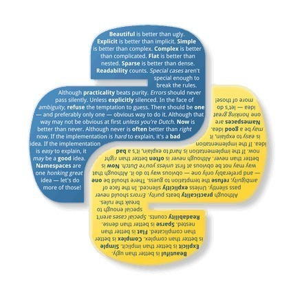

# Python 开发神技 -- 使用管道 Pipe

<a id="profileBt"></a><a id="js_name"></a>Python编程时光 *2021-12-03 09:02*

The following article is from Python技术 Author 派森酱

<a id="copyright_info"></a>[<br>**Python技术** .<br>Python 技术由一群热爱 Python 的技术人组建，专业输出高质量原创的 Python 系列文章，Python程序员都在这里。](#)

众所周知，Pytnon 非常擅长处理数据，尤其是后期数据的清洗工作。今天派森酱就给大家介绍一款处理数据的神器 Pipe。

## 什么是 Pipe

简言之，Pipe 是 Python 的一个三方库。

通过 Pipe 我们可以将一个函数的处理结果传递给另外一个函数，这意味着你的代码会非常简洁。

要使用 Pipe 需要提前安装，直接使用 pip 安装即可。

```
`pip install pipe
`
```

## 过滤元素

和 filter 类似，pipe 中的 where 操作可以过滤可迭代对象中的元素。

```
`In [5]: numbers = [0, 1, 2, 3, 4, 5]
In [6]: list(numbers | where(lambda x: x % 2 == 0))
Out[6]: [0, 2, 4]
`
```

## 作用元素

类似 map，select 操作可以将函数作用于可迭代对象中的每个元素。下面的例子中我们将列表中的元素都扩大 2 倍。

```
`In [8]: list(numbers | select(lambda x: x * 2))
Out[8]: [0, 2, 4, 6, 8, 10]
`
```

当然，还可以将多种操作合并在一起来玩。

下面的例子就是将列表中的偶数挑选出来并扩大 2 倍，和 filter 与 map 不同的是，pipe 可以将多个操作连接起来，就像水管套水管一样，所以我想管道这个名字也是很接地气了。

```
`In [10]: list(numbers
    ...:     | where(lambda x: x % 2 == 0)
    ...:     | select(lambda x: x * 2)
    ...:    )
    ...:
Out[10]: [0, 4, 8]
`
```

## 连接元素

操作嵌套列表时非常痛苦，值得高兴的是 pipe 给出了很友好的接口，只需要 chain 一下即可。

```
`In [11]: list([[1, 2], [3, 4], [5]] | chain)
Out[11]: [1, 2, 3, 4, 5]
In [30]: list((1, 2, 3) | chain_with([4, 5], [6]))
Out[30]: [1, 2, 3, 4, 5, 6]
In [31]: list((1, 2, 3) | chain_with([4, 5], [6,[7]]))
Out[31]: [1, 2, 3, 4, 5, 6, [7]]
`
```

如你所见，chain 只可以拆开一层，如果要拆开多层嵌套的话，不要慌，traverse 轻松搞定。

```
`In [12]: list([[1, 2], [[[3], [[4]]], [5]]] | traverse)
Out[12]: [1, 2, 3, 4, 5]
`
```

结合 select 一起，获取字典中的某个字段属性集合。

```
`In [32]: fruits = [
    ...:     {"name": "apple", "price": [2, 5]},
    ...:     {"name": "orange", "price": 4},
    ...:     {"name": "grape", "price": 5},
    ...: ]
In [33]: list(fruits
    ...:      | select(lambda fruit: fruit["price"])
    ...:      | traverse)
    ...:
Out[33]: [2, 5, 4, 5]
`
```

## 分组

对列表中的元素进行分组是必不可少的，在 pipe 中可以使用 groupby 来完成。

```
`In [26]: list(numbers
    ...:      | groupby(lambda x: 'Even' if x % 2 == 0 else 'Odd')
    ...:      | select(lambda x: {x[0]: list(x[1])})
    ...:     )
    ...:
Out[26]: [{'Even': [0, 2, 4]}, {'Odd': [1, 3, 5]}]
`
```

同样，还可以在 select 中添加 where 过滤条件。

```
`In [27]: list(numbers
    ...:      | groupby(lambda x: 'Even' if x % 2 == 0 else 'Odd')
    ...:      | select(lambda x: {x[0]: list(x[1] | where(lambda x: x > 2))})
    ...:     )
    ...:
Out[27]: [{'Even': [4]}, {'Odd': [3, 5]}]
`
```

## 行列互换

数据处理中时常会用到行列互相转换，尤其是在用 DataFrame 时，使用 pipe 一行代码搞定行列转换。

```
`In [24]: [[1, 2, 3], [4, 5, 6], [7, 8, 9]] | transpose
Out[24]: [(1, 4, 7), (2, 5, 8), (3, 6, 9)]
`
```

## 删除元素

对列表去重也是一项常用的操作，在 pipe 中使用 dedup 来对列表进行去重。

```
`In [28]: list([1, 1, 2, 2, 3, 3, 1, 2, 3] | dedup)
Out[28]: [1, 2, 3]
`
```

与 dedup 不同的是，uniq 只会对连续的重复元素保留一个，非连续重复元素则不过滤。

```
`In [29]: list([1, 1, 2, 2, 3, 3, 1, 2, 3] | uniq)
Out[29]: [1, 2, 3, 1, 2, 3]
`
```

## 总结

今天派森酱给大家介绍了一个处理数据的神器，使用管道可以让繁琐的操作浓缩在几行甚至一行代码搞定，提高可读性的同时还提升了代码的整洁程度，美滋滋～


[](http://mp.weixin.qq.com/s?__biz=MzIzMzMzOTI3Nw==&mid=2247501630&idx=1&sn=d9995a6d275ba89597c067632d7179ec&chksm=e885a7dcdff22eca04579bbce5a16cfb50656729e016167d7a710b16f4e611d62c4940da3f3d&scene=21#wechat_redirect)

[](http://mp.weixin.qq.com/s?__biz=MzIzMzMzOTI3Nw==&mid=2247499305&idx=1&sn=353e2297120352fc93a7a3ff9e8cc53a&chksm=e8859ecbdff217dd586b39767e5b195dd53fe4aabf887b42415b6079fed7cc0ef1d1db02ec19&scene=21#wechat_redirect)

[](http://mp.weixin.qq.com/s?__biz=MzIzMzMzOTI3Nw==&mid=2247502689&idx=1&sn=83fe83679511a5ad0711c33748e89f51&chksm=e885ab83dff222956a622612fae2bdfb6ecd2578e0a173704cdee72d3be72df9cdfc88ed94b3&scene=21#wechat_redirect)

People who liked this content also liked

Python所有核心知识都在这14张思维导图里，速领！

爱数据LoveData

不看的原因

- 内容质量低
- 不看此公众号

一文详解Python图形界面框架：PyQt5

Python大数据分析

不看的原因

- 内容质量低
- 不看此公众号

【进阶】嫌弃Python慢，试试这几个方法？

深度学习算法与计算机视觉

不看的原因

- 内容质量低
- 不看此公众号


Scan to Follow