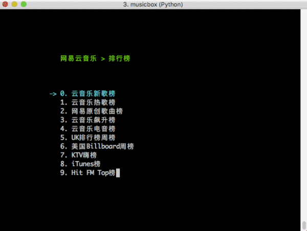

# Python 文本终端 GUI 框架，太酷了

<a id="profileBt"></a><a id="js_name"></a>Python数据之道 *2022-02-21 11:01*


**Python数据之道**

点击领取《Python知识手册》高清电子版，回复数字 “600” 获取。「Python数据之道」秉承“让数据更有价值”的理念​，聚焦于 Python 数据分析、数据可视化、AI、机器学习、深度学习等领域。

<a id="js_profile_article"></a>235篇原创内容

Official Account

> 来源：Python技术

上次发了一篇[基于 Webview 的图形界面的程序](https://mp.weixin.qq.com/s?__biz=MzkxNDI3NjcwMw==&mid=2247498105&idx=1&sn=af2b640421b5a5f60d3c055cc4f0b293&scene=21#wechat_redirect) 制作后，有读者询问：有没有基于文本中终端的 GUI 开发框架？

今天笔者就带大家，梳理几个常见的基于文本终端的 UI 框架，一睹为快！

## Curses

首先出场的是 Curses\[1\]。


Curse

Curses 是一个能提供基于文本终端窗口功能的动态库，它可以:

- 使用整个屏幕
    
- 创建和管理一个窗口
    
- 使用 8 种不同的彩色
    
- 为程序提供鼠标支持
    
- 使用键盘上的功能键
    

Curses 可以在任何遵循 ANSI/POSIX 标准的 Unix/Linux 系统上运行。Windows 上也可以运行，不过需要额外安装 `windows-curses` 库：

```
pip install windows-curses

```

上面图片，就是一哥们用 Curses 写的 俄罗斯方块游戏\[2\]，是不感觉满满的回忆吧，可以拿去复活古董机了。

我们也来试试牛刀：

```
import curses
myscreen = curses.initscr()
myscreen.border(0)
myscreen.addstr(12, 25, "Python curses in action!")
myscreen.refresh()
myscreen.getch()
curses.endwin()

```

- 需要注意 `addstr` 前两个参数是字符坐标，不是像素坐标
    
- `getch` 会阻塞程序，直到等待键盘输入
    
- `curses.endwin()` 作用是退出窗口
    
- 如果需要持续监听用户的交互，需要写个循环，并对 `getch()` 获得的输入进行判断
    

代码运行效果如下：


小试牛刀

Curses 非常轻巧，特别适合处理一下简单交互，代替复杂参数输入的程序，既优雅，有简单，而且 Curses 也是其他文字终端 UI 的基础。

## Npyscreen

Npyscreen\[3\] 也是一个用了编写文本终端的 Python 组件库，是基于 Curses 构建的应用框架。

比起 Curses，Npyscreen 更接近 UI 式编程，通过组件的组合完成 UI 展示和交互，而且 Npyscreen 可以自适应屏幕变化。

Npyscreen 提供了多个控件，比如 表单（Form）、单行文本输入框（TitleText）、日期控件（TitleDateCombo）、多行文本输入框（MultiLineEdit）、单选列表（TitleSelectOne）、进度条（TitleSlider）等多种控件。

提供强大的功能，满足快速开发程序的要求，无论是简单的单页程序还是复杂的多页应用。

来看一个小例子：

```
import npyscreen
class TestApp(npyscreen.NPSApp):
    def main(self):
        # These lines create the form and populate it with widgets.
        # A fairly complex screen in only 8 or so lines of code - a line for each control.
        F  = npyscreen.Form(name = "Welcome to Npyscreen",)
        t  = F.add(npyscreen.TitleText, name = "Text:",)
        fn = F.add(npyscreen.TitleFilename, name = "Filename:")
        fn2 = F.add(npyscreen.TitleFilenameCombo, name="Filename2:")
        dt = F.add(npyscreen.TitleDateCombo, name = "Date:")
        s  = F.add(npyscreen.TitleSlider, out_of=12, name = "Slider")
        ml = F.add(npyscreen.MultiLineEdit,
               value = """try typing here!\nMutiline text, press ^R to reformat.\n""",
               max_height=5, rely=9)
        ms = F.add(npyscreen.TitleSelectOne, max_height=4, value = [1,], name="Pick One",
                values = ["Option1","Option2","Option3"], scroll_exit=True)
        ms2= F.add(npyscreen.TitleMultiSelect, max_height =-2, value = [1,], name="Pick Several",
                values = ["Option1","Option2","Option3"], scroll_exit=True)
        # This lets the user interact with the Form.
        F.edit()
        print(ms.get_selected_objects())
if __name__ == "__main__":
    App = TestApp()
    App.run()

```

- 引入 Npyscreen 模块，如果没有可以通过 pip 安装：`pip install npyscreen`
    
- 继承 `npyscreen.NPSApp` 创建一个应用类 `TestApp`
    
- 实现 `main` 方法，方法里创建一个 `Form` 表单对象，然后向表单对象上添加各种控件，并设置控件的一些属性
    
- 调用表单对象的 `Edit` 方法，将操作权交给用户
    
- 在运行时，实例化 `TestAPP`，然后调用 `run` 方法启动应用，应用即可进入等待用户交互的状态
    

上面代码运行的效果如下：


Npyscreen

- \[Tab\] / \[Shift + Tab\] 用于切换控件焦点
    
- \[回车\] / \[空格\] 用于进入选择、设置、确认
    
- 在选择框架中，方向键与 vim\[4\] 操作类似，即通过 hjkl 来控制
    

是不是感觉很神奇，用文本原来可以做这么多复杂的操作，之前对命令行中的进度显示的疑惑是否有所清晰了~

## Urwid

如果说 Curses 和 Npysreen 是轻量级的文本终端 UI 框架，那么 Urwid\[5\] 绝对称得上是重量级选手。

Urwid 包含了众多开发文本 UI 的特性，例如：

- 应用窗口自适应
    
- 文本自动对齐
    
- 轻松设置文本块
    
- 强大的选择框控件
    
- 可以和各种基于事件驱动的框架集成，比如和 Twisted\[6\], Glib\[7\], Tornado\[8\] 等等
    
- 提供诸如编辑框、按钮、多(单)选框 等多种预制控件
    
- 显示模式支持原生、Curses模式、LCD 显示屏 以及 网络显示器
    
- 支持 UTF-8 以及 CJK 字符集（可以显示中文）
    
- 支持多种颜色
    

看看效果：


消息框


多字体


色彩

不知道你看了是什么感觉，我的感觉是：这也太卷了吧~

几乎可以做 GUI 下的所有事情！

更厉害的是，Urwid 完全是按照面向对象的思想打造的框架：


Urwid 结构图

现在我们来小试一把，感受一下 Urwid 的强大：

```
import urwid
def show_or_exit(key):
    if key in ('q', 'Q'):
        raise urwid.ExitMainLoop()
    txt.set_text(repr(key))
txt = urwid.Text(u"Hello World")
fill = urwid.Filler(txt, 'middle')
loop = urwid.MainLoop(fill, unhandled_input=show_or_exit)
loop.run()

```

- 先引入 urwid 模块
    
- 定义了一个输入事件处理方法 `show_or_exit`
    
- 处理方法中，当输入按键是 q 或者 Q 时，退出主循环，否则将按键名称显示出来
    
- `urwid.Text` 是一个文本控件，接受一个字符串作为显示信息
    
- `urwid.Filler` 类似于 panel，将 txt 控件填充在上面，位置设置在窗口中央
    
- `urwid.MainLoop` 设置 Urwid 的主循环，将 fill 作为控件的绘制入口，参数 `unhandled_input` 接受一个按键事件处理方法，用的就是前面定义的 `show_or_exit`
    
- `loop.run()` 启动 UI，并监控各种事件
    

运行这段代码，就可以看到命令行被设置为交互模式，按键时会在窗口中央显示出键名，如果按下 q 键，程序就会退出。

> **注意**：
> Urwid 只能在 Linux 操作系统中运行，Windows 上会因为缺失必要组件无法运行

## 总结

限于篇幅，这里只展示了三种文本终端框架，不过已经能对基于文本终端 UI 框架的强大感受一二了。

还有一些框架也很优秀，比如 prompt_toolkit，有兴趣的同学可以研究一下。

虽然基于文本终端的 UI 早已不是主流，但是在一些特殊的行业或者业务中，还是有其存在的价值，研究一下，说不定在特殊的地方可以帮助到我们。

最后，推荐一个很有意思的基于文本终端的应用 —— 命令行网易云音乐\[9\]:



NetEase-MusicBox

是基于 Curses 开发，如果运行起来，能被它的强悍所震撼，有空可以玩玩，比心！

\[1\]

Curses: *https://docs.python.org/3/howto/curses.html*

\[2\]

俄罗斯方块游戏: *https://github.com/cSquaerd/CursaTetra*

\[3\]

npyscreen: *https://npyscreen.readthedocs.io/*

\[4\]

vim: *https://www.vim.org/*

\[5\]

Urwid: *https://urwid.org/index.html*

\[6\]

Twisted: *https://www.twistedmatrix.com/trac/*

\[7\]

Glib: *https://docs.gtk.org/glib/*

\[8\]

Tornado: *https://www.tornadoweb.org/en/stable/*

\[9\]

命令行网易云音乐 : *https://github.com/darknessomi/musicbox*

**\-\-\-\-\-\-\-\- End --------**


#### 精选资料

回复关键词，获取对应的资料：

| 关键词 | 资料名称 |
| --- | --- |
| **600** | [《Python知识手册》](https://mp.weixin.qq.com/mp/appmsgalbum?__biz=MzI2NjY5NzI0NA==&action=getalbum&album_id=1370549534602133504#wechat_redirect) |
| **md** | [《Markdown速查表》](https://mp.weixin.qq.com/s?__biz=MzI2NjY5NzI0NA==&mid=2247495631&idx=1&sn=720c931b1f5cdb82ceccd9b34b182a95&scene=21#wechat_redirect) |
| **time** | [《Python时间使用指南》](https://mp.weixin.qq.com/s?__biz=MzI2NjY5NzI0NA==&mid=2247492370&idx=1&sn=1dc6b3edef0fcb241d07757fb9e2ae03&scene=21#wechat_redirect) |
| **str** | [《Python字符串速查表》](https://mp.weixin.qq.com/s?__biz=MzI2NjY5NzI0NA==&mid=2247496716&idx=1&sn=8ec7a6b373059fa49f04433990581aa6&scene=21#wechat_redirect) |
| **pip** | [《Python：Pip速查表》](https://mp.weixin.qq.com/s?__biz=MzI2NjY5NzI0NA==&mid=2247500405&idx=1&sn=c5a760279babd1075c6153858af84af8&scene=21#wechat_redirect) |
| **style** | [《Pandas表格样式配置指南》](https://mp.weixin.qq.com/s?__biz=MzI2NjY5NzI0NA==&mid=2247501026&idx=1&sn=378292e5435b7ef5eede36192812da3b&scene=21#wechat_redirect) |
| **mat** | [《Matplotlib入门100个案例》](https://mp.weixin.qq.com/s?__biz=MzI2NjY5NzI0NA==&mid=2247493274&idx=1&sn=323662b49f3b8e0d619d44315537a76a&scene=21#wechat_redirect) |
| **px** | [《Plotly Express可视化指南》](https://mp.weixin.qq.com/s?__biz=MzI2NjY5NzI0NA==&mid=2247501349&idx=1&sn=04502491758816e83d43525e911cce56&scene=21#wechat_redirect) |

#### 精选内容

**数据科学：** [VS Code 中 Python配置使用指南](https://mp.weixin.qq.com/s?__biz=MzI2NjY5NzI0NA==&mid=2247495918&idx=1&sn=6b06eadc1604b693f48a127e7b5986a4&scene=21#wechat_redirect) | [财经工具 Tushare](https://mp.weixin.qq.com/s?__biz=MzI2NjY5NzI0NA==&mid=2247497358&idx=1&sn=e9574b69ca3c05142edd534e438e855e&scene=21#wechat_redirect) | [Matplotlib 最有价值的 50 个图表](https://mp.weixin.qq.com/s?__biz=MzI2NjY5NzI0NA==&mid=2247485238&idx=1&sn=f2d6b9136ff94697bdce9c9f48397e78&scene=21#wechat_redirect)

**书籍阅读：** [如何阅读一本书](https://mp.weixin.qq.com/s?__biz=MzU3OTA1MTUwOA==&mid=2247484765&idx=1&sn=0d3a39a00797b8710af2ea175bb20566&scene=21#wechat_redirect) | [巴菲特之道](https://mp.weixin.qq.com/s?__biz=MzU3OTA1MTUwOA==&mid=2247483880&idx=1&sn=a28b5ef681e81a54b5281242e7e2ad2f&scene=21#wechat_redirect) | [价值](https://mp.weixin.qq.com/s?__biz=MzU3OTA1MTUwOA==&mid=2247484963&idx=1&sn=341e105747bb1642e3bc89b74d69e98e&scene=21#wechat_redirect) | [原则](https://mp.weixin.qq.com/s?__biz=MzU3OTA1MTUwOA==&mid=2247485540&idx=1&sn=ce0d2dc7a87a5695d388e8ff7d4405b9&scene=21#wechat_redirect) | [投资最重要的事](https://mp.weixin.qq.com/s?__biz=MzU3OTA1MTUwOA==&mid=2247485096&idx=1&sn=a73862a6b3fc166916d0c71b8d16bfac&scene=21#wechat_redirect) | [戴维斯王朝](https://mp.weixin.qq.com/s?__biz=MzU3OTA1MTUwOA==&mid=2247485191&idx=1&sn=a8f45215977c2f1e1776fa396b105fbf&scene=21#wechat_redirect) | [客户的游艇在哪里](https://mp.weixin.qq.com/s?__biz=MzU3OTA1MTUwOA==&mid=2247485799&idx=1&sn=6197a65ac44c5d8001f61dd75d8419c8&scene=21#wechat_redirect) | [刻意练习](https://mp.weixin.qq.com/s?__biz=MzU3OTA1MTUwOA==&mid=2247485688&idx=1&sn=ae808f8999cc40dcab5c551be673b56b&scene=21#wechat_redirect) | [林肯传](https://mp.weixin.qq.com/s?__biz=MzU3OTA1MTUwOA==&mid=2247485857&idx=1&sn=d2149626b4b3d2fd5a8fab31acff2002&scene=21#wechat_redirect) | [金字塔原理](https://mp.weixin.qq.com/s?__biz=MzU3OTA1MTUwOA==&mid=2247484887&idx=1&sn=e8404120ca4c7800214d8bcf3971eb3d&scene=21#wechat_redirect)

**投资小结：** [2021Q4](https://mp.weixin.qq.com/s?__biz=MzU3OTA1MTUwOA==&mid=2247487417&idx=1&sn=a45d93aec5a3b91413f8a9d6b6a8decb&scene=21#wechat_redirect) | [2021Q3](https://mp.weixin.qq.com/s?__biz=MzU3OTA1MTUwOA==&mid=2247487065&idx=1&sn=8766ac15616c871c0ba23cada09aa47b&scene=21#wechat_redirect) | [2021Q2](https://mp.weixin.qq.com/s?__biz=MzU3OTA1MTUwOA==&mid=2247486390&idx=1&sn=91c3cad42676f67d96e94f9b2f205d9e&scene=21#wechat_redirect) | [2021Q1](https://mp.weixin.qq.com/s?__biz=MzU3OTA1MTUwOA==&mid=2247485738&idx=1&sn=5a5636423731174cde98902af2e47d7f&scene=21#wechat_redirect) | [2020Q4](https://mp.weixin.qq.com/s?__biz=MzU3OTA1MTUwOA==&mid=2247485416&idx=1&sn=0cf825834c4f86a81ba87abf300416a7&scene=21#wechat_redirect)

#### 精选视频

**可视化：** [Plotly Express](https://mp.weixin.qq.com/s?__biz=MzI2NjY5NzI0NA==&mid=2247501395&idx=2&sn=9306078c98e6a2efc6e478a5921f5276&scene=21#wechat_redirect)

**财经：** [Plotly在投资领域的应用](https://mp.weixin.qq.com/s?__biz=MzI2NjY5NzI0NA==&mid=2247496637&idx=1&sn=91910ea5f9034fc6685d28ef0f00a70c&scene=21#wechat_redirect) | [绘制K线图表](https://mp.weixin.qq.com/s?__biz=MzI2NjY5NzI0NA==&mid=2247497147&idx=3&sn=9e788955d2268e1ba3f9f8c85ec4ece2&scene=21#wechat_redirect)

**排序算法：** [汇总](https://mp.weixin.qq.com/s?__biz=MzI2NjY5NzI0NA==&mid=2247505089&idx=1&sn=71021ec9da57933b41b64174f3d904c2&scene=21#wechat_redirect) | [冒泡排序](https://mp.weixin.qq.com/s?__biz=MzI2NjY5NzI0NA==&mid=2247504041&idx=2&sn=8dc4e755344edda2fdbb1f4922fa013b&scene=21#wechat_redirect) | [选择排序](https://mp.weixin.qq.com/s?__biz=MzI2NjY5NzI0NA==&mid=2247504041&idx=3&sn=b9aeb552253f6c5e8efe635bbcaead1b&scene=21#wechat_redirect) | [快速排序](https://mp.weixin.qq.com/s?__biz=MzI2NjY5NzI0NA==&mid=2247504041&idx=4&sn=22a3d67b3cec0269060502c13fabae35&scene=21#wechat_redirect) | [归并排序](https://mp.weixin.qq.com/s?__biz=MzI2NjY5NzI0NA==&mid=2247504041&idx=5&sn=90feeb44a998a57dbdabb9e1823bb051&scene=21#wechat_redirect) | [堆排序](https://mp.weixin.qq.com/s?__biz=MzI2NjY5NzI0NA==&mid=2247504041&idx=6&sn=5e8421ee83aa301b37f7f25d7ba6388f&scene=21#wechat_redirect) | [插入排序](https://mp.weixin.qq.com/s?__biz=MzI2NjY5NzI0NA==&mid=2247504041&idx=7&sn=1889203106bce18adc50ff151399e6fc&scene=21#wechat_redirect) | [希尔排序](https://mp.weixin.qq.com/s?__biz=MzI2NjY5NzI0NA==&mid=2247504041&idx=8&sn=d1eccecfbb6f37e34b2eaf3d8908248b&scene=21#wechat_redirect) | [计数排序](https://mp.weixin.qq.com/s?__biz=MzI2NjY5NzI0NA==&mid=2247504165&idx=3&sn=0d79c516472fcfa73ebe97fdf1c13004&scene=21#wechat_redirect) | [桶排序](https://mp.weixin.qq.com/s?__biz=MzI2NjY5NzI0NA==&mid=2247504461&idx=3&sn=78afcc98eef1bc38060b701af6ac3822&scene=21#wechat_redirect) | [基数排序](https://mp.weixin.qq.com/s?__biz=MzI2NjY5NzI0NA==&mid=2247505087&idx=5&sn=52b1af66f7a48de7ab7d61e769b81f82&scene=21#wechat_redirect)


People who liked this content also liked

波动率预测：深度学习VS传统计量模型

量化投资与机器学习

不看的原因

- 内容质量低
- 不看此公众号

Python 一个快速视频剪辑编辑神器 — Moviepy

Python实用宝典

不看的原因

- 内容质量低
- 不看此公众号

厉害了，用Python破个世界纪录！

Jack Cui

不看的原因

- 内容质量低
- 不看此公众号


Scan to Follow