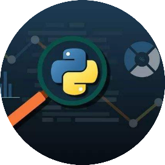

# Python 的十大特性

Python编程大全 *2022-01-10 11:06*

     点击 Python编程大全 ，选择加星标

精彩内容不迷路

**Python编程大全**

分享Python技术文章，实用案例，热点资讯。 你想了解的Python的那些事都在这里...... 当你的才华还撑不起你的野心的时候，那就安静下来学习吧！

6篇原创内容

Official Account

作者 ｜ Rupam Choudhary

译者 ｜ Sambodhi

策划 ｜ 闫园园

在了解 Python 的特性之前，我们首先要了解 Python 编程语言是什么。Python 编程语言是世界上发展最快的编程语言。这一高级通用编程语言提供了广泛的实际应用，并且是一种非常流行的认证。

Python 可以让程序员更加高效地工作和集成系统。Python 的语法优先考虑了可读性，同时支持较少的代码行。动态类型、内置数据结构、功能强大的库、框架和社区支持都是 Python 吸引快速开发任何应用的几个方面。

每次讨论 Python 的特性时，都会有一个大列表。本文将讨论 Python 编程语言的基本特性。对于每一个想要从事程序员职业的学生来说，这很重要。本文将帮助你理解 Python 的基本特性。

Python

软件开发者 Guido Van Rossum 于 1991 年创建了 Python，旨在使程序员的工作更加简单。自那以后，该语言经历了多次迭代和修订，目前已为许多大型公司和 IT 公司所采用的。因为它很好地支持人工智能，它通常被用在 Web 解决方案、企业应用程序和嵌入式语言中。

**与其他语言相比，Python 的流行程度**

Python 编程语言的特性

易于编程

假如你是一个新手（初学者），并且读过任何 Python 文章，我相信你已经了解到 Python 编程非常容易学习和编程。在将 Python 与 C、C#、Javascript 和 Java 等其他编程语言相比较时，Python 是一种非常直接的语言，它允许你轻松地开始编程。python 编程语言的基础知识可以在数小时或数天内学会。

精通 Python 同样具有挑战性。只要努力了就能学到或掌握 Python 的概念，但是要成为 Python 开发者需要大量的实践和耐心。的确，Python 编程很简单，但是要成为一名精通 Python 的程序员，也需要时间去适应。

开源

Python 编程语言的特点之一就是开源，也就是说每个人都可以构建和修改它。Python 编程有一个由成千上万的程序员组成的在线社区，他们每天都聚集在一起讨论该语言的发展。你可以从一个开源的、免费的地方下载它，你所需要知道的就是来源。

Python 编程语言在官方网站上是免费提供的，你通过点击下载 Python 链接即可下载。之后，你需要做的就是在你的计算机上安装 Python。为了运行 Python 编程语言，你需要 IDE（集成开发环境）。

Python 中的 GUI 编程支持

在用户访问你的程序或网站时，他首先看到并与之交互的是图形用户界面（Graphical User Interface，GUI）。良好的用户界面能够极大地提升平台的声誉和用户数。这包括 Python 的特性。

一个用户界面通常包括诸如图标、按钮、图形、显示文本等视觉元素，以及各种输入手段，如复选框、文本输入框等等。这起着至关重要的作用，因为它使得开始使用 Python 编程语言变得非常容易。

Python 可以使用 PyQt5、PyQt4、wxPython 等模块来创建图形用户界面。

如前所述，Python 为设计图形用户界面提供了很多可能性。Tkinter 是最常用的 GUI 技术，它是 Python 提供的 Tk GUI 工具包的一个标准 Python 接口。带有 Tkinter 的 Python 是最快捷、最省力的构建图形用户界面应用的方法。

Python 支持高级语言

Python 支持高级语言，这意味着它对于用户来说非常容易，这增强了 Python 的特性。在了解了 Python 编程语言的基本概念后，编程就变得非常简单。当编写 Python 程序时，我们也不需要回忆机器结构或操作内存。在很多方面的应用中，它的设计理念首先要考虑代码的可读性。它的语言元素和面向对象的方法的目的是帮助程序员为小型和大型项目编写清晰的、有逻辑的代码。

可扩展性

可扩展性是属于 Python 的其他特性之一。在必要时，可以用其他语言编写 Python 代码的一部分，例如 C++。因此，Python 是一种可扩展的语言，这意味着它可以被扩展到其他语言。Python 可扩展的特性是指 Python 的部分代码可以用 C 或 C++ 来编写。这并不能增强语言 （语法、结构等等），但是它可以让你把 Python 和其他语言开发的库连接起来。这就是说，你可以将以其他语言编写的代码包含在你的 Python 源代码中。

可移植性

Python 是一种跨平台的编程语言，这意味着建立在 Mac OSX 上的 Python 应用程序可以在 Linux 操作系统上运行，反之亦然。只需安装 Python 解释器，Python 程序就能在 Windows PC 上执行。这样，Python 程序就可以在各种系统上运行，包括 Windows、Linux、Unix 和 Macintosh。

大型标准库

Python 标准库包含用于日常编程的一系列模块，随 Python 标准版提供，无需额外安装。Python 包含了正则表达式、单元测试、Web 浏览器以及其他实用工具。它包括使用操作系统，读取和写入 CSV 文件，生成随机数，以及使用日期和时间。在使用 Python 进行开发的时候，我相信你肯定会遇到这种情况。

解释性语言

有些编程语言有两种类型的代码转换器用于语言转换。即解释器和编译器。编译器会编译整个程序，而解释器会逐行转换代码。

Python 使用了解释器，这意味着它的代码是逐行执行的。不同于 C、C++、Java 等其他编程语言。这是 Python 的特性之一，Python 的代码无需编译，因此更易于调试。Python 的源代码被转换为字节码，是代码的实例化。

面向对象程序设计语言

面向对象程序设计语言可以对现实世界进行建模，它是面向对象的，并集成了数据和函数。另一方面，面向过程的语言围绕着函数展开，函数是可重复使用的代码片段。Python 的基本特性之一是，它同时支持面向过程和面向对象的编程。与 Java 不同，它还允许多重继承。类是这种项目的蓝图；它是一种不包括任何值的抽象数据类型。

表达力

首先，让我们来定义表达力。假设我们有两种语言，X 和 Y，而且所有用 X 编写的程序都可以通过局部变换在 Y 中编写。但是，通过局部变换，有些程序可以在 Y 中创建，但在 X 中不能。因此，有人声称 Y 比 X 更有表达力。Python 有几种侧重于答案而非语法的结构。它是 Python 的奇妙特性之一，表明了为什么你应该学习 Python。

Python 除了上面提到的特性外，还提供了一长串有用的特性，或者我们可以称之为 Python 的特性，下面列出了其中的一些特性。

1.  Python 既支持功能化和结构化的编程方法，也支持面向对象的编程。
    
2.  Python 也可以作为脚本语言使用，或者编译成用于开发大型应用程序的字节码。
    
3.  支持动态类型验证，并提供非常高级的动态数据类型。
    
4.  会自动支持垃圾收集。
    
5.  它与 C、C++、COM、ActiveX、CORBA 和 Java 无缝集成。
    

总    结

本文讨论了 Python 和“Python 的特性”。但愿你能够从本文中获得一些知识。正如我们所看到的，Python 是解释型的、动态类型的。面向对象的，也是可移植的。免费的，可访问的。这是深入研究 Python 领域的一个好理由。立即开始学习 Python，以促进你的职业生涯。

常见问题

 是 Python 好还是 C++ 好？

总体而言，Python 在语法的简洁和清晰方面胜过 C++。然而，C++ 在性能、速度和应用范围上超越了 Python。每一种编程语言都是建立在 C 和 C++ 之上的，而 Python 是基于 C 构建的，同时考虑到了 Web 编程。

 Python 不具备的能力是什么？

Python 在创建时并没有考虑到开发特定类型的应用程序的能力。举例来说，它缺乏 PHP 等编程语言内置的 Web 开发能力。因此，开发者必须使用额外的工具和框架来开发独特的应用程序。

**原文链接：**

https://statanalytica.com/blog/features-of-python/

*​关注： Python编程大全 ，加星标精彩内容不迷路*

**Python编程大全**

分享Python技术文章，实用案例，热点资讯。 你想了解的Python的那些事都在这里...... 当你的才华还撑不起你的野心的时候，那就安静下来学习吧！

6篇原创内容

Official Account

People who liked this content also liked

使用python绘制散点密度图（用颜色标识密度）

Chemocoder

不看的原因

- 内容质量低
- 不看此公众号

Python其实很简单！从零基础到大佬，超详细知识点汇总，附教程

编程学习部

不看的原因

- 内容质量低
- 不看此公众号

Python unittest单元测试框架及断言方法

软件测试unittest

不看的原因

- 内容质量低
- 不看此公众号

Scan to Follow