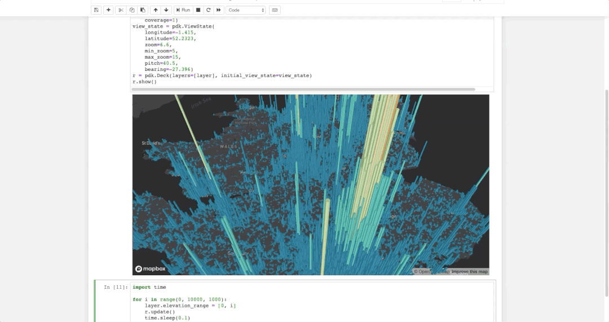

# Python 空间数据可视化神器，Pydeck！

<a id="profileBt"></a><a id="js_name"></a>早起Python *2022-01-19 12:36*

The following article is from 法纳斯特 Author 小F

<a id="copyright_info"></a>[<br>**法纳斯特** .<br>分享学习Python爬虫、数据分析、数据挖掘的点滴。](#)

大家好，我是早起。

今天给大家介绍一款超赞的空间（地理）数据可视化神器：Pydeck。

Pydeck库通过deck.gl对数据进行空间可视化渲染，对3D的可视化支持非常强。

使用文档：

*https://pydeck.gl/index.html*

GitHub：

*https://github.com/visgl/deck.gl/tree/master/bindings/pydeck*



通过下面的命令进行安装。

```


# 安装
pip install pydeck -i https://mirror.baidu.com/pypi/simple


```

可以在jupyter notebook及IDE上运行，其中jupyter上需要安装相关的插件。

```


# 启用Pydeck
jupyter nbextension install --sys-prefix --symlink --overwrite --py pydeck
jupyter nbextension enable --sys-prefix --py pydeck


```

接下来，就给大家介绍一下相关的可视化案例。

使用的数据及代码都已上传，可在文末获取~

**①** 弧形图


打工人下班后的通勤情况，起点位于旧金山市中心(绿色)，终点为目的地(红色)。

数据由美国人口普查局收集。

地址：

*https://lehd.ces.census.gov/data/*

代码如下。

```


import pydeck as pdk
import pandas as pd
DATA_URL = "https://raw.githubusercontent.com/ajduberstein/sf_public_data/master/bay_area_commute_routes.csv"
# A bounding box for downtown San Francisco, to help filter this commuter data
DOWNTOWN_BOUNDING_BOX = [
    -122.43135291617365,
    37.766492914983864,
    -122.38706428091974,
    37.80583561830737,
]
def in_bounding_box(point):
    """Determine whether a point is in our downtown bounding box"""
    lng, lat = point
    in_lng_bounds = DOWNTOWN_BOUNDING_BOX[0] <= lng <= DOWNTOWN_BOUNDING_BOX[2]
    in_lat_bounds = DOWNTOWN_BOUNDING_BOX[1] <= lat <= DOWNTOWN_BOUNDING_BOX[3]
    return in_lng_bounds and in_lat_bounds
df = pd.read_csv(DATA_URL)
# Filter to bounding box
df = df[df[["lng_w", "lat_w"]].apply(lambda row: in_bounding_box(row), axis=1)]
GREEN_RGB = [0, 255, 0, 40]
RED_RGB = [240, 100, 0, 40]
# Specify a deck.gl ArcLayer
arc_layer = pdk.Layer(
    "ArcLayer",
    data=df,
    get_width="S000 * 2",
    get_source_position=["lng_h", "lat_h"],
    get_target_position=["lng_w", "lat_w"],
    get_tilt=15,
    get_source_color=RED_RGB,
    get_target_color=GREEN_RGB,
    pickable=True,
    auto_highlight=True,
)
view_state = pdk.ViewState(latitude=37.7576171, longitude=-122.5776844, bearing=45, pitch=50, zoom=8,)
TOOLTIP_TEXT = {"html": "{S000} jobs <br /> Home of commuter in red; work location in green"}
r = pdk.Deck(arc_layer, initial_view_state=view_state, tooltip=TOOLTIP_TEXT)
r.to_html("arc_layer.html")


```

********②****** 3D****柱状图******


加拿大温哥华的房价情况，输入数据是GeoJSON格式的。

代码如下。

```


import pydeck as pdk
DATA_URL = "https://raw.githubusercontent.com/visgl/deck.gl-data/master/examples/geojson/vancouver-blocks.json"
LAND_COVER = [[[-123.0, 49.196], [-123.0, 49.324], [-123.306, 49.324], [-123.306, 49.196]]]
INITIAL_VIEW_STATE = pdk.ViewState(latitude=49.254, longitude=-123.13, zoom=11, max_zoom=16, pitch=45, bearing=0)
polygon = pdk.Layer(
    "PolygonLayer",
    LAND_COVER,
    stroked=False,
    # processes the data as a flat longitude-latitude pair
    get_polygon="-",
    get_fill_color=[0, 0, 0, 20],
)
geojson = pdk.Layer(
    "GeoJsonLayer",
    DATA_URL,
    opacity=0.8,
    stroked=False,
    filled=True,
    extruded=True,
    wireframe=True,
    get_elevation="properties.valuePerSqm / 20",
    get_fill_color="[255, 255, properties.growth * 255]",
    get_line_color=[255, 255, 255],
)
r = pdk.Deck(layers=[polygon, geojson], initial_view_state=INITIAL_VIEW_STATE)
r.to_html("geojson_layer.html")


```

****************③**************** **图标图**


德国啤酒花园的位置分布情况。

代码如下。

```


import pydeck as pdk
import pandas as pd
# Data from OpenStreetMap, accessed via osmpy
DATA_URL = "https://raw.githubusercontent.com/ajduberstein/geo_datasets/master/biergartens.json"
ICON_URL = "https://upload.wikimedia.org/wikipedia/commons/c/c4/Projet_bi%C3%A8re_logo_v2.png"
icon_data = {
    # Icon from Wikimedia, used the Creative Commons Attribution-Share Alike 3.0
    # Unported, 2.5 Generic, 2.0 Generic and 1.0 Generic licenses
    "url": ICON_URL,
    "width": 242,
    "height": 242,
    "anchorY": 242,
}
data = pd.read_json(DATA_URL)
data["icon_data"] = None
for i in data.index:
    data["icon_data"][i] = icon_data
view_state = pdk.data_utils.compute_view(data[["lon", "lat"]], 0.1)
icon_layer = pdk.Layer(
    type="IconLayer",
    data=data,
    get_icon="icon_data",
    get_size=4,
    size_scale=15,
    get_position=["lon", "lat"],
    pickable=True,
)
r = pdk.Deck(layers=[icon_layer], initial_view_state=view_state, tooltip={"text": "{tags}"})
r.to_html("icon_layer.html")


```

**********************④********************** **流向图**


从希思罗机场飞往欧洲各地的航班路线图。

代码如下。

```


import pydeck as pdk
DATA_URL = {
    "AIRPORTS": "https://raw.githubusercontent.com/visgl/deck.gl-data/master/examples/line/airports.json",
    "FLIGHT_PATHS": "https://raw.githubusercontent.com/visgl/deck.gl-data/master/examples/line/heathrow-flights.json",  # noqa
}
INITIAL_VIEW_STATE = pdk.ViewState(latitude=47.65, longitude=7, zoom=4.5, max_zoom=16, pitch=50, bearing=0)
# RGBA value generated in Javascript by deck.gl's Javascript expression parser
GET_COLOR_JS = [
    "255 * (1 - (start[2] / 10000) * 2)",
    "128 * (start[2] / 10000)",
    "255 * (start[2] / 10000)",
    "255 * (1 - (start[2] / 10000))",
]
scatterplot = pdk.Layer(
    "ScatterplotLayer",
    DATA_URL["AIRPORTS"],
    radius_scale=20,
    get_position="coordinates",
    get_fill_color=[255, 140, 0],
    get_radius=60,
    pickable=True,
)
line_layer = pdk.Layer(
    "LineLayer",
    DATA_URL["FLIGHT_PATHS"],
    get_source_position="start",
    get_target_position="end",
    get_color=GET_COLOR_JS,
    get_width=10,
    highlight_color=[255, 255, 0],
    picking_radius=10,
    auto_highlight=True,
    pickable=True,
)
layers = [scatterplot, line_layer]
r = pdk.Deck(layers=layers, initial_view_state=INITIAL_VIEW_STATE)
r.to_html("line_layer.html")


```

****************************⑤**************************** **路径图**


湾区快速交通线路图。

代码如下。

```


import pandas as pd
import pydeck as pdk
DATA_URL = "https://raw.githubusercontent.com/visgl/deck.gl-data/master/website/bart-lines.json"
df = pd.read_json(DATA_URL)
def hex_to_rgb(h):
    h = h.lstrip("#")
    return tuple(int(h[i : i + 2], 16) for i in (0, 2, 4))
df["color"] = df["color"].apply(hex_to_rgb)
view_state = pdk.ViewState(latitude=37.782556, longitude=-122.3484867, zoom=10)
layer = pdk.Layer(
    type="PathLayer",
    data=df,
    pickable=True,
    get_color="color",
    width_scale=20,
    width_min_pixels=2,
    get_path="path",
    get_width=5,
)
r = pdk.Deck(layers=[layer], initial_view_state=view_state, tooltip={"text": "{name}"})
r.to_html("path_layer.html")


```

************⑥******** 散点图****


旧金山市内各地铁站的出口数量图。

代码如下。

```


import pydeck as pdk
import pandas as pd
import math
SCATTERPLOT_LAYER_DATA = "https://raw.githubusercontent.com/visgl/deck.gl-data/master/website/bart-stations.json"
df = pd.read_json(SCATTERPLOT_LAYER_DATA)
# Use pandas to calculate additional data
df["exits_radius"] = df["exits"].apply(lambda exits_count: math.sqrt(exits_count))
# Define a layer to display on a map
layer = pdk.Layer(
    "ScatterplotLayer",
    df,
    pickable=True,
    opacity=0.8,
    stroked=True,
    filled=True,
    radius_scale=6,
    radius_min_pixels=1,
    radius_max_pixels=100,
    line_width_min_pixels=1,
    get_position="coordinates",
    get_radius="exits_radius",
    get_fill_color=[255, 140, 0],
    get_line_color=[0, 0, 0],
)
# Set the viewport location
view_state = pdk.ViewState(latitude=37.7749295, longitude=-122.4194155, zoom=10, bearing=0, pitch=0)
# Render
r = pdk.Deck(layers=[layer], initial_view_state=view_state, tooltip={"text": "{name}\n{address}"})
r.to_html("scatterplot_layer.html")


```

************⑦******** 其他****

案例较多，这里就不贴代码，直接展示啦！


渲染了10k个点。


1906年，Britton&Rey绘制的旧金山1906年火灾地图，覆盖在交互式的旧金山地图上。


台北房价。数据为2012-2013年。柱子的高度表示单位面积价格的上升，颜色表示离地铁站的距离。


2006年美国新墨西哥州饲养的牲畜的位置。

家禽的位置是蓝色的，牛的位置是橙色的。与Mapbox上的卫星图像叠加以突出地形如何影响农业。


通用样式，一幅世界地图。


通过geopandas的数据，绘制世界地图。

其中geopandas安装起来有点费劲，建议使用whl安装包。


世界上超过33000个发电厂按照它们的生产能力(以高度表示)和燃料类型(绿色，如果可再生的话)绘制在一个球形地图上。


旧金山国际机场直飞航线图。起点是绿色的，目的地是蓝色的。


旧金山自行车停车地点的分布情况。


网格地图。


2006年在美国新墨西哥州饲养牲畜的位置热力图。

家禽的位置是蓝色的，牛的位置是橙色的。与Mapbox上的卫星图像叠加以突出地形如何影响农业。


英国从1979年起发生的人身伤害交通事故。


点云图，激光扫描，由无数个点组成。


加拿大温哥华的房价情况。


这个不知道是啥玩意...


在旧金山内的自行车停车位，将数据聚合网格。


使用AWS开放数据和Mapbox卫星图像制作一个地形图。


旧金山市内各种公共交通站点的名称，在站点的位置上标出。


一辆共享单车在旧金山的骑行情况，从开始到逐渐消失。

好了，以上就是今天分享的内容，大家可以自行去动手练习。

这里小F用到了Mapbox地图，是需要自行去注册，获取token。

地址：

*https://account.mapbox.com/*


然后在pydeck的deck方法中，将token添加到api_keys参数即可。


相关的文件及代码都已上传(*https://pan.baidu.com/s/1sK4ZgMKNZ1upb-P6bzGbWg 提取码：mzca)*需要的读者可以自行下载。

**点击下载「pandas进阶修炼300题」👇**

[](http://mp.weixin.qq.com/s?__biz=Mzg5OTU3NjczMQ==&mid=2247519402&idx=1&sn=535dddd429bf383a1eda9f0316507ec4&chksm=c053ea5ef72463488c4fdd99282d9d4d3922c0ad9fe034865f351d4ec19b375672b3e41350ec&scene=21#wechat_redirect)

* * *


People who liked this content also liked

Apache 架构师总结的 30 条架构原则

架构文摘

不看的原因

- 内容质量低
- 不看此公众号

学Python 新手做到这7点，提升编程能力真不难！

Python编程大全

不看的原因

- 内容质量低
- 不看此公众号

深入理解Lustre分布式文件系统之Lustre架构

存储内核技术交流

不看的原因

- 内容质量低
- 不看此公众号


Scan to Follow