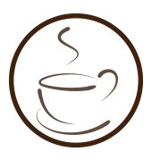

# Python一键替换证件照背景，还用去照相馆？

<a id="profileBt"></a><a id="js_name"></a>python数据分析之禅 *2022-04-13 12:28*

The following article is from 渡码 Author 渡码

<a id="copyright_info"></a>[<br>**渡码** .<br>持续输出 Python 全栈优质文章](#)

哈喽，大家好。

今天继续给大家分享实战项目。

用深度学习算法替换证件照背景，带 UI 界面那种，从此可以跟照相馆说拜拜了。


下面我们来学习一下该项目，文末有源代码和开源地址。

没有啰嗦的文字，没有多余的代码，只有通俗的讲解。

### 1\. 思路

先来看一下最终的效果。


效果

左边是原图片，右边是替换背景后的图片，支持替换任意颜色背景。

项目的实现思路很简单：

1.  用户上传的原图后，使用已经训练好的人像分割模型将人像切割出来
    
2.  将切割后的图片展示在新背景上
    

### 2\. 模型

图像分割是要将图片根据内容分割成不同的块，如下图所示：


相比图像分类和检测，图像分割是一项更精细的工作，因为需要对每个像素点分类，物体的轮廓是精准勾勒的。

本项目的图像（人像）分割采用飞桨(PaddlePaddle)提供的`deeplabv3p_xception65_humanseg`模型。该模型基于`DeepLabv3+`，用百度自建数据集进行训练，可用于人像分割，支持任意大小的图片输入。

`DeepLabv3+` 是 Google DeepLab **语义分割**系列网络的最新作，这里说的**语义分割**是图像分割中的一类。

`DeepLabv3+`的网络结构如下：


DeepLabv3+

`DeepLabv3+`通过encoder-decoder进行多尺度信息的融合，`encoder`是原来的`DeepLabv3`，但`DCNN`采用了**改进的Xception**，提高了语义分割的健壮性和运行速率。

`decoder`是`DeepLabv3+`相比`DeepLabv3`新增的，其将底层特征与高层特征进一步融合，提升分割边界准确度。

下面是人像分割的核心代码：

```
from paddlehub import Module
# 加载训练好的人像分割模型
module = Module(directory="module/deeplabv3p_xception65_humanseg")
# 进行分割
res = module.segmentation(paths=[filename], output_dir='../cache', visualization=True)

```

`filename`是原图片的路径。

### 3\. UI

UI 界面使用`ttkbootstrap`开发，它是`TKinter`的美化库，使用方法跟`TKinter`一样。

这里介绍下 UI 界面的核心代码。

首先需要一个按钮来选择原图片

```
import ttkbootstrap as ttk
ttk.Button(self.leftFrame, text='选择图片', command=self.openFile)

```

点击`选择图片`按钮后，会调用`openFile`函数对原图片进行人像分割，分割出来的人像存储在临时文件中。

还需要一个按钮展示转换背景后的图片

```
ttk.Button(self.leftFrame, text='转换底色', command=self.render)

```

`render`函数会展示转换后的图片，核心代码如下：

```
def render(self):
  # 获取新背景色
  colorHEX = self.color.get()
  # 获取分割后的人像图片
  base_img = Image.open(self.outputdir)
  # 展示新背景
  background = Image.new('RGBA', base_img.size, colorHEX)
  x, y = base_img.size
  # 将分割后的人像贴在新背景上
  background.paste(base_img, (0, 0, x, y), base_img)
  self.image_final = background

```

`self.image_final`是转换背景后的图片，调整大小后便可以在 UI 上展示。

### 4\. 运行

到这里，整个项目已经介绍完了，最后简单说下拿到源码后如何运行该项目。

首先，安装飞桨(PaddlePaddle)

```
pip install --upgrade paddlepaddle -i https://mirror.baidu.com/pypi/simple
pip install --upgrade paddlehub -i https://mirror.baidu.com/pypi/simple

```

然后，安装`ttkbootstrap`

```
pip install ttkbootstrap

```

最后，运行`Circulation.py`文件即可。

如果本文对你有帮助，就点个在看鼓励下吧。

> 参考文章： 
> 
> 1.  开源地址：https://github.com/GavinSun0921/Circulation
>     
> 2.  https://zhuanlan.zhihu.com/p/62261970
>     
> 3.  https://www.paddlepaddle.org.cn/hubdetail?name=deeplabv3p\_xception65\_humanseg&en_category=ImageSegmentation
>     

People who liked this content also liked

Crack App | 【填坑】某 H5 app 的反调试绕过（Frida 与 Xposed 双版本）

...

咸鱼学Python

不看的原因

- 内容质量低
- 不看此公众号

python 显示地图

...

叶子陪你玩编程

不看的原因

- 内容质量低
- 不看此公众号


Scan to Follow