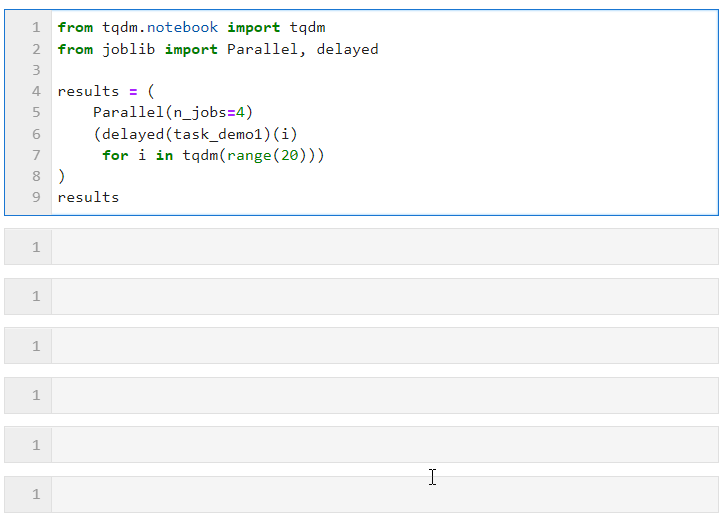
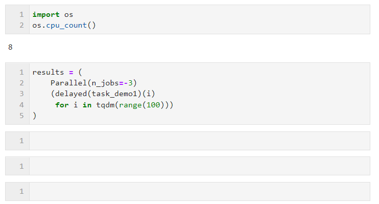

# Python中最简单易用的并行加速技巧

<a id="copyright_logo"></a>Original <a id="js_author_name"></a>费弗里 <a id="profileBt"></a><a id="js_name"></a>Python大数据分析 *2022-05-14 20:00* *Posted on <a id="js_ip_wording"></a>重庆*


添加微信号"CNFeffery"加入技术交流群

> ❝
> 
> 本文示例代码及文件已上传至我的`Github`仓库https://github.com/CNFeffery/DataScienceStudyNotes
> 
> ❞

# 1 简介

我们在日常使用`Python`进行各种数据计算处理任务时，若想要获得明显的计算加速效果，最简单明了的方式就是想办法将默认运行在单个进程上的任务，扩展到使用多进程或多线程的方式执行。

而对于我们这些从事数据分析工作的人员而言，以最简单的方式实现等价的加速运算的效果尤为重要，从而避免将时间过多花费在编写程序上。而今天的文章费老师我就来带大家学习如何利用`joblib`这个非常简单易用的库中的相关功能，来快速实现并行计算加速效果。


# 2 使用joblib进行并行计算

作为一个被广泛使用的第三方`Python`库（譬如`scikit-learn`项框架中就大量使用`joblib`进行众多机器学习算法的并行加速），我们可以使用`pip install joblib`对其进行安装，安装完成后，下面我们来学习一下`joblib`中有关并行运算的常用方法：

## 2.1 使用Parallel与delayed进行并行加速

`joblib`中实现并行计算只需要使用到其`Parallel`和`delayed`方法即可，使用起来非常简单方便，下面我们直接以一个小例子来演示：

`joblib`实现并行运算的思想是将一组通过循环产生的串行计算子任务，以多进程或多线程的方式进行调度，而我们针对自定义的运算任务需要做的仅仅是将它们封装为函数的形式即可，譬如：

```
`import time
def task_demo1():
    
    time.sleep(1)
    
    return time.time()
`
```

接着只需要像下面的形式一样，为`Parallel()`设置相关参数后，衔接循环创建子任务的列表推导过程，其中利用`delayed()`包裹自定义任务函数，再衔接`()`传递任务函数所需的参数即可，其中`n_jobs`参数用于设置并行任务同时执行的`worker`数量，因此在这个例子中可以看到进度条是按照4个一组递增的，可以看到最终时间开销也达到了并行加速效果：



其中可以根据计算任务以及机器CPU核心数具体情况为`Parallel()`调节参数，核心参数有：

- backend：用于设置并行方式，其中多进程方式有`'loky'`（更稳定）和`'multiprocessing'`两种可选项，多线程有`'threading'`一种选项。默认为`'loky'`
    
- n_jobs：用于设置并行任务同时执行的worker数量，当并行方式为多进程时，`n_jobs`最多可设置为机器CPU逻辑核心数量，超出亦等价于开启全部核心，你也可以设置为`-1`来快捷开启全部逻辑核心，若你不希望全部CPU资源均被并行任务占用，则可以设置更小的负数来保留适当的空闲核心，譬如设置为`-2`则开启全部核心-1个核心，设置为`-3`则开启全部核心-2个核心
    

譬如下面的例子，在我这台逻辑核心数为8的机器上，保留两个核心进行并行计算：



关于并行方式的选择上，由于`Python`中多线程时全局解释器锁的限制，如果你的任务是计算密集型，则推荐使用默认的多进程方式加速，如果你的任务是IO密集型譬如文件读写、网络请求等，则多线程是更好的方式且可以将`n_jobs`设置的很大，举个简单的例子，可以看到，通过多线程并行，我们在5秒的时间里完成了1000次请求，远快于单线程17秒请求100次的成绩（此例仅供参考，大家在学习尝试时请不要过于频繁访问他人的网站）：


你可以根据自己实际任务的不同，好好利用`joblib`来加速你的日常工作。

* * *

以上就是本文的全部内容，欢迎在评论区与我进行讨论~


加入知识星球**【我们谈论数据科学】**

**500+**小伙伴一起学习！

* * *

* * *


* * *

* * *

**· ****推荐阅读 ****·**

**[盘点2021最佳数据可视化作品](http://mp.weixin.qq.com/s?__biz=MzA3ODYwNDkzOQ==&mid=2659068847&idx=1&sn=8db0be0906a3509f375375106b0db1bb&chksm=84cab44bb3bd3d5de009be958a3a03870d6db95bf574cbfd084eca8888ecbe968c2176ec76bf&scene=21#wechat_redirect)**

**[一行代码实现地址信息解析](http://mp.weixin.qq.com/s?__biz=MzA3ODYwNDkzOQ==&mid=2659070783&idx=1&sn=2c63721dccc4cea7d2c5e947774bf8f9&chksm=84caacdbb3bd25cde96fc7103cc2df8d3dd3830ecd2f86ec4107962bb5925400cdc1bfdee1c3&scene=21#wechat_redirect)**

**[新一代Python包管理工具来了](http://mp.weixin.qq.com/s?__biz=MzA3ODYwNDkzOQ==&mid=2659069201&idx=1&sn=35d452d34f933824a8b726d5e5d49166&chksm=84cab2f5b3bd3be354179dea529702cc85fb797002d5375ccfe984c6f618d115bf0bc24694b0&scene=21#wechat_redirect)**


People who liked this content also liked

这个网站有195万个Python Q&A

...

Python大数据分析

不看的原因

- 内容质量低
- 不看此公众号

Python为什么要用import导入模块？何不直接导入所有模块更省事

...

Python大数据分析

不看的原因

- 内容质量低
- 不看此公众号

纯Python开发在线二维码生成工具

...

Python大数据分析

不看的原因

- 内容质量低
- 不看此公众号


Scan to Follow