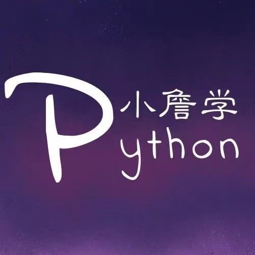

# 【Python】Python的类和对象（长文系列第⑤篇）

<a id="profileBt"></a><a id="js_name"></a>机器学习初学者 *2022-04-05 13:53*

The following article is from 小詹学Python Author 奶糖猫

<a id="copyright_info"></a>[<br>**小詹学Python** .<br>一个有温度的 Python 订阅号！](#)

系列最后一篇来说说Python中的类与对象，Python这门语言是无处不对象，如果你曾浅要了解过Python，你应该听过Python是一种面向对象编程的语言，所以你经常可能会看到面向“对象”编程这类段子，而面向对象编程的语言都会有三大特征：封装、继承、多态。

我们平时接触到的很多函数、方法的操作都具有这些性质，我们只是会用，但还没有去深入了解它的本质，下面就介绍一下关于类和对象的相关知识。

## 封装

封装这个概念应该并不陌生，比如我们把一些数据封装成一个列表，这就属于数据封装，我们也可以将一些代码语句封装成一个函数方便调用，这就是代码的封装，我们也可以将数据和代码封装在一起。用术语表示的话，就是可以将属性和方法进行封装，从而得到对象。

首先我们可以定义一个类，这个类中有属性和方法，但有的伙伴会比较好奇，属性和方法不是会封装成对象嘛，为什么又变成类了？举个例子，类就好比是一个毛坯房，而对象是在毛坯房的基础上改造成的精装房。

```


class XiaoMing:
    #属性
    height = 180
    weight = 65
    sex = '男'
    #方法
    def run(self):
        print('小明在跑步')
    def sleep(self):
        print('小明在睡觉')


```

在类定义完成时就创建了一个类对象，它是对类定义创建的命名空间进行了一个包装。类对象支持两种操作：属性引用和实例化。

属性引用的语法就是一般的标准语法：obj.name。比如XiaoMing.height和XiaoMing.run就是属性引用，前者会返回一条数据，而后者会返回一个方法对象。

```


In[1]:print(XiaoMing.height)
Out[1]:180
In[2]:print(XiaoMing.run)
Out[2]:<function XiaoMing.run at 0x0000021C6239D0D0>


```

这里也支持对类属性进行赋值操作，比如为类中的weight属性赋予一个新值。

```


In[3]:print(XiaoMing.weight)
Out[3]:65
In[4]:XiaoMing.weight = 100
In[5]:print(XiaoMing.weight)
Out[5]:100


```

而类的实例化可以将类对象看作成一个无参函数的赋值给一个局部变量，如下：

```


In[6]:ming = XiaoMing()


```

ming就是由类对象实例化后创建的一个实例对象，通过实例对象也可以调用类中的属性和方法。

```


In[7]:ming.run()
Out[7]:小明在跑步
In[8]:print(xiaoming.height)
Out[8]:180
#通过向类对象调用方法返回的方法对象中传入实例对象也可以达到同样效果
In[11]:XiaoMing.run(ming)
Out[11]:小明在跑步


```

### 魔法方法\_\_init\_\_

类在实例化过程中并不都是像上面例子一样简单的，一般类都会倾向将实例对象创建为有初始状态的，所以在类中可能会定义一个\_\_init\_\_的魔法方法，这个方法就可以帮助接收、传入参数。

而一个类如果定义了\_\_init\_\_方法，那么在类对象实例化的过程中就会自动为新创建的实例化对象调用\_\_init\_\_方法，请看下面这个例子。

```


class Coordinates:
    def __init__(self,x,y):
        self.x = x
        self.y = y
    def print_coor(self):
        print('当前坐标为(%s,%s)'%(self.x,self.y))


```

可以看到在\_\_init\_\_()中传入了参数x和y，然后在print\_coor中需要接收参数x和y，接下来通过实例化这个类对象，验证一下参数是否能通过\_\_init__()传递到类的实例化操作中。

```


In[9]:coor = Coordinates(5,3)
In[10]:coor.print_coor()
Out[10]:当前坐标为(5,3)


```

## 继承

所谓继承就是一个新类在另一个类的基础上构建而成，这个新类被称作子类或者派生类，而另一个类被称作父类、基类或者超类，而子类会继承父类中已有的一些属性和方法。

```


class Mylist(list):
    pass
list_ = Mylist()
list_.append(1)
print(list_)
'''
[1]
'''


```

比如上面这个例子，我并没有将list_定义成一个列表，但它却能调用append方法。原因是类Mylist继承于list这个基类，而list_又是Mylist的一个实例化对象，所以list_也会拥有父类list拥有的方法。

当然可以通过自定义类的形式实现两个类之间的继承关系，我们定义Parent和Child两个类，Child中没有任何属性和方法，只是继承于父类Parent。

```


class Parent:
    def par(self):
        print('父类方法')
class Child(Parent):
    pass
child = Child()
child.par()
'''
父类方法
'''


```

### 覆盖

当子类中定义了与父类中同名的方法或者属性，则会自动覆盖父类对应的方法或属性，还是用上面这个例子实现一下，方便理解。

```


class Parent:
    def par(self):
        print('父类方法')
class Child(Parent):
    def par(self):
        print('子类方法')
child = Child()
child.par()
'''
子类方法
'''


```

可以看到子类Child中多了一个和父类Parent同名的方法，再实例化子类并调用这个方法时，最后调用的是子类中的方法。

Python中继承也允许多重继承，也就是说一个子类可以继承多个父类中的属性和方法，但是这类操作会导致代码混乱，所以大多数情况下不推荐使用，这里就不过多介绍了。

## 多态

多态比较简单，比如定义两个类，这两个类没有任何关系，只是两个类中有同名的方法，而当两个类的实例对象分别调用这个方法时，不同类的实例对象调用的方法也是不同的。

```


class XiaoMing:
    def introduce(self):
        print("我是小明")
class XiaoHong:
    def introduce(self):
        print("我是小红")


```

上面这两个类中都有introduce方法，我们可以实例化一下两个类，利用实例对象调用这个方法实现一下多态。

```


In[12]:ming = XiaoMing()
In[13]:hong = XiaoHong()
In[14]:ming.introduce()
Out[14]:我是小明
In[15]:hong.introduce()
Out[15]:我是小红


```

## 常用BIF

### 1、isssubclass(class,classinfo)

判断一个类是否是另一个类的子类，如果是则返回True，反之则返回False。

```


class Parent:
    pass
class Child(Parent):
    pass
print(issubclass(Child,Parent))
'''
True
'''


```

需要注意的有两点：

- 1.第二个参数不仅可以传入类，也可以传入由类组成的元组。
    
- 2.一个类被判定为自身的子类，也就是说这两个参数传入同一个类时，也会返回True。
    

```


print(issubclass(Parent,Parent))
'''
True
'''


```

### 2、isinstance(object,classinfo)

判断一个对象是否为一个类的实例对象，如果是则返回True，反之则返回False。

```


class Parent:
    pass
class Child:
    pass
p = Parent()
c = Child()
print(isinstance(p,Parent,Child))
#True
print(isinstance(c,Parent))
#False


```

需要注意的有两点：

- 1.第二个参数不仅可以传入类，也可以传入由类组成的元组。
    
- 2.如果第一个参数传入的不是一个对象，则总是返回False。
    

### 3、hasattr(object,name)

判断一个实例对象中是否包含一个属性，如果是则返回True，反之则返回False。

```


class Parent:
    height = 100
p = Parent()
print(hasattr(p,'height'))
'''
True
'''


```

需要注意的是第二个参数name必须为字符串形式传入，如果不是则会返回False。

```


```


```


```


```


```


往期精彩回顾

- [适合初学者入门人工智能的路线及资料下载](http://mp.weixin.qq.com/s?__biz=MzIwODI2NDkxNQ==&mid=2247484737&idx=1&sn=27c52b4bc4ca98d3ab817344b84226cc&chksm=97048efda07307eb78d4f4ec0039a386a658404156b051af0cb715fafa8d2ae66cbe49343bf3&scene=21#wechat_redirect)
    
- [(图文+视频)机器学习入门系列下载](https://mp.weixin.qq.com/mp/appmsgalbum?__biz=MzIwODI2NDkxNQ==&action=getalbum&album_id=2259163844755406853#wechat_redirect)
    
- [中国大学慕课《机器学习》（黄海广主讲）](http://mp.weixin.qq.com/s?__biz=MzIwODI2NDkxNQ==&mid=2247502323&idx=1&sn=598d7231681ce2f316503201dd615c86&chksm=9707424fa070cb59f861a47f9eb4218cc5d3b835be49e93e67bb086dcc4c3b555a3546ebe9c5&scene=21#wechat_redirect)
    
- [机器学习及深度学习笔记等资料打印](http://mp.weixin.qq.com/s?__biz=MzIwODI2NDkxNQ==&mid=2247488304&idx=1&sn=581944f63eab1822ca53b9a4eeedad79&chksm=9704988ca073119a38a534adbedd51ca0b5705cdd6a104fed74b265bb092485e97c91bb5b347&scene=21#wechat_redirect)
    
- [《统计学习方法》的代码复现专辑](https://mp.weixin.qq.com/mp/appmsgalbum?action=getalbum&album_id=1337257945842778113&__biz=MzIwODI2NDkxNQ==#wechat_redirect)
    
- [AI基础下载](http://mp.weixin.qq.com/s?__biz=MzIwODI2NDkxNQ==&mid=2247487602&idx=2&sn=478d9893e85d564282334654b3be7fda&chksm=97049bcea07312d8b74ac7e99e3a3dbea331315c1439888f4e16e912b18d3d8626f36e1fc0df&scene=21#wechat_redirect)
    
- 机器学习交流qq群955171419，加入微信群请扫码：
    


```


```


```


```


```


```

People who liked this content also liked

使用图片隐写的Python远控恶意样本分析

...

ChaMd5安全团队

不看的原因

- 内容质量低
- 不看此公众号

用Python去除图片背景：​Rembg库

...

Python大数据分析

不看的原因

- 内容质量低
- 不看此公众号

介绍用于图像识别的五大最佳编程语言！

...

小白学视觉

不看的原因

- 内容质量低
- 不看此公众号


Scan to Follow