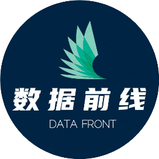

# 一款让Python开发效率提升50%的工具包

<a id="profileBt"></a><a id="js_name"></a>SQL数据库开发 *2022-03-10 08:30*

The following article is from 平凡而诗意 Author Jackpop

<a id="copyright_info"></a>[<br>**平凡而诗意** .<br>进阶技术，优质资源，实用工具！](#)

**点击关注上方“SQL数据库开发”，**

**设为“置顶或星标****”，第一时间送达干货**

依赖管理一直都在编程语言中占据着至关重要的地位，无论是Python、JavaScript还是Java、Go。

虽然不同编程语言的依赖管理工具不尽相同，但是它们追求的目标都是大同小异的。能够对项目以来进行更加轻松统一的管理，能够更加便捷的进行项目迁移和部署。

因此，就出现了maven、npm、pip这些依赖包管理工具，但是，对比于Java和JS，Python在依赖管理方面更加特殊。所以，先后出现了多款不同的管理工具，每一次升级都是为了更好的做好Python的依赖包管理工具。

Python在依赖包管理方面主要的特殊性就来自于，不仅需要考虑项目以来的第三方包，还要着重考虑**虚拟环境**。这一点，是由于Python和Java、JS这些编程语言本质上存在差异导致的。


Java、JS是**以项目进行隔离**，每当开发一个项目，依赖包都是安装在项目工程路径下。每个工程之间是隔离的，这样，即便是不同工程用到同一个包的不同版本，它们之间也不会产生冲突。


但是，Python则不同，在Python中无法通过工程对依赖包进行隔离。

当我们之间使用`pip`安装第三方包时，所有的依赖都会安装到安装目录下的`site-packages`。

试想一下，如果我们开发A工程，用到了TensorFlow`v0.1`。但是，开发B工程，需要用到TensorFlow`v0.2`。这时候，site-packages下的依赖包就会产生冲突，后面安装的依赖包就会把前面已经安装的版本卸载掉然后再安装新版本依赖包。

显然，这样是非常不友好的。

为了解决这个问题，**虚拟环境**就起到了至关重要的作用。


在开发不同的工程时，可以创建并激活不同的虚拟环境。这样，不同的工程就会用到不同环境下的解析器，我们也可以把依赖包安装到不同虚拟环境的site-packages路径下。

因此，在Python中依赖管理一般指代**依赖管理+虚拟环境**。

以往，针对Python依赖管理和虚拟环境经常会用到2个工具：`pip`和`virtualenv`。

其中pip用于依赖包的管理，virtualenv用于虚拟环境的管理。

这样虽然解决了不同工程之间环境隔离的问题，但是也存在着明显的不足：

- 需要同时依赖2款管理工具
    
- 不能动态更新requirements.txt
    

其中比较突出的问题就是第2点。

在工程开发过程中，需要一个配置文件来记录依赖包和环境参数，例如，maven的pom.xml、npm的package.json。

而在Python中常用的就是requirements.txt。

这种纯文本的格式只能用于记录依赖包的名称，而不能像yaml、json、xml这些文本存储格式一样记录更多环境参数信息。

另外，更致命的一点就是，每次导出依赖包都需要手动执行`pip freeze > requirements.txt`命令。很明显，这样是非常不合理的。试想一下，如果由于忙碌忘记手动执行这项操作，那么费九牛二虎之力部署到生产环境之后发现报错，这样会造成很大的损失。

因此，`pipenv`就诞生了。

### pipenv

pipenv是由requests、flask等知名工具包的作者Kenneth Reitz于2017年发布的一款Python依赖包管理工具。

pipenv可以看成是pip+virtualenv两款工具的合体，它集合了pip的依赖包管理和virtualenv虚拟环境管理于一身。另外，在依赖包记录方面使用Pipfile替代原来的requirements.txt。而且，它能够自动记录并更新记录文件，这样就不再需要手动执行命令来更新requirements.txt。

pipenv的出现的确大大降低了Python依赖包管理的复杂度，提升了项目开发、工程迁移的效率。

因此，近几年关于pipenv的评价一直都非常好，各大内容平台对于pipenv称颂的文章更是**多如牛毛**。

但是，我至今没有成为pipenv的忠实用户，而且，也不会选择pipenv来代替原来pip+virtualenv的方案。

我相信，那些满篇称颂pipenv的作者也未必是它的忠实用户。

不可否认，pipenv在Python依赖包管理方面提供了一个很好的解决方案。但是，它依然有一些致命的缺陷，比原来pip+virtualenv方案的繁琐、手动操作更为棘手。

- Lock速度缓慢
    
- 强行更新不相干依赖
    
- 依赖处理效果较差
    

这里举个例子来解释一下第3点。

使用pipenv安装一个包，

```
$ pipenv install oslo.utils==1.4.0

```

这时候就会发生报错，

```
Could not find a version that matches pbr!=0.7,!=2.1.0,<1.0,>=0.6,>=2.0.0

```

这个报错的含义是无法找到合适版本的pbr，即便是有合适的版本，pipenv也会简单粗暴的抛出错误，无法完成依赖包的处理和安装。

这时，更为优秀的工具包出现了，它就是**poetry**。

### poetry

poetry是一款可以管理Python依赖、环境，同时可以用于Python工程打包和发布的一款第三方工具包。

poetry通过配置文件`pyproject.toml`来完成依赖管理、环境配置、基本信息配置等功能。相当于把Python项目中的`Pipfile`、`setup.py`、`setup.cfg`、`requirements.txt`、`MANIFEST.in`融合到一起。

通过`pyproject.toml`文件，不仅可以配置依赖包，还可以用于区分开发、测试、生产环境、配置源路径。

#### 为什么选择poetry?

poetry相比于pipenv具有很多明显优势的功能：

- 更强大的依赖处理功能
    
- 易于打包和构建Python工程
    
- 易于发布工具包
    
- 结构化展示依赖关系
    

**更强大的依赖处理功能**

以前面介绍pipenv的例子来介绍poetry在依赖处理方面的强大之处。

pipenv在安装工具包遇到直观的问题时会直接报错，并终止。

而使用poetry安装则不会，

```
$ poetry add oslo.utils=1.4.0
  - Installing pytz (2018.3)
  - Installing netifaces (0.10.6)
  - Installing netaddr (0.7.19)
  - Installing oslo.i18n (2.1.0)
  - Installing iso8601 (0.1.12)
  - Installing six (1.11.0)
  - Installing babel (2.5.3)
  - Installing pbr (0.11.1)
  - Installing oslo.utils (1.4.0)

```

poetry在遇到`pbr (>=0.6,!=0.7,<1.0)`这个限定条件时，它会尝试去安装最新的pbr(0.11.1版)，同时会选择`oslo.i18n==3.20.0`，但是，这时候发现`oslo.i18n`的版本和pbr最新版本冲突。如果在pipenv中则会报错。但是poetry会尝试找出解决方案，最后发现`oslo.i18n==2.1.0`时可以满足所有相互依赖关系的要求。最终，成功安装依赖包。

**易于打包和构建Python工程**

在工程开发过程中，项目迁移和工程化部署是无法绕开的问题。

如果需要把我们的工程部署到生产环境服务器上，这时候就需要用到Python的打包和安装功能。

在以往，会写繁琐的`setup.py`、`setup.cfg`。而在poetry中，一行命令就可以解决，

```
$ poetry build
Building poetry (1.0.0)
- Building sdist
- Built poetry-1.0.0.tar.gz
- Building wheel
- Built poetry-1.0.0-py2.py3-none-any.whl

```

**易于发布工具包**

如果想要把工程发布到PyPI仓库怎么办？

在poetry中，只需要简单配置一下`pyproject.toml`，就可以实现一行命令发布工具包，

```
$ poetry publish
Publishing poetry (1.0.0) to PyPI
  - Uploading poetry-1.0.0.tar.gz 100%
  - Uploading poetry-1.0.0-py2.py3-none-any.whl 58%

```

**结构化展示依赖关系**

Python是一款对第三方工具包依赖很强的一种编程语言，一个项目中会用到很多款不同的工具包，而这些包的依赖关系是什么样的，很多开发者对其了解却很少。

poetry可以实现结构化展示每个工具包的依赖关系，让工程的依赖一目了然，

```
$ poetry show --tree
requests-toolbelt 0.8.0 A utility belt for advanced users...
└── requests <3.0.0,>=2.0.1
    ├── certifi >=2017.4.17
    ├── chardet >=3.0.2,<3.1.0
    ├── idna >=2.5,<2.7
    └── urllib3 <1.23,>=1.21.1
$ poetry show --latest
pendulum 2.0.4   1.4.5 Python datetimes made easy.
django   1.11.11 2.0.3 A high-level Python Web framework ...
requests 2.18.4  2.18.4 Python HTTP for Humans.

```

#### 如何使用poetry？

**安装**

poetry提供多种安装方式，个人推荐从以下2种方式中选择：

方式一：（推荐）

```
$ curl -sSL https://raw.githubusercontent.com/python-poetry/poetry/master/get-poetry.py | python

```

方式二：（pip）

```
$ pip install --user poetry

```

**工程初始化**

如果当前还没有创建工程，可以使用poetry新建工程：

```
$ poetry new poetry-demo

```

这时候，会创建一个包含如下内容的工程，

```
poetry-demo
├── pyproject.toml
├── README.rst
├── poetry_demo
│   └── __init__.py
└── tests
    ├── __init__.py
    └── test_poetry_demo.py

```

除了新建工程，还可以在**已有工程**的基础上进行创建，

```
$ poetry init

```

这时候，它会让你输入包名称、版本号等信息，你可以选择输入，也可以选择按下`ENTER`键使用默认值。

**依赖包管理**

- **安装依赖包**
    

可以使用add命令来安装一款Python工具包，

```
$ poetry add numpy

```

还可以，通过添加配置参数`--dev`来区分不同环境下的依赖包。

可以使用install命令直接解析并安装`pyproject.toml`的依赖包，

```
$ poetry install

```

- **更新依赖包**
    

更新所有锁定版本的依赖包，

```
$ poetry update

```

更新指定依赖包，

```
$ poetry update numpy

```

- **卸载依赖包**
    

```
$ poetry remove numpy

```

**虚拟环境管理**

- **创建虚拟环境**
    

创建虚拟环境有2种方式：

方式1：

如果在配置文件中配置了`virtualenvs.create=true`，执行`poetry install`时会检查是否有虚拟环境，否则会自动创建。

方式2：

利用`poetry env use`命令，

```
$ poetry env use python3.7

```

- **激活虚拟环境**
    

```
$ poetry shell

```

- **查看虚拟环境信息**
    

```
$ poetry env info

```

- **显示虚拟环境列表**
    

```
$ poetry env list

```

- **删除虚拟环境**
    

```
$ poetry env remove python3.7

```

### 结语

poetry或许目前依然存在着某些不足之处，但是，它的确提供了一套当前最为完善的Python依赖包管理解决方案。相对与当前的pip、pipenv具有很多显而易见的优势，而在GitHub上该项目也已经获得高达**11.2k**颗star。

如果喜欢尝鲜，可以尝试使用poetry替换pip+virtualenv或者pipenv进行依赖包管理和虚拟环境管理。很多新事物的出现，都会伴随着一些学习成本，例如，Java的spring boot、JS的umi。刚开始会耗费很多精力去理解这些新鲜事物，但是一旦熟悉它的使用，就会发现会大大提升开发效率。

```


```


我是岳哥，最后给大家分享我写的SQL两件套：《SQL基础知识第二版》和《SQL高级知识第二版》的PDF电子版。里面有各个语法的解释、大量的实例讲解和批注等等，非常通俗易懂，方便大家跟着一起来实操。

有需要的读者可以下载学习，在下面的公众号「数据前线」(非本号)后台回复关键字：SQL，就行

数据前线

                 

       

         

                                           数据前线                                      

专注数据相关领域，主要分享MySQL，数据分析，Python，Excel 等相关技术内容，关注回复「1024」获取资源大礼包。

           

             <a id="js_profile_article"></a>58篇原创内容                        

         

                

     

   

   

Official Account 

#### 

```


后台回复关键字：1024，获取一份精心整理的技术干货

后台回复关键字：进群，带你进入高手如云的交流群。

```


推荐阅读

- [详解用 SQL 提取字符串中的字母](http://mp.weixin.qq.com/s?__biz=MzA3MTg4NjY4Mw==&mid=2457325587&idx=2&sn=ea408ee9f0c5c4b5b50d107919d1fb59&chksm=88a5c227bfd24b3161638c660c4ad3454acc1499f987f619a11f4bbc0da2e3826d0d990a1f70&scene=21#wechat_redirect)
    
- [看一遍就理解：group by详解](http://mp.weixin.qq.com/s?__biz=MzA3MTg4NjY4Mw==&mid=2457325546&idx=2&sn=68651be968ea2ed4443008bbaf13eae0&chksm=88a5dddebfd254c817a45cc28870e43de5998a484d8a956d72c96e4921011a0a3230aae56a25&scene=21#wechat_redirect)
    
- [详解SQL中的排名问题](http://mp.weixin.qq.com/s?__biz=MzA3MTg4NjY4Mw==&mid=2457325571&idx=2&sn=9e9d5a3bbc482c42d5a7a4e9a47e8f74&chksm=88a5c237bfd24b219c60936a6c643c820861d8ad34af36cf8fb0306243230d8a98a66c0e2564&scene=21#wechat_redirect)
    
- [神奇的 SQL 之 CASE表达式，妙用多多 ！](http://mp.weixin.qq.com/s?__biz=MzA3MTg4NjY4Mw==&mid=2457325465&idx=1&sn=662ac88e6cd4b22cd45471dbeaa19943&chksm=88a5ddadbfd254bbd46462ed3fa66bc1a1f94693043822c4e48301e18c083342de542ed3599f&scene=21#wechat_redirect)
    
- [高逼格的 SQL 写法：行行比较](http://mp.weixin.qq.com/s?__biz=MzA3MTg4NjY4Mw==&mid=2457325401&idx=1&sn=1854468d2e804bdee704494781f4dd62&chksm=88a5dd6dbfd2547b397661ca2289458e2be3e380749edc33a387d098b1467607397bfee82473&scene=21#wechat_redirect)
    


```


```


```


```

People who liked this content also liked

Vue组件库设计 | Vue3组件在线交互解释器

前端下午茶

不看的原因

- 内容质量低
- 不看此公众号

Java on Visual Studio Code 3月更新

微软中国MSDN

不看的原因

- 内容质量低
- 不看此公众号

Python 哪种方式循环最快，或许颠覆你的认知！

Python大数据分析

不看的原因

- 内容质量低
- 不看此公众号


Scan to Follow