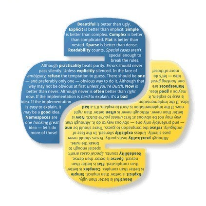

# 丢弃Tkinter，这款GUI神器值得拥有！

<a id="profileBt"></a><a id="js_name"></a>python数据分析之禅 *2021-12-10 13:02*

The following article is from Python技术 Author 派森酱

<a id="copyright_info"></a>[<br>**Python技术** .<br>Python 技术由一群热爱 Python 的技术人组建，专业输出高质量原创的 Python 系列文章，Python程序员都在这里。](#)


文 | 闲欢

来源：Python 技术「ID: pythonall」


GUI是一个人机交互的界面，换句话说，它是人类与计算机交互的一种方法。GUI主要使用窗口，图标和菜单，也可以通过鼠标和键盘进行操作。

GUI库包含部件。部件是一系列图形控制元素的集合。在构建GUI程序时，通常使用层叠方式。众多图形控制元素直接叠加起来。

当使用python编写应用程序时，你就必须使用GUI库来完成。对于Python GUI库，你可以有很多的选择。

之前我用的最多的是 Tkinter ，这个 GUI 库比较灵活，可以做出比较复杂的界面。但是在页面布局和控件使用上比较复杂，想画出一个好看的界面还是要花很多功夫的。

今天给大家介绍一个 GUI 库 —— Gooey ，一行代码就可以快速生成 GUI 应用程序。

### 安装

安装方法毫无新意，跟以前我们安装其他库一样：

> pip install Gooey

### 简单示例

```
`
from gooey import Gooey, GooeyParser
@Gooey(program_name="简单的实例")
def main():
    parser = GooeyParser(description="第一个示例!")
    parser.add_argument('文件路径', widget="FileChooser")      # 文件选择框
    parser.add_argument('日期', widget="DateChooser")          # 日期选择框
    args = parser.parse_args()                                 # 接收界面传递的参数
    print(args)
if   __name__ == '__main__':
    main()
`
```

这里看代码应该大致知道界面有些什么控件：文件选择框、日期选择框。

运行之后的效果如下：


非常的简洁大方有木有！绝对拿得出手！

### 组件

GUI 界面都是由一个个组件排列组成的，上面的例子中我们使用了 FileChooser 和 DateChooser 这两个组件，使用起来是不是很简单？我们来看看 Gooey 还有哪些组件。

```
| 控件名        | 控件类型    |
| --------   | -----:   |
| FileChooser      | 文件选择器 | 
| MultiFileChooser | 文件多选器| 
| DirChooser       | 目录选择器 |
| MultiDirChooser  | 目录多选器 |
| FileSaver        | 文件保存      |
| DateChooser        | 日期选择      |
| TextField        | 文本输入框      |
| Dropdown        | 下拉列表      |
| Counter        | 计数器      |
| CheckBox        | 复选框      |
| RadioGroup        | 单选框      |

```

这些组件基本上看名称就知道是什么样子的了，都是我们平时常用的页面组件。

### 配置

配置参数主要是对Gooey界面做全局配置，配置方法如下：

```
`@Gooey(program_name='全局配置Demo')
def main():
    ...
`
```

这里就使用了 program_name 这个配置，主要是配置显示程序的名称。

除此之外，Gooey 还有好多其他的配置参数：

| 参数  | 类型  | 简介  |
| --- | --- | --- |
| advanced | Boolean | 切换显示全部设置还是仅仅是简化版本 |
| show_config | Boolean | 跳过所有配置并立即运行程序 |
| language | str | 指定从 gooey/languages 目录读取哪个语言包 |
| program_name | str | GUI 窗口显示的程序名。默认会显 sys.argv\[0\]。 |
| program_description | str | Settings 窗口顶栏显示的描述性文字。默认值从 ArgumentParser 中获取。 |
| default_size | tuple | 窗口默认大小，(600,400) |
| required_cols | int | 设置必选参数行数。 |
| optional_cols | int | 设置可选参数行数。 |
| dump\_build\_config | Boolean | 将设置以 JSON 格式保存在硬盘中以供编辑/重用。 |
| richtext_controls | Boolean | 打开/关闭控制台对终端控制序列的支持（对字体粗细和颜色的有限支持） |

比如我们上面的例子中除了我们自己设置的，其他的控件例如选择按钮、确定按钮等默认都是英文的，我们可以通过 language 参数来设置语言。语言包在 Gooey 的 GitHub 源码中有：


我们使用语言配置：

```
`
from gooey import Gooey, GooeyParser
@Gooey(program_name="简单的实例", language='chinese')
def main():
    parser = GooeyParser(description="第一个示例!")
    parser.add_argument('文件路径', widget="FileChooser")      # 文件选择框
    parser.add_argument('日期', widget="DateChooser")          # 日期选择框
    args = parser.parse_args()                                 # 接收界面传递的参数
    print(args)
if   __name__ == '__main__':
    main()
`
```

这里加了一个 language 参数，我们看看运行后效果：


我们可以看到，界面上的文字都变成中文了。

### 结构布局

通过使用一些简单的自定义，您可以使用Gooey实现相当灵活的布局。我们可以通过Gooey装饰器的各种参数来控制总体布局选项。

- show_sidebar=True
    


- show_sidebar=False
    


- navigation='TABBED'
    


- tabbed_groups=True
    


### 实例

我们通过一个小栗子来看看运行的效果吧。

```
`
from gooey import Gooey, GooeyParser
@Gooey(
    richtext_controls=True,                 # 打开终端对颜色支持
    program_name="MQTT连接订阅小工具",        # 程序名称
    encoding="utf-8",                       # 设置编码格式，打包的时候遇到问题
    progress_regex=r"^progress: (\d+)%$"    # 正则，用于模式化运行时进度信息
)
def main():
    settings_msg = 'MQTT device activation information subscription'
    parser = GooeyParser(description=settings_msg)
    subs = parser.add_subparsers(help='commands', dest='command')
    my_parser = subs.add_parser('MQTT消息订阅')
    my_parser.add_argument("connect", metavar='运行环境',help="请选择开发环境",choices=['dev环境','staging环境'], default='dev环境')
    my_parser.add_argument("device_type",metavar='设备类型',help="请选择设备类型",choices=['H1','H3'],default='H1')
    my_parser.add_argument("serialNumber", metavar='设备SN号',default='LKVC19060047',help='多个请用逗号或空格隔开')
    siege_parser = subs.add_parser('进度条控制')
    siege_parser.add_argument('num',help='请输入数字',default=100)
    args = parser.parse_args()
    print(args, flush=True)    # flush=True在打包的时候会用到
if __name__ == '__main__':
    main()
`
```

这个例子运行的效果如下：


### 打包成应用程序

第一步，先安装我们的打包库：

> pip install pyinstaller

第二步，执行打包命令：

> pyinstaller -F gooeydemo.py -w

等待执行完成，我们就可以在代码目录下看到这样的结构：


我们的 exe 可执行文件就在 dist 文件夹下。

### 总结

今天给大家介绍了 Gooey 的一些简单使用，个人觉得比 Tkinter 要好用一些，应对一些简单的 GUI 界面，我们使用 Gooey 可以快速生成，而使用 Tkinter 的话，可能就需要耗费一些时间了。当然，Gooey 还有一些其他的特性，大家有兴趣可以去探索！

People who liked this content also liked

上海疫情究竟怎么样了？

python数据分析之禅

不看的原因

- 内容质量低
- 不看此公众号


Scan to Follow