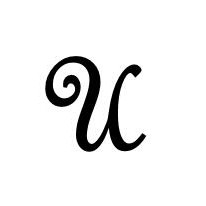

# 保姆级教程：用 Python 做游戏有多简单?

<a id="profileBt"></a><a id="js_name"></a>Python编程时光 *2022-05-23 09:02* *Posted on <a id="js_ip_wording"></a>福建*

The following article is from 未闻Code Author kingname

<a id="copyright_info"></a>[<br>**未闻Code** .<br>博主喜欢Python和爬虫，已经出了两本书。这里是他灵感的发源地。关注这个公众号，你的生产效率在三天内就会得到提高。P.S.: 这个公众号日更。](#)

我520的公众号图片发了以后，有很多同学问我这个游戏是怎么做的，难不难。我就用两篇文章来介绍一下，如果使用Python做游戏。


这个游戏是使用PyGame做的，贴图素材是从itch.io<sup>\[1\]</sup>找的。我之前也没有用过PyGame，这次属于是现学现用，参考的教程是PyGame: A Primer on Game Programming in Python<sup>\[2\]</sup>。

用PyGame做游戏非常简单，我们今天第一篇文章，让大家实现一个可以在地图上移动的小猪。

## 基本框架

首先，无论你是做什么游戏，别管三七二十一，先把下面这段代码复制粘贴到你的编辑器里面。所有游戏都需要这几行代码：

```
import pygame
def main():
    pygame.init()
    pygame.display.set_caption('未闻Code：青南做的游戏')  # 游戏标题
    win = pygame.display.set_mode((800, 600))  # 窗口尺寸，宽800高600
    running = True
    while running:
        for event in pygame.event.get():
            if event.type == pygame.QUIT:  # 点击左上角或者右上角的x关闭窗口时，停止程序
                running = False
main()

```

运行效果如下图所示：


## 加载素材

现在，我们随便找两张图片，一张作为背景，一张作为主角。尺寸不用太在意，差不多就可以了，因为我们可以用代码动态调整。下面两张图是我随便找的素材，大家注意图中红框框住的地方，是这两张图片的尺寸。


我们使用如下代码加载图片：

```
img_surf = pygame.image.load('图片地址').convert_alpha()

```

其中的`.convert_alpha()`是保留png图片的透明背景。如果你加载的图片不png图片，可以把`convert_alpha()`改成`convert()`。

如果要修改图片尺寸，使用如下代码：

```
img_surf = pygame.transform.scale(img_surf, (宽, 高))

```

要把图片显示在窗口中，使用下面两行代码：

```
win.blit(素材对象, (素材左上角的横坐标, 素材左上角的纵坐标))
pygame.display.flip()

```

完整的代码如下：

```
import pygame
def main():
    pygame.init()
    pygame.display.set_caption('未闻Code：青南做的游戏')  # 游戏标题
    win = pygame.display.set_mode((800, 600))  # 窗口尺寸
    bg_small = pygame.image.load('bg.png').convert_alpha()
    bg_big = pygame.transform.scale(bg_small, (800, 600))
    pig = pygame.image.load('pig_in_car.png').convert_alpha()
    running = True
    while running:
        for event in pygame.event.get():
            if event.type == pygame.QUIT:  # 点击左上角或者右上角的x关闭窗口时，停止程序
                running = False
        win.blit(bg_big, (0, 0))  # 背景图最先加载，坐标是(left, top)
        win.blit(pig, (200, 300))
        pygame.display.flip()
main()

```

运行效果如下图所示：


需要注意的是，`win.blit`和`pygame.display.flip()`都要放到while循环里面。其中`win.blit`的第一个参数是我们刚刚加载的素材对象。第二个参数是一个元组，标记这个图片左上角在画布上面的坐标。整个画布左上角对应坐标`(0, 0)`。由于背景图的尺寸也是`(800, 600)`，所以背景图的左上角放到`(0, 0)`，就刚好可以铺满整个画布。

## 哪里找素材？

我们做的是一个像素风格的游戏，可以到`itch.io`上面找素材：


这个网站提高了大量的游戏素材，并且绝大部分素材，在个人非商业用途的情况下是免费的。你找到自己喜欢的素材以后，就可以直接下载，整个过程你甚至都不需要登录（比国内的垃圾素材网站可良心多了）。

## 怎么我的素材长这样？

你下载了素材以后，可能会发现一件非常奇怪的事情，怎么素材全部画在一张图上？


实际上，这就是业界惯例，做素材的人会把每一类素材排列到一张图片上，你要用的时候，需要自己去裁剪。例如所有植物放在一张图上，所有雕像放在一张图上，地基贴图也放在一张图上。

上面我们演示用的背景图，初看起来是一张绿色的图，但是它实际上包含了多个地基元素，请注意我用红框框住的部分：


在正式游戏中，我们要把每一个基本元素拆出来，重新组合起来使用。重组的时候，有些元素要复制多份重复使用，有些元素要旋转缩放。最终组合成下面这样看起来`好看`的地图：


一般来说，像素风格的素材，尺寸大多是`16x16`，`32x32`，`64x64`，`128x128`。素材作者正常情况下会提供裁剪说明。如果没有提供的话，你也可以肉眼观察，然后猜一猜。

例如我要从雕像素材里面剪切出红框框住的女神像：


那么，我可以这样写代码：

```
img_surf = pygame.image.load('雕像素材.png').convert_alpha()
goddess= img_surf.subsurface(( 女神像左上角的横坐标 , 女神像左上角的纵坐标, 女神像的宽, 女神像的高))

```

运行效果如下图所示：


可能有同学问：为什么女神的坐标是这样的呢？我只能说，这个坐标是我试了很多次，试出来的。

## 使用小精灵来管理对象

除了背景图，我们添加的每一个元素都是一个对象，例如上面的小猪和女神像。原则上来讲，上面的代码就足够让你把游戏做得漂亮了，想加什么东西，就不停加载图片素材，然后放到合适的位置就可以了。

但我们可以使用面向对象的设计方法，让代码更容易维护，也更简单。PyGame里面，有一个类叫做`Sprite`，我们可以为每一个对象实现一个类，继承`Sprite`，然后把对象的素材设置成`.surf`属性，把对象的位置设置为`.rect`属性。例如上面的代码，我们修改一下：

```
import pygame
class Bg(pygame.sprite.Sprite):
    def __init__(self):
        super(Bg, self).__init__()
        bg_small = pygame.image.load('bg.png').convert_alpha()
        grass_land = bg_small.subsurface((0, 0, 128, 128))
        self.surf = pygame.transform.scale(grass_land, (800, 600))
        self.rect = self.surf.get_rect(left=0, top=0)  # 左上角定位
class Pig(pygame.sprite.Sprite):
    def __init__(self):
        super(Pig, self).__init__()
        self.surf = pygame.image.load('pig_in_car.png').convert_alpha()
        self.rect = self.surf.get_rect(center=(400, 300))  # 中心定位
class Goddess(pygame.sprite.Sprite):
    def __init__(self):
        super(Goddess, self).__init__()
        building = pygame.image.load('building.png').convert_alpha()
        self.surf = building.subsurface(((7 * 64 - 10, 0, 50, 100)))
        self.rect = self.surf.get_rect(center=(500, 430))  # 女神像的中心放到画布(500, 430)的位置
def main():
    pygame.init()
    pygame.display.set_caption('未闻Code：青南做的游戏')  # 游戏标题
    win = pygame.display.set_mode((800, 600))  # 窗口尺寸
    bg = Bg()
    goddess = Goddess()
    pig = Pig()
    all_sprites = [bg, goddess, pig]  # 注意添加顺序，后添加的对象图层在先添加的对象的图层上面
    running = True
    while running:
        for event in pygame.event.get():
            if event.type == pygame.QUIT:  # 点击左上角或者右上角的x关闭窗口时，停止程序
                running = False
        for sprite in all_sprites:
            win.blit(sprite.surf, sprite.rect)
        pygame.display.flip()
if __name__ == '__main__':
    main()

```

运行效果如下图所示：


注意代码中的`all_sprites = [bg, goddess, pig]`，这里我使用的是列表。后面会有更高级的数据结构`SpriteGroup`来储存他们。今天使用列表就足够了。

`素材对象.get_rect()`会返回一个坐标定位对象，这个对象有多个属性，例如`.left`, `.top`, `.center`, `.width`, `.height`。在不传参数的情况下，默认`.left=0`, `.top=0`，PyGame会自动根据这个对象的尺寸计算`.width`，`.height`和`.center`。我们可以通过传入参数的形式主动设定。当你设定左上角的时候，它自动就能算出中心点的坐标；当你传入中心坐标的时候，它自动就能算出左上角的坐标。

理论上来讲，在每个类里面，素材对象可以用任何名字，不一定要用`.surf`。坐标定位对象也不一定要用`.rect`，只要你在`win.blit`的时候对应起来就可以了。但是如果你统一使用`.surf`和`.rect`会给你带来很多好处。这一点我们到物体碰撞那个地方再讲。因此我建议你就使用这两个名字。

## 让小猪动起来

既然是游戏，那肯定要按键盘让主角动起来。否则跟一幅画有什么区别呢？大家注意`main()`函数里面的`while running`这个循环，如果你在循环里面加上一行代码：`print(111)`，你会发现当你运行这个游戏的时候，`111`会一直不停的打印出来。

PyGame本质上，就是通过`win.blit`不停地画图，由于这个`while`循环每秒要运行很多次，如果每次运行的时候，我们让`win.blit`的第二个参数，也就是素材对象的坐标有细微的差异，那么在人眼看起来，这个素材对象就在运动了。

我们的目标是按住键盘的上下左右方向键，小猪向4个不同的方向移动。在PyGame里面，获得键盘按住不放的键，使用如下代码实现：

```
keys = pygame.key.get_pressed()

```

它返回的是一个长得像列表的对象（但不是列表），当我们要判断某个键是否被按下的时候，只需要判断`if keys[想要判断的键]`，如果返回`True`，说明被按住了。基于这个原理，我们来写两段代码。首先修改`Pig`类，新增一个`.update`方法：

```
class Pig(pygame.sprite.Sprite):
    def __init__(self):
        super(Pig, self).__init__()
        self.surf = pygame.image.load('pig_in_car.png').convert_alpha()
        self.rect = self.surf.get_rect(center=(400, 300))  # 中心定位
    def update(self, keys):
        if keys[pygame.K_LEFT]:
            self.rect.move_ip((-5, 0))  # 横坐标向左
        elif keys[pygame.K_RIGHT]:
            self.rect.move_ip((5, 0))  # 横坐标向右
        elif keys[pygame.K_UP]:
            self.rect.move_ip((0, -5))  #纵坐标向上
        elif keys[pygame.K_DOWN]:
            self.rect.move_ip((0, 5))  # 纵坐标向下
        # 防止小猪跑到屏幕外面
        if self.rect.left < 0:
            self.rect.left = 0
        if self.rect.right > 800:
            self.rect.right = 800
        if self.rect.top < 0:
            self.rect.top = 0
        if self.rect.bottom > 600:
            self.rect.bottom = 600

```

`.update`方法接收一个参数`keys`，就是我们按键返回的长得像列表的对象。然后判断是哪个方向键被按下了。根据被按下的键，`.rect`坐标定位对象修改相应方向的值。`rect.move_ip`这里的`ip`是`inplace`的简写，也就是修改`.rect`这个属性自身。它的参数是一个元组，对应横坐标和纵坐标。横纵坐标小于0表示向左或者向上，大于0表示向右或者向下。

原来的`main()`函数只需要在`win.blit`之前增加两行代码：

```
keys = pygame.key.get_pressed()
pig.update(keys)

```

完整代码如下：

```
import pygame
class Bg(pygame.sprite.Sprite):
    def __init__(self):
        super(Bg, self).__init__()
        bg_small = pygame.image.load('bg.png').convert_alpha()
        grass_land = bg_small.subsurface((0, 0, 128, 128))
        self.surf = pygame.transform.scale(grass_land, (800, 600))
        self.rect = self.surf.get_rect(left=0, top=0)  # 左上角定位
class Pig(pygame.sprite.Sprite):
    def __init__(self):
        super(Pig, self).__init__()
        self.surf = pygame.image.load('pig_in_car.png').convert_alpha()
        self.rect = self.surf.get_rect(center=(400, 300))  # 中心定位
    def update(self, keys):
        if keys[pygame.K_LEFT]:
            self.rect.move_ip((-5, 0))
        elif keys[pygame.K_RIGHT]:
            self.rect.move_ip((5, 0))
        elif keys[pygame.K_UP]:
            self.rect.move_ip((0, -5))
        elif keys[pygame.K_DOWN]:
            self.rect.move_ip((0, 5))
        # 防止小猪跑到屏幕外面
        if self.rect.left < 0:
            self.rect.left = 0
        if self.rect.right > 800:
            self.rect.right = 800
        if self.rect.top < 0:
            self.rect.top = 0
        if self.rect.bottom > 600:
            self.rect.bottom = 600
class Goddess(pygame.sprite.Sprite):
    def __init__(self):
        super(Goddess, self).__init__()
        building = pygame.image.load('building.png').convert_alpha()
        self.surf = building.subsurface(((7 * 64 - 10, 0, 50, 100)))
        self.rect = self.surf.get_rect(center=(500, 430))  # 女神像的中心放到画布(500, 430)的位置
def main():
    pygame.init()
    pygame.display.set_caption('未闻Code：青南做的游戏')  # 游戏标题
    win = pygame.display.set_mode((800, 600))  # 窗口尺寸
    bg = Bg()
    goddess = Goddess()
    pig = Pig()
    all_sprites = [bg, goddess, pig]  # 注意添加顺序，后添加的对象图层在先添加的对象的图层上面
    running = True
    while running:
        for event in pygame.event.get():
            if event.type == pygame.QUIT:  # 点击左上角或者右上角的x关闭窗口时，停止程序
                running = False
        keys = pygame.key.get_pressed()
        pig.update(keys)
        for sprite in all_sprites:
            win.blit(sprite.surf, sprite.rect)
        pygame.display.flip()
if __name__ == '__main__':
    main()

```

最后的运行效果如下面这个视频所示：


## 总结

PyGame做游戏真的非常简单，只要会加载素材，就能做出一个还能看得过去的游戏。今天我们学会了怎么添加素材，怎么捕获键盘事件。

PyGame可以读取Gif图片，但是你会发现加载进来以后，Gif不会动。下一篇文章，我们来讲讲如何让你控制的角色动起来，例如控制一个小娃娃，移动的时候，它的脚也跟着动。以及对象的碰撞检测。

### 参考资料

\[1\]

itch.io: *https://itch.io/game-assets*

\[2\]

PyGame: A Primer on Game Programming in Python: *https://realpython.com/pygame-a-primer*


[](https://mp.weixin.qq.com/mp/appmsgalbum?__biz=MzkzMjMxMTg2NQ==&action=getalbum&album_id=2225391633284562944&scene=173&subscene=90&sessionid=1642653201&enterid=1642653281&from_msgid=2247483819&from_itemidx=1&count=3&nolastread=1#wechat_redirect)

[](http://mp.weixin.qq.com/s?__biz=MzIzMzMzOTI3Nw==&mid=2247505072&idx=1&sn=3605fcc95b6c0c7b0b9ec5dd15480231&chksm=e885b452dff23d44649944d41a190d55955a9f8ea6987e1ed73363c10bf3711528f4f8524e8a&scene=21#wechat_redirect)

[](http://mp.weixin.qq.com/s?__biz=MzIzMzMzOTI3Nw==&mid=2247505084&idx=1&sn=d3bc3a37cda2759c1a078ce9811fdec2&chksm=e885b45edff23d48744d42d9f6658cdddd2164af7042544815851a851dc710c70a1527a9b686&scene=21#wechat_redirect)

[](http://mp.weixin.qq.com/s?__biz=MzIzMzMzOTI3Nw==&mid=2247505065&idx=1&sn=a8b98840693b8d57bc5422da6d68a25d&chksm=e885b44bdff23d5d93cd686803d091d4b280c6f8a33afcf9e38c3f92746a1c222d1b40a8ad9a&scene=21#wechat_redirect)

People who liked this content also liked

一文学完Linux Shell编程（强烈建议收藏）

...

ITPUB技术小栈

不看的原因

- 内容质量低
- 不看此公众号

Python处理PDF神器：PyMuPDF的安装与使用

...

杰哥的IT之旅

不看的原因

- 内容质量低
- 不看此公众号

​Python实现常见的8个概率分布公式和可视化

...

Python大数据分析

不看的原因

- 内容质量低
- 不看此公众号


Scan to Follow