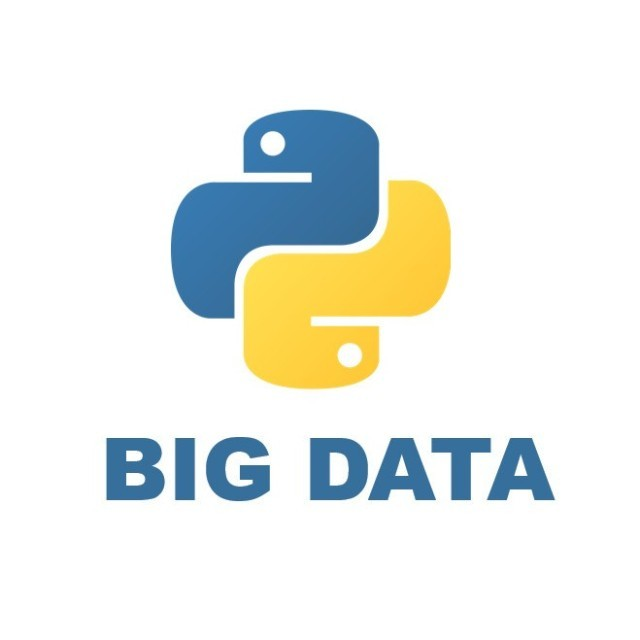

# 写Python需要养成的9个编程好习惯

Python程序员 *2022-04-22 08:30*

The following article is from Python大数据分析 Author 朱卫军

[ **Python大数据分析** . 分享python编程、可视化设计、大数据分析、机器学习等技术以及数据分析案例，包括但不限于pandas、numpy、spark、matplotlib、sklearn、tensorflow、keras、tableau等](#)

以写Python代码为例，有以下9个编程好习惯，整理供大家参考。

## 1\. 提前设计

写代码和写作文一样，需要有大纲，不然很容易变成"屎山"。

思考业务逻辑和代码流程，是动手前的准备工作，这上面可以花一半以上时间。

一些程序员洋洋洒洒写了几万行，删删改改，bug很多，误以为自己很忙。这都是思考不足的结果，导致时效很低。

提前设计也有方法可循。

比如通过draw.io、xwind等工具画流程图，想好每个模块实现什么功能，然后写伪代码提炼核心逻辑，把每一个测试节点安排好。

## 2\. 代码注释

代码注释相当于产品说明书，太重要了。

代码注释既是给自己看的，更是给别人看的。因为代码需要维护。

如果你的继任者没法理解你写的东西，那大概率是代码写的太烂了，或者注释写的太烂了。

写代码注释需要注意以下几点原则：

- 帮助别人理解你写代码的意图，而不是重复这段代码干了什么
    
- 文字表述要简洁清晰，如非必要，勿增实体
    
- 对实现代码块进行注释，而不是单行代码
    
- 对各种主要的数据结构、输出的函数、多个函数公用的变量进行详细地注释
    

Python代码注释规范：

Python使用文档字符串来注释，用三重双引号""" """

文档字符串是包, 模块, 类或函数里的第一个语句. 这些字符串可以通过对象的\_\_doc\_\_成员被自动提取, 并且被pydoc所用

当然如果你足够优秀，也可以让代码自己解释自己。

> ❝
> 
> 代码的注释不是越详细越好。实际上好的代码本身就是注释，我们要尽量规范和美化自己的代码来减少不必要的注释。若编程语言足够有表达力，就不需要注释，尽量通过代码来阐述。
> 
> ❞

## 3\. 规范命名

命名是程序员最头疼的一件事，很多代码就是命名不规范导致阅读性极差。

之前有过一个调查问卷，评选“程序员最头疼的事情”，命名问题赫然名列第一，占比达到49%

变量名、函数名、类名等名称需要遵循”所见即所得“的原则，就是名称要能代表该变量、函数、类的含义，让人一目了然。

要想代码足够有表达力，良好且一致性的命名规范是必不可少的。

Python命名规范需要注意以下几点：

- 模块命名
    

（1）模块推荐使用小写命名，

（2）除非有很多字母，尽量不要用下划线

因为很多模块文件存与模块名称一致的类，模块采用小写，类采用首字母大写，这样就能区分开模块和类。

- 类命名
    

（1）类名使用驼峰(CamelCase)命名风格，首字母大写；

（2）私有类可用一个下划线开头。

- 函数命名
    

（1）函数名一律小写，如有多个单词，用下划线隔开

（2）类内部函数命名，用单下划线(_)开头（该函数可被继承访问）

- 变量命令
    

（1）变量名推荐小写，如有多个单词，用下划线隔开

（2）类内部变量命名，用单下划线(_)开头（该变量可被继承访问）

（3）类内私有变量命名，用双下划线(__)开头（该变量不可被继承访问）

- 常量
    

常量名所有字母大写，由下划线连接各个单词如MAX_OVERFLOW，TOTAL

- 文件名
    

全小写,可使用下划线

## 4\. 保持代码美观

Python强制缩进，所以代码整洁度上有保障，但我们也要注意细节。

《代码整洁之道》里面说，整洁的代码是只做好一件事，这里尤其指函数。

Python之禅可以很好地解释什么是美观地代码。

> ❝
> 
> 优美胜于丑陋（Python 以编写优美的代码为目标） 
> 
> 明了胜于晦涩（优美的代码应当是明了的，命名规范，风格相似） 简洁胜于复杂（优美的代码应当是简洁的，不要有复杂的内部实现） 
> 
> 复杂胜于凌乱（如果复杂不可避免，那代码间也不能有难懂的关系，要保持接口简洁） 
> 
> 扁平胜于嵌套（优美的代码应当是扁平的，不能有太多的嵌套） 间隔胜于紧凑（优美的代码有适当的间隔，不要奢望一行代码解决问题） 
> 
> 可读性很重要（优美的代码是可读的） 
> 
> 即便假借特例的实用性之名，也不可违背这些规则（这些规则至高无上） 
> 
> 不要包容所有错误，除非你确定需要这样做（精准地捕获异常，不写 except:pass 风格的代码） 
> 
> 当存在多种可能，不要尝试去猜测 而是尽量找一种，最好是唯一一种明显的解决方案（如果不确定，就用穷举法） 
> 
> 虽然这并不容易，因为你不是 Python 之父（这里的 Dutch 是指 Guido ） 
> 
> 做也许好过不做，但不假思索就动手还不如不做（动手之前要细思量）
> 
> 如果你无法向人描述你的方案，那肯定不是一个好方案；反之亦然（方案测评标准） 
> 
> 命名空间是一种绝妙的理念，我们应当多加利用（倡导与号召）
> 
> ❞

## 5\. 完善的README

如果你使用过github，一定对README不陌生，它相当于一份项目说明书，帮助你理解该项目。

README作用主要有告诉人们为什么应该使用你的项目，以及如何安装和使用，一份标准化的README可以简化它的创建和维护，所以README值得你花时间去创建。

写好 README 之后，随着项目的演进及时更新它，不会花太多时间，但能让你随时都对项目有个整体的把握。绝对值得一试。

## 6\. 模块化

模块化就是将繁杂冗长的代码按照一定的规则规范分成多个块（可以是面向对象的方式）或者文件，然后再进行组合实现想要的功能和结果。

模块化可以在多个项目里复用代码，而不需要重新写，就像造车模块化一样，底盘一样、电气系统一样，只要改改外观、内饰，就可以造多个车型。

Python提供了强大的模块支持，主要体现在，不仅 Python 标准库中包含了大量的模块（称为标准模块），还有大量的第三方模块，开发者自己也可以开发自定义模块。通过这些强大的模块可以极大地提高开发者的开发效率。

## 7\. 版本控制

随着参与项目的人不断增加，或因一时的大意造成了巨大的错误，并需要回到以前的版本。现在如果您的错误涉及到多个代码文件，其中有些文件被修改了多天甚至几个月前的。版本控制系统尤为重要。

在几个版本控制软件中，Git是最受欢迎的，有大量的在线帮助文档。使用Git，您可以根据需要保留尽可能多的修订版本，分支出一些代码实验的文件，跟踪上次更改的代码部分，并随时返回到他们。

## 8\. 注意备份

备份不用多说了，防止突发情况，这个很重要！

## 9\. 多看官方文档

不管用什么语言编程，官方文档永远是学习最好的选择，最新最详细的代码说明都在官方文档里。

Python也是这样，虽然市场上的教程多如牛毛，但官方文档必须要看的。

现在既有英文也有中文版，非常方便。

https://docs.python.org/zh-cn/3/

注：文中部分内容来源网络

People who liked this content also liked

使用图片隐写的Python远控恶意样本分析

...

ChaMd5安全团队

不看的原因

- 内容质量低
- 不看此公众号

PythonOS模块的常用命令详解

...

51Testing软件测试网

不看的原因

- 内容质量低
- 不看此公众号

C++库文件和头文件编写教程

...

小白学视觉

不看的原因

- 内容质量低
- 不看此公众号

Scan to Follow