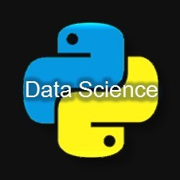

# 基于 Python 的 8 种常用抽样方法

<a id="profileBt"></a><a id="js_name"></a>Python数据之道 *2022-01-26 11:01*

The following article is from Python数据科学 Author 东哥起飞

<a id="copyright_info"></a>[<br>**Python数据科学** .<br>以Python为核心语言，专攻于「数据科学」领域，文章涵盖数据分析，数据挖掘，机器学习等干货内容，分享大量数据挖掘实战项目分析和讲解，以及海量的学习资源。](#)


**Python数据之道**

点击领取《Python知识手册》高清电子版，回复数字 “600” 获取。「Python数据之道」秉承“让数据更有价值”的理念​，聚焦于 Python 数据分析、数据可视化、AI、机器学习、深度学习等领域。

<a id="js_profile_article"></a>235篇原创内容

Official Account

今天来和大家聊聊**抽样**的几种常用方法，以及在`Python`中是如何实现的。

**抽样**是统计学、机器学习中非常重要，也是经常用到的方法，因为大多时候使用全量数据是不现实的，或者根本无法取到。所以我们需要抽样，比如在推断性统计中，我们会经常通过采样的样本数据来推断估计总体的样本。

上面所说的都是以概率为基础的，实际上还有一类非概率的抽样方法，因此总体上归纳为两大种类：

1.  **概率抽样**：根据概率理论选择样本，每个样本有相同的概率被选中。
    
2.  **非概率抽样**：根据非随机的标准选择样本，并不是每个样本都有机会被选中。
    

## 概率抽样技术

### 1.随机抽样(Random Sampling)

这也是最简单暴力的一种抽样了，就是直接随机抽取，不考虑任何因素，完全看概率。并且在随机抽样下，总体中的每条样本被选中的概率相等。


比如，现有10000条样本，且各自有序号对应的，假如抽样数量为1000，那我就直接从1-10000的数字中随机抽取1000个，被选中序号所对应的样本就被选出来了。

在`Python`中，我们可以用`random`函数随机生成数字。下面就是从100个人中随机选出5个。

```
import random
population = 100
data = range(population)
print(random.sample(data,5))
> 4, 19, 82, 45, 41

```

### 2.分层抽样(Stratified Sampling)

分层抽样其实也是随机抽取，不过要加上一个前提条件了。在分层抽样下，会根据一些共同属性将带抽样样本分组，然后从这些分组中单独再随机抽样。


**因此，可以说分层抽样是更精细化的随机抽样，它要保持与总体群体中相同的比例。** 比如，机器学习分类标签中的类标签0和1，比例为3:7，为保持原有比例，那就可以分层抽样，按照每个分组单独随机抽样。

`Python`中我们通过`train_test_split`设置`stratify`参数即可完成分层操作。

```
from sklearn.model_selection import train_test_split
stratified_sample, _ = train_test_split(population, test_size=0.9, stratify=population[['label']])
print (stratified_sample)

```

### 3.聚类抽样(Cluster Sampling)

聚类抽样，也叫整群抽样。它的意思是，先将整个总体划分为多个子群体，这些子群体中的每一个都具有与总体相似的特征。也就是说它不对个体进行抽样，而是随机选择整个子群体。


用`Python`可以先给聚类的群体分配聚类ID，然后随机抽取两个子群体，再找到相对应的样本值即可，如下。

```
import numpy as np
clusters=5
pop_size = 100
sample_clusters=2
# 间隔为 20, 从 1 到 5 依次分配集群100个样本的聚类 ID，这一步已经假设聚类完成
cluster_ids = np.repeat([range(1,clusters+1)], pop_size/clusters)
# 随机选出两个聚类的 ID
cluster_to_select = random.sample(set(cluster_ids), sample_clusters)
# 提取聚类 ID 对应的样本
indexes = [i for i, x in enumerate(cluster_ids) if x in cluster_to_select]
# 提取样本序号对应的样本值
cluster_associated_elements = [el for idx, el in enumerate(range(1, 101)) if idx in indexes]
print (cluster_associated_elements)

```

### 4.系统抽样(Systematic Sampling)

系统抽样是以**预定的规则间隔**（基本上是固定的和周期性的间隔）从总体中抽样。比如，每 9 个元素抽取一下。一般来说，这种抽样方法往往比普通随机抽样方法更有效。

下图是按顺序对每 9 个元素进行一次采样，然后重复下去。


用`Python`实现的话可以直接在循环体中设置`step`即可。

```
population = 100
step = 5
sample = [element for element in range(1, population, step)]
print (sample)

```

### 5.多级采样(Multistage sampling)

在多阶段采样下，我们将多个采样方法一个接一个地连接在一起。比如，在第一阶段，可以使用聚类抽样从总体中选择集群，然后第二阶段再进行随机抽样，从每个集群中选择元素以形成最终集合。


`Python`代码复用了上面聚类抽样，只是在最后一步再进行随机抽样即可。

```
import numpy as np
clusters=5
pop_size = 100
sample_clusters=2
sample_size=5
# 间隔为 20, 从 1 到 5 依次分配集群100个样本的聚类 ID，这一步已经假设聚类完成
cluster_ids = np.repeat([range(1,clusters+1)], pop_size/clusters)
# 随机选出两个聚类的 ID
cluster_to_select = random.sample(set(cluster_ids), sample_clusters)
# 提取聚类 ID 对应的样本
indexes = [i for i, x in enumerate(cluster_ids) if x in cluster_to_select]
# 提取样本序号对应的样本值
cluster_associated_elements = [el for idx, el in enumerate(range(1, 101)) if idx in indexes]
# 再从聚类样本里随机抽取样本
print (random.sample(cluster_associated_elements, sample_size))

```

## 非概率抽样技术

非概率抽样，毫无疑问就是不考虑概率的方式了，很多情况下是有条件的选择。因此，对于无随机性我们是无法通过统计概率和编程来实现的。这里也介绍3种方法。

### 1.简单采样(convenience sampling)

简单采样，其实就是研究人员只选择最容易参与和最有机会参与研究的个体。比如下面的图中，蓝点是研究人员，橙色点则是蓝色点附近最容易接近的人群。


### 2.自愿抽样(Voluntary Sampling)

自愿抽样下，感兴趣的人通常通过填写某种调查表格形式自行参与的。所以，这种情况中，调查的研究人员是没有权利选择任何个体的，全凭群体的自愿报名。比如下图中蓝点是研究人员，橙色的是自愿同意参与研究的个体。


### 3.雪球抽样(Snowball Sampling)

雪球抽样是说，最终集合是通过其他参与者选择的，即研究人员要求其他已知联系人寻找愿意参与研究的人。比如下图中蓝点是研究人员，橙色的是已知联系人，黄色是是橙色点周围的其它联系人。

## 总结

以上就是8种常用抽样方法，平时工作中比较常用的还是概率类抽样方法，因为没有随机性我们是无法通过统计学和编程完成自动化操作的。

比如在信贷的风控样本设计时，就需要从样本窗口通过概率进行抽样。因为采样的质量基本就决定了你模型的上限了，所以在抽样时会考虑很多问题，如样本数量、是否有显著性、样本穿越等等。在这时，一个良好的抽样方法是至关重要的。

参考：

\[2\] https://towardsdatascience.com/8-types-of-sampling-techniques-b21adcdd2124

**\-\-\-\-\-\-\-\- End --------**


#### 精选资料

回复关键词，获取对应的资料：

| 关键词 | 资料名称 |
| --- | --- |
| **600** | [《Python知识手册》](https://mp.weixin.qq.com/mp/appmsgalbum?__biz=MzI2NjY5NzI0NA==&action=getalbum&album_id=1370549534602133504#wechat_redirect) |
| **md** | [《Markdown速查表》](https://mp.weixin.qq.com/s?__biz=MzI2NjY5NzI0NA==&mid=2247495631&idx=1&sn=720c931b1f5cdb82ceccd9b34b182a95&scene=21#wechat_redirect) |
| **time** | [《Python时间使用指南》](https://mp.weixin.qq.com/s?__biz=MzI2NjY5NzI0NA==&mid=2247492370&idx=1&sn=1dc6b3edef0fcb241d07757fb9e2ae03&scene=21#wechat_redirect) |
| **str** | [《Python字符串速查表》](https://mp.weixin.qq.com/s?__biz=MzI2NjY5NzI0NA==&mid=2247496716&idx=1&sn=8ec7a6b373059fa49f04433990581aa6&scene=21#wechat_redirect) |
| **pip** | [《Python：Pip速查表》](https://mp.weixin.qq.com/s?__biz=MzI2NjY5NzI0NA==&mid=2247500405&idx=1&sn=c5a760279babd1075c6153858af84af8&scene=21#wechat_redirect) |
| **style** | [《Pandas表格样式配置指南》](https://mp.weixin.qq.com/s?__biz=MzI2NjY5NzI0NA==&mid=2247501026&idx=1&sn=378292e5435b7ef5eede36192812da3b&scene=21#wechat_redirect) |
| **mat** | [《Matplotlib入门100个案例》](https://mp.weixin.qq.com/s?__biz=MzI2NjY5NzI0NA==&mid=2247493274&idx=1&sn=323662b49f3b8e0d619d44315537a76a&scene=21#wechat_redirect) |
| **px** | [《Plotly Express可视化指南》](https://mp.weixin.qq.com/s?__biz=MzI2NjY5NzI0NA==&mid=2247501349&idx=1&sn=04502491758816e83d43525e911cce56&scene=21#wechat_redirect) |

#### 精选内容

**数据科学：** [VS Code 中 Python配置使用指南](https://mp.weixin.qq.com/s?__biz=MzI2NjY5NzI0NA==&mid=2247495918&idx=1&sn=6b06eadc1604b693f48a127e7b5986a4&scene=21#wechat_redirect) | [财经工具 Tushare](https://mp.weixin.qq.com/s?__biz=MzI2NjY5NzI0NA==&mid=2247497358&idx=1&sn=e9574b69ca3c05142edd534e438e855e&scene=21#wechat_redirect) | [Matplotlib 最有价值的 50 个图表](https://mp.weixin.qq.com/s?__biz=MzI2NjY5NzI0NA==&mid=2247485238&idx=1&sn=f2d6b9136ff94697bdce9c9f48397e78&scene=21#wechat_redirect)

**书籍阅读：** [如何阅读一本书](https://mp.weixin.qq.com/s?__biz=MzU3OTA1MTUwOA==&mid=2247484765&idx=1&sn=0d3a39a00797b8710af2ea175bb20566&scene=21#wechat_redirect) | [巴菲特之道](https://mp.weixin.qq.com/s?__biz=MzU3OTA1MTUwOA==&mid=2247483880&idx=1&sn=a28b5ef681e81a54b5281242e7e2ad2f&scene=21#wechat_redirect) | [价值](https://mp.weixin.qq.com/s?__biz=MzU3OTA1MTUwOA==&mid=2247484963&idx=1&sn=341e105747bb1642e3bc89b74d69e98e&scene=21#wechat_redirect) | [原则](https://mp.weixin.qq.com/s?__biz=MzU3OTA1MTUwOA==&mid=2247485540&idx=1&sn=ce0d2dc7a87a5695d388e8ff7d4405b9&scene=21#wechat_redirect) | [投资最重要的事](https://mp.weixin.qq.com/s?__biz=MzU3OTA1MTUwOA==&mid=2247485096&idx=1&sn=a73862a6b3fc166916d0c71b8d16bfac&scene=21#wechat_redirect) | [戴维斯王朝](https://mp.weixin.qq.com/s?__biz=MzU3OTA1MTUwOA==&mid=2247485191&idx=1&sn=a8f45215977c2f1e1776fa396b105fbf&scene=21#wechat_redirect) | [客户的游艇在哪里](https://mp.weixin.qq.com/s?__biz=MzU3OTA1MTUwOA==&mid=2247485799&idx=1&sn=6197a65ac44c5d8001f61dd75d8419c8&scene=21#wechat_redirect) | [刻意练习](https://mp.weixin.qq.com/s?__biz=MzU3OTA1MTUwOA==&mid=2247485688&idx=1&sn=ae808f8999cc40dcab5c551be673b56b&scene=21#wechat_redirect) | [林肯传](https://mp.weixin.qq.com/s?__biz=MzU3OTA1MTUwOA==&mid=2247485857&idx=1&sn=d2149626b4b3d2fd5a8fab31acff2002&scene=21#wechat_redirect) | [金字塔原理](https://mp.weixin.qq.com/s?__biz=MzU3OTA1MTUwOA==&mid=2247484887&idx=1&sn=e8404120ca4c7800214d8bcf3971eb3d&scene=21#wechat_redirect)

**投资小结：** [2021Q4](https://mp.weixin.qq.com/s?__biz=MzU3OTA1MTUwOA==&mid=2247487417&idx=1&sn=a45d93aec5a3b91413f8a9d6b6a8decb&scene=21#wechat_redirect) | [2021Q3](https://mp.weixin.qq.com/s?__biz=MzU3OTA1MTUwOA==&mid=2247487065&idx=1&sn=8766ac15616c871c0ba23cada09aa47b&scene=21#wechat_redirect) | [2021Q2](https://mp.weixin.qq.com/s?__biz=MzU3OTA1MTUwOA==&mid=2247486390&idx=1&sn=91c3cad42676f67d96e94f9b2f205d9e&scene=21#wechat_redirect) | [2021Q1](https://mp.weixin.qq.com/s?__biz=MzU3OTA1MTUwOA==&mid=2247485738&idx=1&sn=5a5636423731174cde98902af2e47d7f&scene=21#wechat_redirect) | [2020Q4](https://mp.weixin.qq.com/s?__biz=MzU3OTA1MTUwOA==&mid=2247485416&idx=1&sn=0cf825834c4f86a81ba87abf300416a7&scene=21#wechat_redirect)

#### 精选视频

**可视化：** [Plotly Express](https://mp.weixin.qq.com/s?__biz=MzI2NjY5NzI0NA==&mid=2247501395&idx=2&sn=9306078c98e6a2efc6e478a5921f5276&scene=21#wechat_redirect)

**财经：** [Plotly在投资领域的应用](https://mp.weixin.qq.com/s?__biz=MzI2NjY5NzI0NA==&mid=2247496637&idx=1&sn=91910ea5f9034fc6685d28ef0f00a70c&scene=21#wechat_redirect) | [绘制K线图表](https://mp.weixin.qq.com/s?__biz=MzI2NjY5NzI0NA==&mid=2247497147&idx=3&sn=9e788955d2268e1ba3f9f8c85ec4ece2&scene=21#wechat_redirect)

**排序算法：** [汇总](https://mp.weixin.qq.com/s?__biz=MzI2NjY5NzI0NA==&mid=2247505089&idx=1&sn=71021ec9da57933b41b64174f3d904c2&scene=21#wechat_redirect) | [冒泡排序](https://mp.weixin.qq.com/s?__biz=MzI2NjY5NzI0NA==&mid=2247504041&idx=2&sn=8dc4e755344edda2fdbb1f4922fa013b&scene=21#wechat_redirect) | [选择排序](https://mp.weixin.qq.com/s?__biz=MzI2NjY5NzI0NA==&mid=2247504041&idx=3&sn=b9aeb552253f6c5e8efe635bbcaead1b&scene=21#wechat_redirect) | [快速排序](https://mp.weixin.qq.com/s?__biz=MzI2NjY5NzI0NA==&mid=2247504041&idx=4&sn=22a3d67b3cec0269060502c13fabae35&scene=21#wechat_redirect) | [归并排序](https://mp.weixin.qq.com/s?__biz=MzI2NjY5NzI0NA==&mid=2247504041&idx=5&sn=90feeb44a998a57dbdabb9e1823bb051&scene=21#wechat_redirect) | [堆排序](https://mp.weixin.qq.com/s?__biz=MzI2NjY5NzI0NA==&mid=2247504041&idx=6&sn=5e8421ee83aa301b37f7f25d7ba6388f&scene=21#wechat_redirect) | [插入排序](https://mp.weixin.qq.com/s?__biz=MzI2NjY5NzI0NA==&mid=2247504041&idx=7&sn=1889203106bce18adc50ff151399e6fc&scene=21#wechat_redirect) | [希尔排序](https://mp.weixin.qq.com/s?__biz=MzI2NjY5NzI0NA==&mid=2247504041&idx=8&sn=d1eccecfbb6f37e34b2eaf3d8908248b&scene=21#wechat_redirect) | [计数排序](https://mp.weixin.qq.com/s?__biz=MzI2NjY5NzI0NA==&mid=2247504165&idx=3&sn=0d79c516472fcfa73ebe97fdf1c13004&scene=21#wechat_redirect) | [桶排序](https://mp.weixin.qq.com/s?__biz=MzI2NjY5NzI0NA==&mid=2247504461&idx=3&sn=78afcc98eef1bc38060b701af6ac3822&scene=21#wechat_redirect) | [基数排序](https://mp.weixin.qq.com/s?__biz=MzI2NjY5NzI0NA==&mid=2247505087&idx=5&sn=52b1af66f7a48de7ab7d61e769b81f82&scene=21#wechat_redirect)


People who liked this content also liked

Python 一个快速视频剪辑编辑神器 — Moviepy

Python实用宝典

不看的原因

- 内容质量低
- 不看此公众号

C函数指针别再停留在语法，得上升到软件设计~

嵌入式资讯精选

不看的原因

- 内容质量低
- 不看此公众号

如何用Python获取接口响应时间?elapsed方法来帮你！

清菡软件测试

不看的原因

- 内容质量低
- 不看此公众号


Scan to Follow