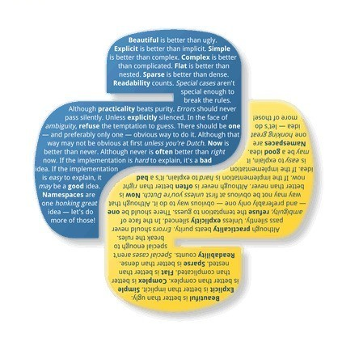

# 如何用 Python 捕获、播放和保存摄像头视频

<a id="profileBt"></a><a id="js_name"></a>Python编程时光 *2022-05-01 19:02* *Posted on <a id="js_ip_wording"></a>福建*

The following article is from Python技术 Author 派森酱

<a id="copyright_info"></a>[<br>**Python技术** .<br>Python 技术由一群热爱 Python 的技术人组建，专业输出高质量原创的 Python 系列文章，Python程序员都在这里。](#)

前几天有个读者在粉丝群里面提了一个问题：

> Python 怎样提高视频清晰度和对比度？

我之前没有涉及到使用 Python 操作视频这一方面，所以当时很抱歉地跟读者朋友说暂未涉及。

这两天想了下，感觉应该补一下这一块的内容，一方面是增加自己涉猎的广度，另一方面也可以给粉丝答疑解惑。

今天先分享一下 Python 操作视频最基本的操作，包括读取和播放视频和保存视频。

### 读取视频

要捕获视频，你需要创建一个 VideoCapture 对象。它的参数可以是设备索引或视频文件的名称。所以，我们读取视频有两种方式，分别是从相机中读取视频和从文件中读取视频。

#### 从相机中读取视频

对于有摄像头的设备，例如带摄像头的笔记本电脑，我们可以直接调起电脑的摄像头，读取摄像头的视频流。

```
`import cv2 as cv
cap = cv.VideoCapture(0)
if not cap.isOpened():
    print("Cannot open camera")
    exit()
while True:
    # 逐帧捕获
    ret, frame = cap.read()
    # 如果正确读取帧，ret为True
    if not ret:
        break
    # 显示结果帧
    cv.imshow('frame', frame)
    if cv.waitKey(1) == ord('q'):
        break
# 完成所有操作后，释放捕获器
cap.release()
cv.destroyAllWindows()
`
```

这里我向 `VideoCapture` 对象传入了参数 `0`，表示设备索引，设备索引就是指定哪个摄像头的数字。正常情况下，一个摄像头会被连接(就像我的情况一样)。所以我简单地传0。你可以通过传递1来选择第二个相机，以此类推。

`cap.isOpened()` 用来判断是否捕获到视频。

`cap.read()` 返回布尔值(True/ False)。如果正确读取了帧，它将为True。因此，你可以通过检查此返回值来检查视频的结尾。

`cv.imshow` 方法用来显示视频的帧。我们播放视频的原理就是逐帧播放。

在最后，不要忘记通过 `cap.release()` 释放俘虏。

运行这段代码，你就可以看到一个弹窗实时地播放你电脑摄像头中的图像了。

#### 从文件中播放视频

与从相机捕获相同，只是用视频文件名更改摄像机索引。

另外，在显示视频时，可以通过 `cv.waitKey()` 来控制视频播放的速度。如果设置太小，则视频将非常快，相当于倍速播放；而如果太大，则视频将变得很慢，相当于延迟播放。正常情况下25毫秒就可以了。

```
`import cv2 as cv
cap = cv.VideoCapture('video.mp4')
while cap.isOpened():
    ret, frame = cap.read()
    # 如果正确读取帧，ret为True
    if not ret:
        break
    cv.imshow('frame', frame)
    if cv.waitKey(1) == ord('q'):
        break
cap.release()
cv.destroyAllWindows()
`
```

运行这段代码，你就可以看到一个弹窗播放你选择的视频文件了。

### 保存视频

从相机读取视频，我们可以将视频保存到本地。我们捕捉一个视频，一帧一帧地处理，如果我们想要保存这个视频，非常简单，只需使用 `cv.VideoWriter()`。

`cv.VideoWriter()` 有5个参数：

- 参数1：输出文件名，例如: output.mp4。
    
- 参数2：FourCC 代码，FourCC 是用于指定视频编解码器的4字节代码。
    
- 参数3：帧率的数量。
    
- 参数4：帧大小。
    
- 参数5：颜色标志。如果为 True，正常颜色输出，否则就是灰色图像输出。
    

关于 `FourCC` 与视频格式的对照关系，我列举了一些常见的格式：

> cv2.VideoWriter\_fourcc(‘P’,‘I’,‘M’,‘1’) = MPEG-1 codec cv2.VideoWriter\_fourcc(‘M’,‘J’,‘P’,‘G’) = motion-jpeg codec --> mp4v cv2.VideoWriter\_fourcc(‘M’, ‘P’, ‘4’, ‘2’) = MPEG-4.2 codec cv2.VideoWriter\_fourcc(‘D’, ‘I’, ‘V’, ‘3’) = MPEG-4.3 codec cv2.VideoWriter\_fourcc(‘D’, ‘I’, ‘V’, ‘X’) = MPEG-4 codec --> avi cv2.VideoWriter\_fourcc(‘U’, ‘2’, ‘6’, ‘3’) = H263 codec cv2.VideoWriter\_fourcc(‘I’, ‘2’, ‘6’, ‘3’) = H263I codec cv2.VideoWriter\_fourcc(‘F’, ‘L’, ‘V’, ‘1’) = FLV1 codec

保存视频的代码：

```
`import cv2 as cv
cap = cv.VideoCapture(0)
# 定义编解码器并创建VideoWriter对象
fourcc = cv.VideoWriter_fourcc(*'MJPG')
out = cv.VideoWriter('output.mp4', fourcc, 20.0, (640,  480))
while cap.isOpened():
    ret, frame = cap.read()
    if not ret:
        break
    frame = cv.flip(frame, 1)
    # 写翻转的框架
    out.write(frame)
    cv.imshow('frame', frame)
    if cv.waitKey(1) == ord('q'):
        break
# 完成工作后释放所有内容
cap.release()
out.release()
cv.destroyAllWindows()
`
```

运行这段代码，你就可以在代码目录下找到一个 `output.mp4` 的视频文件了。

上面几段代码中，如果想要退出视频操作，敲击键盘的 `q` 就可以。

### 总结

以上就是今天要介绍的内容了，使用 python-opencv 来操作视频还是比较简单的。当然，你也可以在读取或者保存视频时对视频进行一些处理，这个我们后续再发文介绍。


[](https://mp.weixin.qq.com/mp/appmsgalbum?__biz=MzkzMjMxMTg2NQ==&action=getalbum&album_id=2225391633284562944&scene=173&subscene=90&sessionid=1642653201&enterid=1642653281&from_msgid=2247483819&from_itemidx=1&count=3&nolastread=1#wechat_redirect)

[](http://mp.weixin.qq.com/s?__biz=MzIzMzMzOTI3Nw==&mid=2247505072&idx=1&sn=3605fcc95b6c0c7b0b9ec5dd15480231&chksm=e885b452dff23d44649944d41a190d55955a9f8ea6987e1ed73363c10bf3711528f4f8524e8a&scene=21#wechat_redirect)

[](http://mp.weixin.qq.com/s?__biz=MzIzMzMzOTI3Nw==&mid=2247505084&idx=1&sn=d3bc3a37cda2759c1a078ce9811fdec2&chksm=e885b45edff23d48744d42d9f6658cdddd2164af7042544815851a851dc710c70a1527a9b686&scene=21#wechat_redirect)

[](http://mp.weixin.qq.com/s?__biz=MzIzMzMzOTI3Nw==&mid=2247505065&idx=1&sn=a8b98840693b8d57bc5422da6d68a25d&chksm=e885b44bdff23d5d93cd686803d091d4b280c6f8a33afcf9e38c3f92746a1c222d1b40a8ad9a&scene=21#wechat_redirect)

People who liked this content also liked

保姆级教程：用 Python 做游戏有多简单?

...

Python编程时光

不看的原因

- 内容质量低
- 不看此公众号

分享10个超级实用事半功倍的Python自动化脚本

...

简说Python

不看的原因

- 内容质量低
- 不看此公众号

故障分析 | 手动 rm 掉 binlog 导致主从报错

...

爱可生开源社区

不看的原因

- 内容质量低
- 不看此公众号


Scan to Follow