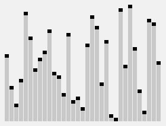

# 最全Python入门算法来了，GitHub超6.8万星

<a id="profileBt"></a><a id="js_name"></a>Python编程大全 *2022-01-25 17:30*

点击下方名片关注和星标『**Python编程大全**』！


**Python编程大全**

分享Python技术文章，实用案例，热点资讯。 你想了解的Python的那些事都在这里...... 当你的才华还撑不起你的野心的时候，那就安静下来学习吧！

<a id="js_profile_article"></a>6篇原创内容

Official Account

##### **【导读】**Github上超过6.8万星标：最全算法及Python实现。该项目的算法包括排序、搜索等经典算法，描述较为详细，对算法原理本身、应用场景以及实现过程的可视化等。

我们讨论机器学习的时候，其实很多时候都是在讨论算法。今天向大家推荐一个好资源，用Python实现所有算法。该项目在Github上已经获得了超过6.8万星标，可以说非常受欢迎了。

该项目主要包括两方面内容：算法的基本原理讲解，以及Python代码实现，并给出了算法实现过程的动图，非常直观易懂。

项目地址：

https://github.com/TheAlgorithms/Python

排序算法介绍及代码实现

**冒泡算法**


冒泡排序，有时也称为下沉排序，是一种简单的排序算法，它反复遍历要排序的列表，比较每对相邻的项目，如果它们的顺序错误则交换它们。重复传递列表，直到不需要交换，这表明列表已排序。

代码实现：

https://www.toptal.com/developers/sorting-algorithms/bubble-sort

**桶排序算法**


桶排序（Bucket sort）或所谓的箱排序，是一个排序算法，工作的原理是将数组分到有限数量的桶里。每个桶再个别排序（有可能再使用别的排序算法或是以递归方式继续使用桶排序进行排序）。桶排序是鸽巢排序的一种归纳结果。

**鸡尾酒排序算法**


鸡尾酒排序，也叫双向冒泡排序（Bidirectional Bubble Sort）等。这是冒泡排序的一种变体。不同之处在于，冒泡排序是从低到高比较序列里的每个元素，而鸡尾酒排序从两个方向（低到高、高到低）来回排序，效率更高。

代码实现：

https://en.wikipedia.org/wiki/Cocktail\_shaker\_sort

**插入排序**


插入排序（英语：Insertion Sort）是一种简单直观的排序算法。它的工作原理是通过构建有序序列，对于未排序数据，在已排序序列中从后向前扫描，找到相应位置并插入。插入排序在实现上，通常采用in-place排序，因而在从后向前扫描过程中，需要反复把已排序元素逐步向后挪位，为最新元素提供插入空间。

代码实现：

https://www.toptal.com/developers/sorting-algorithms/insertion-sort

**归并排序**


归并排序（英语：Merge sort，或mergesort），是创建在归并操作上的一种有效的排序算法，。1945年由约翰·冯·诺伊曼首次提出。该算法是采用分治法（Divide and Conquer）的一个非常典型的应用，且各层分治递归可以同时进行。

代码实现：

https://www.toptal.com/developers/sorting-algorithms/merge-sort

**快速排序**


快速排序（英语：Quicksort），又称划分交换排序（partition-exchange sort），简称快排，一种排序算法，最早由东尼·霍尔提出，用作按顺序放置数组元素的系统方法。

代码实现：

https://www.toptal.com/developers/sorting-algorithms/quick-sort

**堆排序**

堆排序（英语：Heapsort）是指利用堆这种数据结构所设计的一种排序算法。堆是一个近似完全二叉树的结构，并同时满足堆积的性质：即子节点的键值或索引总是小于（或者大于）它的父节点。

代码实现：

https://www.toptal.com/developers/sorting-algorithms/heap-sort

**基数排序**

基数排序（英语：Radix sort）是一种非比较型整数排序算法，其原理是将整数按位数切割成不同的数字，然后按每个位数分别比较。由于整数也可以表达字符串（比如名字或日期）和特定格式的浮点数，所以基数排序也不是只能使用于整数。基数排序的发明可以追溯到1887年赫尔曼·何乐礼在打孔卡片制表机（Tabulation Machine）上的贡献。

**选择排序**


选择排序（Selection sort）是一种简单直观的排序算法。它的工作原理如下。首先在未排序序列中找到最小（大）元素，存放到排序序列的起始位置，然后，再从剩余未排序元素中继续寻找最小（大）元素，然后放到已排序序列的末尾。以此类推，直到所有元素均排序完毕。

代码实现：

https://www.toptal.com/developers/sorting-algorithms/selection-sort

**希尔排序**


希尔排序，也称递减增量排序算法，是插入排序的一种更高效的改进版本。希尔排序是非稳定排序算法。希尔排序是基于插入排序的以下两点性质而提出改进方法的：

- 插入排序在对几乎已经排好序的数据操作时，效率高，即可以达到线性排序的效率
    
- 但插入排序一般来说是低效的，因为插入排序每次只能将数据移动一位
    

代码实现：

https://www.toptal.com/developers/sorting-algorithms/shell-sort

**拓扑排序**

在计算机科学领域，有向图的拓扑排序是其顶点的线性排序，使得对于从顶点u到顶点v的每个有向边uv，u在排序中都在v之前。例如，图形的顶点可以表示要执行的任务，并且边可以表示一个任务必须在另一个任务之前执行的约束; 在这个应用中，拓扑排序只是一个有效的任务顺序。 如果且仅当图形没有定向循环，即如果它是有向无环图（DAG），则拓扑排序是可能的。任何DAG具有至少一个拓扑排序，并且已知这些算法用于在线性时间内构建任何DAG的拓扑排序。

搜索算法

**线性搜索**


线性搜索或顺序搜索是一种寻找某一特定值的搜索算法，指按一定的顺序检查数组中每一个元素，直到找到所要寻找的特定值为止。是最简单的一种搜索算法。

**二分搜索算法**


二分搜索（英语：binary search），也称折半搜索（英语：half-interval search），对数搜索（英语：logarithmic search），是一种在有序数组中查找某一特定元素的搜索算法。搜索过程从数组的中间元素开始，如果中间元素正好是要查找的元素，则搜索过程结束；如果某一特定元素大于或者小于中间元素，则在数组大于或小于中间元素的那一半中查找，而且跟开始一样从中间元素开始比较。如果在某一步骤数组为空，则代表找不到。这种搜索算法每一次比较都使搜索范围缩小一半。

**插值搜索算法**

插值查找(Interpolation Search)是根据要查找的关键字key与顺序表中最大、最小记录的关键字比较后的查找方法，它假设输入数组是线性增加的（这个假设的精确度会影响算法的效率，但不会影响算法的正确性）。

**跳跃搜索算法**

跳跃搜索算法（Jump Search）跟二分查找算法类似，它也是针对有序序列的查找，只是它是通过查找比较少的元素找到目标。当然它需要通过固定的跳跃间隔，这样它相比二分查找效率提高了很多。

**快速选择**



快速选择（英语：Quickselect）是一种从无序列表找到第k小元素的选择算法。它从原理上来说与快速排序有关。与快速排序一样都由托尼·霍尔提出的，因而也被称为霍尔选择算法。它在实际应用是一种高效的算法，具有很好的平均时间复杂度，然而最坏时间复杂度则不理想。快速选择及其变种是实际应用中最常使用的高效选择算法。与快速排序一样，快速选择一般是以原地算法的方式实现，除了选出第k小的元素，数据也得到了部分地排序。

**禁忌搜索**

禁忌搜索（Tabu Search，TS，又称禁忌搜寻法）是一种现代启发式算法，由美国科罗拉多大学教授Fred Glover在1986年左右提出的，是一个用来跳脱局部最优解的搜索方法。其先创立一个初始化的方案；基于此，算法“移动”到一相邻的方案。经过许多连续的移动过程，提高解的质量。

加密算法

**凯撒密码**

凯撒密码（英语：Caesar cipher），或称凯撒加密、凯撒变换、变换加密，是一种最简单且最广为人知的加密技术。它是一种替换加密的技术，明文中的所有字母都在字母表上向后（或向前）按照一个固定数目进行偏移后被替换成密文。例如，当偏移量是3的时候，所有的字母A将被替换成D，B变成E，以此类推。这个加密方法是以罗马共和时期恺撒的名字命名的，当年恺撒曾用此方法与其将军们进行联系。

**维吉尼亚密码**

维吉尼亚密码（又译维热纳尔密码）是使用一系列凯撒密码组成密码字母表的加密算法，属于多表密码的一种简单形式。维吉尼亚密码曾多次被发明。该方法最早记录在吉奥万·巴蒂斯塔·贝拉索（ Giovan Battista Bellaso）于1553年所著的书《吉奥万·巴蒂斯塔·贝拉索先生的密码》（意大利语：La cifra del. Sig. Giovan Battista Bellaso）中。然而，后来在19世纪时被误传为是法国外交官布莱斯·德·维吉尼亚（Blaise De Vigenère）所创造，因此现在被称为“维吉尼亚密码”。

**置换密码**

又名取代加密法，是密码学中按规律将文字加密的一种方式。置换密码中可以用不同字母数为一单元，例如每一个或两个字母为一单元，然后再作加密。密文接收者解密时需用原加密方式解码才可取得原文本。由于拼音文字中字的组成为有限的字母，以英语为例只有26个字母，组成可能的单元数较少，因此使用置换密码相对较为容易，而且亦可使用简单机械进行加密；相反，非拼音文字如中文则因单元数非常大难以使用一般加密方式，必需建立密码本，然后逐字替换。更何况某些非拼音文字中字字皆由不同大小的字根来组字，较难转换，因此使用置换密码的示例比较少。

**RSA加密算法**

RSA加密算法是一种非对称加密算法。在公开密钥加密和电子商业中RSA被广泛使用。RSA是1977年由罗纳德·李维斯特（Ron Rivest）、阿迪·萨莫尔（Adi Shamir）和伦纳德·阿德曼（Leonard Adleman）一起提出的。当时他们三人都在麻省理工学院工作。RSA就是他们三人姓氏开头字母拼在一起组成的。对极大整数做因数分解的难度决定了RSA算法的可靠性。换言之，对一极大整数做因数分解愈困难，RSA算法愈可靠。假如有人找到一种快速因数分解的算法的话，那么用RSA加密的信息的可靠性就肯定会极度下降。但找到这样的算法的可能性是非常小的。今天只有短的RSA钥匙才可能被强力方式解破。到当前为止，世界上还没有任何可靠的攻击RSA算法的方式。只要其钥匙的长度足够长，用RSA加密的信息实际上是不能被解破的。

**ROT13算法**

ROT13（回转13位，rotate by 13 places，有时中间加了个连字符称作ROT-13）是一种简易的替换式密码。它是一种在英文网络论坛用作隐藏八卦（spoiler）、妙句、谜题解答以及某些脏话的工具，目的是逃过版主或管理员的匆匆一瞥。ROT13被描述成“杂志字谜上下颠倒解答的Usenet点对点体”。（Usenet equivalent of a magazine printing the answer to a quiz upside down.）ROT13 也是过去在古罗马开发的凯撒加密的一种变体。

**异或密码**

异或密码是密码学中一种简单的加密算法，异或运算符常作为更为复杂的加密算法的组成部分。对于其本身来说，如果使用不断重复的密钥，利用频率分析就可以破解这种简单的异或密码。如果消息的内容被猜出或知道，密钥就会泄露。异或密码值得使用的原因主要是其易于实现，而且计算成本小。简单重复异或加密有时用于不需要特别安全的情况下来隐藏信息。

*关注： Python编程大全 ，加星标精彩内容不迷路*

```


如果喜欢我的文章，那么

“在看”和转发是对我最大的支持！

```


 （戳下面蓝字阅读）

- [Python 的十大特性](http://mp.weixin.qq.com/s?__biz=Mzg5NzcxMzA0NA==&mid=2247483803&idx=1&sn=7c7a6b9bdd5d4506d49d583dc7b9a52e&chksm=c06cd760f71b5e7690e1ee8092c59a24609c71fdaee13789edfac2e1f29c9cbb46c9d16b6d35&scene=21#wechat_redirect)
    
- [30 个 Python 代码实现的常用功能](http://mp.weixin.qq.com/s?__biz=Mzg5NzcxMzA0NA==&mid=2247484085&idx=1&sn=b00838903213cb1dc72d3bc01e27b113&chksm=c06cd44ef71b5d582710d50abf1f4cb5b28962b5696a555f544ec8ea5510b541adacf58ed31b&scene=21#wechat_redirect)
    
- [终于把所有的Python库，都整理出来啦！](http://mp.weixin.qq.com/s?__biz=Mzg5NzcxMzA0NA==&mid=2247484001&idx=1&sn=9be186c81f09819c519f9e5a3cdf8666&chksm=c06cd49af71b5d8cf87a165fa0e615538a60fd487b2587fcb4ee6f3f8131f09634940f1f0b41&scene=21#wechat_redirect)
    
- [两年撸代码总结出的21个Python高效代码，学到了很省事！](http://mp.weixin.qq.com/s?__biz=Mzg5NzcxMzA0NA==&mid=2247484206&idx=1&sn=32b16d17dbe761f0afa62a1282f589ce&chksm=c06cd5d5f71b5cc34081a210cd390f6ee19162c5892626dcb5f491188d38858c86c51a180269&scene=21#wechat_redirect)
    
- [Python中使用构造方法创建对象](http://mp.weixin.qq.com/s?__biz=Mzg5NzcxMzA0NA==&mid=2247483871&idx=1&sn=85cacff5a50fd77aa71be4fa8544fd1f&chksm=c06cd724f71b5e321e503fa1d69ce53f53afe0bd2c3b84ba52e98f79504bdea479c7ce9bc4a5&scene=21#wechat_redirect)
    
- [一些著名的软件都用什么语言编写？](http://mp.weixin.qq.com/s?__biz=Mzg5NzcxMzA0NA==&mid=2247483934&idx=1&sn=1a67d7e67521bd719dde09d9e02bc068&chksm=c06cd4e5f71b5df3857ede19be1627c5e3176be13224cd03ab9d30868c86040a1f066aa45978&scene=21#wechat_redirect)
    
- [Python超车，C#错失年度编程语言](http://mp.weixin.qq.com/s?__biz=Mzg5NzcxMzA0NA==&mid=2247483887&idx=1&sn=c9c39d8a239f405017ba8eac1665fc9b&chksm=c06cd714f71b5e0233062e2a1722dd95a49cf3f4da9bec3b96d0bbe07e50a1b8096b2dd3f077&scene=21#wechat_redirect)
    
- [Python再获年度编程语言，微软或成最大赢家](http://mp.weixin.qq.com/s?__biz=Mzg5NzcxMzA0NA==&mid=2247483886&idx=1&sn=b5fe0bde24ae244dfc90ef6b68e096cb&chksm=c06cd715f71b5e03f7109a13cc306f060e8837bb84aa4e8f4c92aed042508affe4443cfe02d9&scene=21#wechat_redirect)
    
- [Python 应该怎么学？](http://mp.weixin.qq.com/s?__biz=Mzg5NzcxMzA0NA==&mid=2247484170&idx=1&sn=4b3cc59a6c12b5f0c6de3778d44e94a1&chksm=c06cd5f1f71b5ce76e2845a08526d03df025b92f3e25d5933f881add7cabb32b218926ea4ae9&scene=21#wechat_redirect)
    


Python编程大全

进群学习交流加 : mm1552923

觉得不错，请点个在看呀


```


```

```


分享


```

People who liked this content also liked

学Python 新手做到这7点，提升编程能力真不难！

Python编程大全

不看的原因

- 内容质量低
- 不看此公众号

卷积神经网络|VGG

视觉算法与编程实验室

不看的原因

- 内容质量低
- 不看此公众号

机器学习|分享一篇25分临床预测模型文章，再次体现SHAP 值在机器学习中的重要性！

劝人学医TDLP

不看的原因

- 内容质量低
- 不看此公众号


Scan to Follow