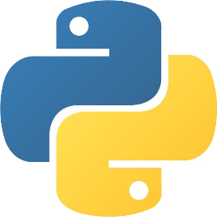

# Pandas Tutor：用 Pyodide 学习数据科学

SamLau&PhilipGuo Python中文社区 *2022-05-27 22:20* *Posted on 广东*

**Python中文社区**

Python中文开发者的精神部落

295篇原创内容

Official Account

在这篇文章中，我们将向你介绍免费教育工具Pandas Tutor，它可以帮助我们使用流行的pandas库学习数据科学。上面的截图显示了如何使用它在一个基于网络的编辑器中编写Python和pandas代码，并逐步看到你的代码的可视化效果。

在概述了Pandas Tutor之后，我们将深入研究我们如何将其移植到Pyodide的案例，以及为什么我们觉得Pyodide对于像我们这样的教育用例来说是非常棒的。

**什么是Pandas Tutor？**

Pandas现在是数据科学的行业标准工具，但由于其复杂的API，学习起来还是有一定难度的。例如，这段代码从 `dogs`的数据集中选择、排序和分组数值，产生一个汇总表。但如果你在Jupyter notebook中运行这段代码，你看到的只是最终结果。

pandas到底做了什么来把 `dogs`的数据集变成这个输出的汇总表？从你上面看到的情况来看，这一点都不清楚。

如果你在Pandas Tutor 中运行这段相同的代码，它就会在你的代码选择、排序、分组和计算组别中位数的过程中，一步步向你展示正在发生的事情。

教师可以使用Pandas Tutor来帮助他们的教学，而学生可以使用它来理解和调试他们的作业。

**为什么要把Pandas Tutor移植到Pyodide？**

最初版本的Pandas Tutor在我们的Linux服务器上运行用户的代码，为每一个代码执行请求启动一个新的Docker容器。它的主要局限性在于速度慢--从用户点击 "运行 "按钮开始，服务器需要5秒钟的时间来运行他们的代码，产生一步步的执行跟踪，并通过网络发送到他们的浏览器。当有很多并发用户时，延迟可能会达到10秒，或者服务器可能会因为太多的Docker容器而崩溃。当老师在讲课或数百名学生同时使用该工具来可视化课堂上的代码例子时，这可能是一个令人沮丧的用户体验。

除了用户体验，这种基于服务器的设置对维护也是一种痛苦，因为我们必须仔细配置Linux和Docker来处理不断增加的规模。这意味着我们没有维护一个生产规模的服务器部署设置所需的技术和机构资源。

这就是为什么当发现Pyodide时，我们非常兴奋，因为它可以帮助我们克服所有这些限制。所以现在我们把Pandas Tutor移植到了Pyodide上。

- 用户可以立即看到他们的可视化，因为他们的所有代码都在浏览器中运行（在Pyodide的初始启动时间之后）。在他们每次试图运行一段代码时，不再需要等待5-10秒的服务器端沙盒执行和网络数据传输。
    
- 与此相关，零延迟意味着我们甚至不需要 "运行 "按钮了。Pandas Tutor会在用户编辑代码的过程中不断地实时运行，这样他们就能看到最新的可视化信息。
    
- 我们不再需要维护一个复杂的服务器端Linux和Docker设置。相反，我们可以将应用程序作为静态托管服务或CDN上的一个JavaScript包来提供。
    
- 由于我们不再在服务器上运行不受信任的用户编写的代码，因此确保服务器的安全也变得更加容易。
    
- 现在，无论网站上有多少并发用户，Pandas Tutor都可以毫不费力地进行扩展......如果在一个大讲堂里有500多名学生同时使用它，也没有问题 毕竟，由于Pyodide的魔力，每个人都在他们的笔记本电脑的浏览器中运行Python代码。这样的规模在我们基于服务器的设置中是不可能的。
    

总而言之，我们觉得Pyodide对于像我们这样的可扩展的教育用例来说是非常强大的，因为它允许任何拥有网络浏览器的人快速尝试Python及其庞大的软件包生态系统，而无需任何安装或进行系统维护。

**我们是如何移植它的，我们遇到了什么问题？**

将Pandas Tutor从原来基于服务器的设置移植到Pyodide上是非常愉快的。在Pyodide核心开发者Roman Yurchak的帮助下，我们找到了一种完全不改变Pandas Tutor代码库的方法。

第一步：创建一个独立的Pandas Tutor轮子

将自定义Pyodide代码加载到Pyodide的推荐方式是使用轮子，所以我们首先创建了一个轮子来打包Pandas Tutor的后端代码。这很简单，因为它是纯Python，不需要任何WASM代码编译。

然而，我们马上就遇到了第一个问题。由于Pandas Tutor有近十种软件包的依赖，我们原本以为可以使用micropip来安装它们，正如Pyodide文档所建议的那样。不幸的是，有些软件包不能用micropip安装，因为它们在PyPI上没有轮子（例如， `micropip.install('docopt')`不起作用）。我们的解决方案是将所有的依赖包捆绑（即内联）到一个独立的Pandas Tutor轮子中，这样我们的网络前端代码只需要调用micropip一次，而不是近十次的单独调用。

1.  `const micropip = pyodide.pyimport("micropip");`
    
2.  `await micropip.install("https://pandastutor.com/build/pandastutor-1.0-py3-none-any.whl");`
    

这种方法还有一个很好的副作用，就是把所有的依赖版本固定下来，以提高API的稳定性。我们唯一没有捆绑的依赖是pandas，因为它需要WASM编译的代码。但幸运的是，Pyodide内置了pandas!

第二步：在JavaScript中导入Pandas Tutor模块

我们在前端的JavaScript中添加了一行，在页面加载时从Pandas Tutor导入 `main.py`（在步骤1的轮子被安装后）。

1.  `const pandastutor_py = pyodide.pyimport("pandas_tutor.main");`
    

这是一个同步调用，在网络应用程序第一次加载时导入 `pandas_tutor`和所有的依赖项，所以它需要3-5秒才能完成，因为pandas和其他库必须被加载。不幸的是，浏览器缓存并不能加快这里的速度，因为即使所有文件都被缓存在本地，Pyodide仍然需要运行导入和初始化代码。

如果Pyodide能在所有文件被初始化后序列化一个二进制的内存快照，可能会加快这个速度。然后用户的浏览器可以在第一次访问页面时直接加载该快照，并为以后的访问进行缓存。(但也许这个快照太大，无法有效加载）。

第三步：从JavaScript调用Pandas Tutor后台代码

现在我们可以从我们的前端JavaScript中调用Pandas Tutor后端，只需一行。

1.  `// 1) frontend grabs userCode from the user's in-browser code editor`
    
2.  `// 2) run the user's code to produce an execution trace ...`
    
3.  `const executionTrace = pandastutor_py.run_user_code(userCode);` 
    
4.  `// 3) frontend process executionTrace to produce step-by-step visualizations`
    

这一行在Pyodide中使用Pandas Tutor后端运行用户的代码，Pandas Tutor分析代码，产生执行跟踪，前端使用它来呈现一步步的可视化。这行代码最酷的地方在于，它直接从JavaScript无缝调用了Python函数。

在我们移植到Pyodide之前，这个过程需要向服务器发出HTTP请求，服务器会启动一个新的Docker容器，在其中运行Pandas Tutor后端，并将生成的JSON执行轨迹通过互联网传输到用户的浏览器。当时有多个可能的故障点，而强大的异常处理是实现的一个痛苦。现在，一切都发生在浏览器中的一个函数调用，异常处理只是一行JavaScript代码 `try...catch`!

其他微调和正在进行的工作

- 为了继续支持旧的浏览器，我们的前端代码会检测是否有任何加载Pyodide版本的Pandas Tutor的问题，如果有，会自动恢复到原来的服务器端版本。另外，loadPyodide在一些旧的移动设备上会崩溃（可能是由于内存有限），我们似乎无法捕捉到异常来恢复；所以我们在移动设备上默认禁用它，并添加一个切换按钮，让用户明确启用它。(这也是很贴心的，因为它可以防止页面在用户的手机计划中预先下载大量的数据）。
    
- 我们希望用户在Pandas Tutor中编写代码时能够导入任何包。但是Pyodide的loadPackagesFromImports只适用于Pyodide自带的包。为了给用户更多的灵活性，我们写了一个自动导入器，每当用户的代码试图导入一个未知的包时，就会自动调用 `micropip.install()`。这些包轮子会按需从PyPI下载并缓存在浏览器中。(注意，只有当PyPI上的软件包名称与导入语句中的名称一致时，这才起作用）。
    
- 预加载。一旦用户访问 `pandastutor.com`登陆页面，它就开始在后台下载Pyodide和选定的包（如pandas、numpy）。这样，当用户进入可视化页面时，这些包可能已经被缓存在他们的浏览器中了，所以他们可以马上开始工作。
    
- 缓存文件下载。一些 pandas 代码使用 `read_csv` 或 `read_html` 等函数从网上下载数据文件。如果能在浏览器中本地缓存这些文件就更好了，这样当用户将来重新运行这些代码时，Pandas Tutor就不需要重复相同的下载。(浏览器可能已经对Pyodide发出的获取请求进行了缓存，但使用Pyodide/Emscripten文件系统API可以让我们对文件缓存进行更精细的控制）。
    
- 启动速度：即使所有软件包都被缓存，在页面加载时仍需要几秒钟来初始化Pandas Tutor。我们计划对我们的代码进行剖析，并可能尝试使用 pyc-wheel 将我们轮子中的 `*.py`编译成 `*.pyc` 文件。
    

未来。Pandas Tutor + Pyodide无处不在!

Pyodide对我们来说真的很令人兴奋，因为它打开了将Pandas Tutor嵌入任何现有网站的大门，这样任何人都可以在他们喜欢的网站背景下学习数据科学，而无需安装任何东西。

为了实现这一目标，我们正在建立一个书签，将Pandas Tutor + Pyodide注入任何网页，以增加一个可以访问其DOM的内联代码编辑器。这将允许学生编写Python代码，例如，使用BeautifulSoup解析HTML表格，清理原始数据，并将其绘制出来。下面是一个模拟截图，将Pandas Tutor（红色虚线框内）注入维基百科页面，为社会研究探索和绘制国家人口。

(这个想法最初来自于2017年的研究论文《DS.js：将任何网页变成以实例为中心的实时编程环境，用于学习数据科学》，作者是 Xiong Zhang 和 Philip Guo)

接下来，我们可以把这个想法更进一步......如果官方的pandas API文档是可运行的，那岂不是很酷？通过这个书签，我们可以将Pandas Tutor + Pyodide注入到任何API文档中，自动解析其代码示例，将其可视化，并让访问者现场编辑该代码以探索不同的参数值。

我们也可以用Stack Overflow或其他帮助论坛网站做同样的事情，因为它们通常有自成一体的代码例子，可以直接可视化。

这就是目前的情况，但这只是我们使用Pyodide的开始。在未来，当我们用它来构建大规模的数据科学教学工具时，请继续关注更多的信息。

**\- 点击下方阅读原文加入****社区会员 -**

Read more

People who liked this content also liked

Go 开源项目推荐：一个简单的 Go 练手项目

...

polarisxu

不看的原因

- 内容质量低
- 不看此公众号

Deno 简介及与 Node.js 相比优缺点

...

Nodejs技术栈

不看的原因

- 内容质量低
- 不看此公众号

气象学博士开发的可视化Python库让你画出更好看的图

...

好奇心Log

不看的原因

- 内容质量低
- 不看此公众号

Scan to Follow