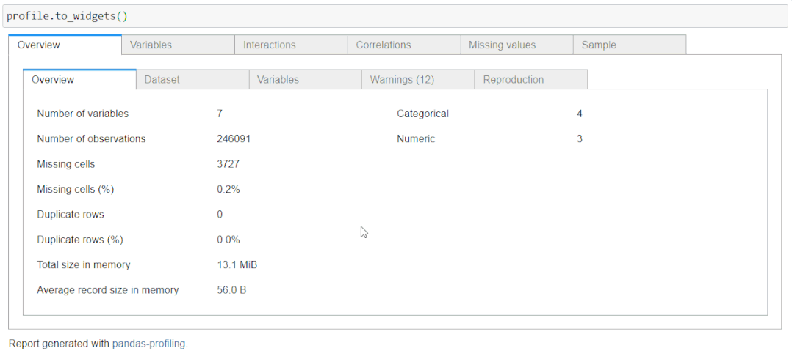

# Pandas profiling 生成报告并部署的一站式解决方案

<a id="profileBt"></a><a id="js_name"></a>数据分析与开发 *2022-02-19 12:10*

The following article is from 数据STUDIO Author 云朵君

<a id="copyright_info"></a>[<br>**数据STUDIO** .<br>点击领取《Python学习手册》，后台回复「福利」获取。『数据STUDIO』专注于数据科学原创文章分享，内容以 Python 为核心语言，涵盖机器学习、数据分析、可视化、MySQL等领域干货知识总结及实战项目。](#)

Pandas 库功能非常强大，特别有助于数据分析与处理，并为几乎所有操作提供了完整的解决方案。一种常见的Pandas函数是`pandas describe`。它向用户提供数据集所有特征的描述性统计摘要，尽管其比较常用，但它仍然**没有提供足够详细的功能。**

**`Pandas profiling`** 可以弥补 **`pandas describe`** 没有详细数据报告生成的不足。它为数据集提供**报告生成**，并为生成的报告提供许多功能和自定义。在本文中，我们将探索这个库，查看提供的所有功能，以及一些高级用例和集成，这些用例和集成可以对从数据框创建令人惊叹的报告!

### 安装

与其他所有 python 包一样，可以通过 pip 包管理器轻松安装 Pandas 分析：

```
pip install pandas-profiling
```

它也可以通过 Conda 包管理器安装：

```
conda env create -n pandas-profiling
conda activate pandas-profiling
conda install -c conda-forge pandas-profiling 
```

## 数据集和设置

看下如何启动 `pandas_profiling` 库并从数据框中生成报告了。首先导入一个将为其生成报告的数据集。该数据集包含 `State_name、District_name、Crop_year、Season、Crop、Area 和 Production`的**农业数据集**。

数据集获取：
https://www.kaggle.com/divyosmi2009/crop-production-in-india-statevise?select=crop_production.csv

```
import pandas as pd
df = pd.read_csv("crop_production.csv")
```

在讨论  `pandas_profiling` 之前，先看看数据帧的 `Pandas describe` 函数输出：

```
df.describe(include='all')
```


> 注意我使用了`describe` 函数的 `include` 参数设置为`"all"`，强制 pandas 包含要包含在摘要中的数据集的所有数据类型。字符串类型值伴随有诸如`unique、top 和 freq`等选项。

#### 导入 pandas_profiling

```
from pandas_profiling import ProfileReport
```

分析DataFrame有两种方法：

1.  可以在 Pandas DataFrame上调用`'.profile_report()'` 函数。此函数不是 Pandas API 的一部分，但只要导入profiling库，它就会将此函数添加到DataFrame对象中。
    
2.  可以**将DataFrame对象传递给profiling函数**，然后调用创建的函数对象以开始生成分析文件。
    

无论采用哪种方式，都将获得**相同的输出报告**。我正在使用第二种方法为导入的农业数据集生成报告。

```
profile = ProfileReport(df)
profile
```


动画显示报告生成

## 报告部分

现在我们一起一一探索生产报告的所有部分。

### 1\. 概述 Overview

此部分包含 3 个选项卡：**Overview, Warnings, 和 Reproduction**。

该**Overview**包括总体统计的。这包括变量数（数据框的特征或列）、观察数（数据框的行）、缺失单元格、缺失单元格百分比、重复行、重复行百分比和内存中的总大小。


该**Warnings**选项卡由任何类型的相关基数，相关性与其他变量，缺失值零，偏态变量，以及其他Warnings。


该**reproduction**标签只显示相关的报告生成的信息。它显示分析的开始和结束时间、生成报告所用的时间、pandas_profiling 的版本以及配置下载选项。


我们将在本文的高级用例部分讨论配置文件。

### 2\. 变量

报告的这一部分详细分析了数据集的所有变量/列/特征。显示的信息因变量的数据类型而异。

#### **数值变量**

对于数值数据类型特征，可以获得有关不同值、缺失值、最小值-最大值、平均值和负值计数的信息。还可以获得直方图形式的小表示值。


切换按钮来展开的**Statistics, Histogram, Common values, Extreme values**选项卡。

统计选项卡包括：

1.  分位数统计：Min-Max、百分位数、中位数、范围和 IQR（四分位间距）。
    
2.  描述性统计：标准偏差、方差系数、峰度、均值、偏度、方差和单调性。
    


直方图选项卡显示变量的频率或数值数据的分布。通用值选项卡基本上是变量的 `value_counts`，同时显示为计数和百分比频率。


#### **字符串变量**

对于字符串类型变量，您将获得不同（唯一）值、不同百分比、缺失、缺失百分比、内存大小以及所有具有计数表示的唯一值的水平条表示。


> 它还会报告与变量相关的任何警告，而不管其数据类型如何

切换按钮扩展到**Overview, Categories, Words, and Characters**选项卡。

字符串类型值的概览选项卡显示最大-最小中值平均长度、总字符、不同字符、不同类别、唯一和来自数据集的样本。


类别选项卡显示直方图，有时显示特征值计数的饼图。该表包含值、计数和百分比频率。


在以表格和直方图格式呈现数据的方式方面，单词和字符选项卡与类别选项卡的作用相同，但它可以更深入地处理小写、大写、标点符号，特殊字符类别也很重要！

### 3\. 相关性

相关性用于描述两个变量相互协调移动的程度。在熊猫分析报告中，可以访问 5 种类型的相关系数：`Pearson's r、Spearman's ρ、Kendall's τ、Phik (φk) 和 Cramér's V (φc)`。


还可以单击切换按钮以获取有关各种相关系数的详细信息。

### 4\. 缺失值

生成的报告还包含数据集中缺失值的可视化。您将获得 3 种类型的图：计数、矩阵和树状图。计数图是一个基本的条形图，以 x 轴作为列名，条形的长度代表存在的值的数量（没有空值）。类似的还有矩阵和树状图。


### 5\. 样本

此部分显示数据集的前 10 行和最后 10 行。

## 如何保存报告？

到目前为止，我们已经了解了如何仅使用一行代码或函数生成DataFrame报告，以及报告包含的所有功能。我们可能有兴趣将此分析导出到外部文件，以便可以将其与其他应用程序集成或将其发布到 Web 上。

可以将此报告保存在

1.  HTML格式
    
2.  JSON 格式
    

任何格式的保存功能都保持不变，只需在保存时更改文件扩展名。要保存报告，请在配置文件对象上调用 **`.to_file()`**函数：

```
profile.to_file("Analysis.html")
profile.to_file("Analysis.json")
```


## 高级用法

`Pandas profiling` 生成的报告是一个完整的分析，除了 DataFrame 对象之外，没有用户的任何输入。报告的所有元素都是自动选择的，默认值是首选。

报告中可能有一些您不想包含的元素，或者您需要为最终报告添加自己的元数据。这个库的高级用法来了。您可以通过更改默认配置来控制报告的各个方面。

**我们可以自定义报告的一些方法。**

### 添加元数据

您可以添加 `“title”, “description”, “creator”, “author”, “URL”, “copyright_year”, and “copyright_holder”` 等信息。此信息将出现在数据集概述部分。对于此元数据，将创建一个名为“dataset”的新选项卡。要将此数据添加到报告中，请在 ProfileReport 函数中使用 dataset 参数并将此数据作为字典传递：

```
profile = ProfileReport(df,
                        title="Agriculture Data",
        dataset={
        "description": "This profiling report was generated for 数据STUDIO",
        "copyright_holder": "数据STUDIO",
        "copyright_year": "2021",
        "url": "https://t.1yb.co/HqGX",
    },)
profile
```


我们还可以使用 variables 参数添加有关数据集中使用的变量的信息。这将具有描述的字典作为键和值作为另一个具有键值对的字典，其中键是变量名称，值作为变量的描述。

```
variables={
"descriptions": {
"State_Name": "州名",
"District_Name": "区名",
"Crop_Year": "播种的年份",
"Season": "作物年",
"Crop": "播种的是哪种作物？",
"Area": "作物分配了多少面积？",
"Production": "产量多少",
}
}
```

当您将其添加到 `ProfileReport` 函数时，将在概览部分下创建一个名为`“variables”`的单独选项卡：


### 报表的控制参数

假设你不想显示所有类型的相关系数。你可以通过使用相关性配置来简单地禁用其他系数。这也是一个字典对象，可以传递给 `ProfileReport` 函数：

```
profile = ProfileReport(df,
                        title="Agriculture Data",
                        correlations={
                        "pearson": {"calculate": True},
                        "spearman": {"calculate": False},
                        "kendall": {"calculate": False},
                        "phi_k": {"calculate": False},
    })
```

同样，您可以自定义报告的每个部分、HTML 格式、图表等等。

> 有关详细信息，请查看文档的此页面<sup>\[1\]</sup>。

## 集成

在通过配置报告的各个方面使您的报告令人惊叹后，你可能希望以任何方式发布它。或许，你可以将其导出为 HTML 格式并上传到网络。但是还有一些其他方法可以使你的报告脱颖而出。

### Jupyter 笔记本中的小部件

在你的 Jupyter 笔记本中运行`panda profiling`时，你将仅在代码单元格中呈现 HTML。这干扰了用户的体验。你可以让它像一个小部件一样易于访问并提供紧凑的视图。为此，只需在你的配置文件对象上调用**`.to_widgets()`**：



### Streamlit app

我们也可以将此报告作为`Streamlit app`的一部分。Streamlit 是一个功能强大的软件包，可以用最少的代码构建 `GUI Web app`。这些应用程序是交互式的，几乎与所有设备兼容。您可以按照以下代码将你的报告作为 `streamlit app` 的一部分：

#### **第 1 步：安装 streamlit\_pandas\_profiling**

```
pip install streamlit-pandas-profiling
```

#### **第 2 步：创建一个 Python 文件并以此格式编写代码**

```
`        import pandas as pd
import pandas_profiling
import streamlit as st
from streamlit_pandas_profiling import st_profile_report
from pandas_profiling import ProfileReport
df = pd.read_csv("crops data.csv", na_values=['='])
profile = ProfileReport(df,
        title="Agriculture Data",
        dataset={
        "description": "This profiling report was generated for 数据STUDIO",
        "copyright_holder": "数据STUDIO",
        "copyright_year": "2021",
        "url": "https://t.1yb.co/HqGX",
    },
variables={
    "descriptions": {
    "State_Name": "州名",
    "District_Name": "区名",
    "Crop_Year": "播种的年份",
    "Season": "作物年",
    "Crop": "播种的是哪种作物？",
    "Area": "作物分配了多少面积？",
    "Production": "产量多少",
    }}
)
st.title("Pandas Profiling in Streamlit!")
st.write(df)
st_profile_report(profile)`
```

#### **第 3 步：运行 Streamlit 应用程序**

在终端中，输入：

```
streamlit run .py
```


## 写在最后

在本文中，我们一起了解了一个新工具`“Pandas Profiling”`——从 Pandas DataFrame 生成报告的一站式解决方案。我们探索了此工具的所有功能、不同部分及其内容。然后我们继续保存生成的报告，稍后，我们查看了该库的一些高级用例，最后集成了 `Streamlit` 应用程序，使报告更具前景和互动性。

### 参考资料

\[1\] 

Pandas Profiling: *https://pandas-profiling.github.io/pandas-profiling/docs/master/rtd/pages/advanced_usage.html*

\- EOF -

推荐阅读  点击标题可跳转

<ins>1、[Pandas 缺失数据处理大全（附代码）](http://mp.weixin.qq.com/s?__biz=MzA5ODM5MDU3MA==&mid=2650881301&idx=2&sn=9a15270ef6ee99bdfbc8ce0a68feaacd&chksm=8b67da50bc105346a162d0611c3a9b84cd5073859e76828f14aa9ddc402856173beca96b49e4&scene=21#wechat_redirect)</ins>

<ins>2、[10000 字的 pandas 核心操作知识大全！](http://mp.weixin.qq.com/s?__biz=MzA5ODM5MDU3MA==&mid=2650880984&idx=2&sn=86226abb54d2c7798691da674cba1938&chksm=8b67dc9dbc10558b0c280cb506707bb3a2aa9e7435541e4dc0a804e999a6946b20d89aa726ab&scene=21#wechat_redirect)</ins>

<ins>3、[用 pandas-profiling 做出更好的探索性数据分析](http://mp.weixin.qq.com/s?__biz=MzA5ODM5MDU3MA==&mid=2650866936&idx=2&sn=af894fc31c49cf35006c091638f9816f&chksm=8b67e3bdbc106aab0be79c89d3cb319bbb7038a48aa8b07dacd94a5e03ef8f2e61785b305dc6&scene=21#wechat_redirect)</ins>

看完本文有收获？请转发分享给更多人

**推荐关注「数据分析与开发」，提升数据技能**


**数据分析与开发**

「数据分析与开发」分享数据分析与开发相关技术文章、教程、工具

<a id="js_profile_article"></a>55篇原创内容

Official Account

点赞和在看就是最大的支持❤️

People who liked this content also liked

这些 Shell 分析服务器日志命令集锦，优秀！

高效运维

不看的原因

- 内容质量低
- 不看此公众号

Linux 性能优化的全景指南，可能都在这里了，建议收藏~

高效运维

不看的原因

- 内容质量低
- 不看此公众号

Elasticsearch 节点运维的那些套路，这篇是易懂的

高效运维

不看的原因

- 内容质量低
- 不看此公众号


Scan to Follow