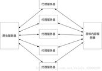
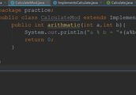
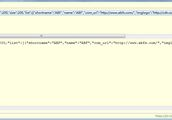
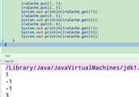

- [首页](https://www.freesion.com)
- [联系我们](mailto:freesion@gmx.com)
- [版权申明](https://www.freesion.com/copyright.html)
- [隐私政策](https://www.freesion.com/privacy.html)

- 搜索
    

## Pandas常用方法

标签： [python](https://www.freesion.com/tag/python/ "python")

Pandas 基本用法
是基于Numpy创建的

# **1.安装**

```
`Pip3 install pandas` 

- 1


```

**①使用Series ,DataFrame(一维数组,二维数组)**

```
`from pandas import Series ,DataFrame
from pandas as pd` 

- 1
- 2


```

***本文以 data 作为数据来使用**

```
 `pd.date_range(“20080301”,periods= 6)  #从20080301 开始产生6个日期
 #在Series 和DataFrame 参数中还可以设置index 和columns(写成列表)   DataFrame中的数据形式有多种 ,字典.......` 

- 1
- 2


```

**常见用法**

```
`data.shape  #查看数据有几行几列
data.info()   #查看数据信息
data.dtypes   #查看每列数据的类型
     .index  #查看所有行号
     .columns  # 查看所有列号
     .values  #查看所有值
     .apply(类型)    #改变数据类型 
#(   改变某列数据类型    data[“列名”].astype( int )      )
     .describe( )   #  查看data中的
            count   计数
            mean  平均值
            std   标准差  等等
data.T    #二维表反转 (index  和 columns交换)
data.sort_index(axis = 1,ascending =False)
#axis = 0或1        0为行排序  1为列排序
#         ascending   =  true  或false    true为正序  (小到大)
data.head(5)   #只显示前五行数据
data.tail(5)   #只显示后五行数据
#设置显示配置
pd.set_option( “display.max_columns”,10)  显示10行10列
pd.set_option( “display.max_rows”,10)
data.set_index(“某列名”)  # 把某列名设置为index  也可以用列表设置成多个index
    .reset_index(level = 0,drop =true )   #恢复...
     #Level = 0  表示最外层索引
    .sort_values( by =”E”)  #按照 列标E 的值排序
data[“A”]  或data.A  #输出A整列的数据
data[ 0:3 ]  切片  行
data[‘20080301’:’20080305’]   筛选` 

- 1
- 2
- 3
- 4
- 5
- 6
- 7
- 8
- 9
- 10
- 11
- 12
- 13
- 14
- 15
- 16
- 17
- 18
- 19
- 20
- 21
- 22
- 23
- 24
- 25
- 26
- 27
- 28


```

## **根据 loc 进行数据精确选择**

```
`data.loc[ ‘20060301’,[“A”,”B”] ]   #标签名
data.iloc[ 3,1]     Data.iloc[ 3:5,1:3]
data.iloc[ [1,2,3],[5,6,7]]    #   行/列号
#以上两种混合
data.ix[ ]                                                                                              
#根据判断 筛选数据
data[data.A>0]                                                                                                                                                                                                                                                                                     
#数据设置
#根据上面的   iloc  和loc  设置数据
data.iloc[ 2,2] =67
data[data.A>0] =12
data[“A”] =np.nan   #根据行列设置` 

- 1
- 2
- 3
- 4
- 5
- 6
- 7
- 8
- 9
- 10
- 11
- 12


```

## **添加数据**

```
`#1.增加一列数据
data[“新列号”]=pd.Series([1,2,3,4,5,6,7] , index=date_range(“20080301”,periods= 6))
#2.删除数据 
data.drop( 0,inplace =True)  #删除第0行数据 
Inplace = True  否则返回一个新data` 

- 1
- 2
- 3
- 4
- 5


```

## 处理丢失数据、填缺失值、重复值处理

### 处理一些数据中的NaN数据

**①使用dropna( ) 去掉Nan的行或列**

```
`data.dropna( axis =0, how = “any”)
 #axis =0 对行操作    how=”any”或”all”
#any  只要有NaN即去掉   all 全都是NaN才去掉
#参数 thresh= 5   Nan超过5个才去掉` 

- 1
- 2
- 3
- 4


```

**②替换 、填充 数据**

```
`Data.fillna(values =0)  #nan值全部替换为0
    #参数 method =’ffill’或’bfill’ 
    #ffill:用前一个值填充  bfill 用后一个值填充` 

- 1
- 2
- 3


```

**③ isnull( ) #判断数据是否丢失**

```
 `Pd.isnull( data)  #NaN  为True 
   np.any( data.isnull( ) )` 

- 1
- 2


```

**④**

```
`data.interpolate( )    #  插值,即NaN填充为上一个和下一个值得平均值，可用参数method=“time”基于时间序列填充，参数method =“values”基于index 填充` 

- 1


```

**⑤ 重复行处理**

```
`data.duplicated( )  #判断是否有重复行 
data.drop_duplicates( [ “A”,”B”] )  #去掉重复行
#参数可以是一个列表   该列表为一些列标,列表里为哪些列作为判断重复的标准
#若使用另一个参数keep =”last”  则保留重复行后面的那行` 

- 1
- 2
- 3
- 4


```

**数据导入 导出
有多种格式**
**Csv excel json html pickle hdf5…**
**读取数据时 常见参数**

```
`1、index_col =0   #第0列作为索引（作为index）
2、header =None  #去掉columns  (变为数字标)
3、names = 列标的列表     #设置列的名字
4、dtype = {‘Goals’:np.float64}   #把Goals列设为float型
5、usecols =[列表]     #只读取列表中有的列名的数据
6、sep = “xx”   #以  xx  作为数据的分隔符
7、skiprows = [0,1] #跳过第 0,1行的数据
8、sKip_footer =1   # 跳过倒数一行的数据
9、engine =’python’  #和 8一起使用
10、nrows =5   # 只读出五行数据
11、Parse_date= true  #自动判定时间序列` 

- 1
- 2
- 3
- 4
- 5
- 6
- 7
- 8
- 9
- 10
- 11


```

**read_excel中 文件可能有多个表 可用参数 sheetname = ‘某表名称’
to_excel( ) 中,参数index = False 可以不把index 标签写到文件中
参数 sheet_name= ‘xxx’ 可以设置表名 excel文件后缀为 .xlsx**

**②Execl文件追加写入**

```
`from pandas import ExcelWriter
with ExcelWriter(“路径”)  as w:
    data.to_excel(w,sheet_name = “表1”)
    data.to_excel(w,sheet_name = “表2”)` 

- 1
- 2
- 3
- 4


```

**③数据库的读取,写入**
读

```
`data = pd.io.sql.read_sql( a , b, c )
a  查询语句
b  connection  连接数据库
C   index_col = “index”` 

- 1
- 2
- 3
- 4


```

写

```
`data.to_sql(“数据表名”,connection,  if_exits =”replace”)
#参数 if_exits =”replace”  #若已有该表则替换` 

- 1
- 2


```

**④hdf5读取 (后缀为 .h5)**

```
`hdf = pd.HDFStore(‘路径’)
hdf是一个对象,类似字典
hdf[“df”] =data` 

- 1
- 2
- 3


```

## **数据转换、重构**

1、transform (也是数据清洗的一种方法)
**①映射 x.map( y)**
x

|     |     |
| --- | --- |
| one | 1   |
| two | 2   |
| three | 3   |

y

|     |     |
| --- | --- |
| 1   | a   |
| 2   | b   |
| 3   | c   |

结果
One a
Two b
Three c

**② 替换**

```
`data.replace( 1,5)  #把data中的1都替换为5  (只替换一个值)
'''
也可以这样  
data.replace( [ 1,2,3 ] , [4,5,6] )  
把data中的1,2,3,替换为4,5,6
还可以用字典格式   
data.replace( {1:6 , 3:10 } )  
把值1替换为6  3替换为10
还可以     
data.replace( {“A”:1，“B”：2}，100)  
把A列中的1，B列中的2 替换为100 ''''` 

- 1
- 2
- 3
- 4
- 5
- 6
- 7
- 8
- 9
- 10
- 11


```

**③ apply( ) 函数**
data
        a b c
0|    0 1 2
1|    3 4 5
2|    6 7 8
3|    9 10 11
\-\-\-\-\-\-\-\-\-\-\-\-\-\-\-\-\-\-\-\-\-\-\-

```
`data.apply( lambda col: col.sum() )` 

- 1


```

**结果**
a 18
b 22
c 26

```
`data.apply(  lambda row:  row.sum(),axis =1 )` 

- 1


```

**结果**
0 3
1 12
2 21
3 30

**更常用apply添加一个列**

```
`#这个例子是添加列 “new”  为a和b的和  还是上面的data
data[“new”] = Data.apply(lambda r:  r.a*r.b ,axis= 1)` 

- 1
- 2


```

**结果**
data
      a b c new
0|   0 1 2 0
1|   3 4 5 12
2|   6 7 8 42
3|   9 10 11 90

**2、 outlier 异常值的处理** (忘记了)

```
`mask =np.abs( data.data-data.data.mean() ) >= ( 2*data.Data.std() )
#mask 为标准差之外的异常值
data[mask ] =data.data.mean()  #用均值填充异常值` 

- 1
- 2
- 3


```

**3、重构 转换表或向量的结构**

```
`from collections import orderedDict   可以生成一个有序字典
1.pivot() 
2.pivot_table()
3. stack()
4. un_stack( )` 

- 1
- 2
- 3
- 4
- 5


```

函数pivot( )中的三个参数 index , columns , values
data.pivot( index=’列名A’ , columns=’列名B’ , values=’列名C’)
(有点类似groupby( ) )意思是把一个data A列设index…
      A B C D
0|   x a 1
1|   x b 2
2|   y a 4
3|   y c 5

结果

| B   | a   | b   | c   |
| --- | --- | --- | --- |
| A   |     |     |     |
| x   | 1   | 2   | NaN |
| y   | 4   | NaN | 5   |

values 缺省条件下会把其余列标都当做values (即多列pivot)
常见错误 index/columns 索引后对应有多行相同值
此时就要使用pivot\_table( ) 它会对相同检索的值求(默认)平均值,还可以通过参数 aggfunc = np.max/mean/mix …改变这个默认 参数fill\_value = 0 填充NaN
参数 Margins =true 显示汇总,合计
**Pivot()** 实际上是对向量 进行stack的特例
**Stack** 是把最内层的 列 索引变成最内层的 行 索引
**Unstack** 是把最内层的 行 索引变成最内层的 列 索

**数据合并 concat ,merge ,join**

```
`res = pd.concat( [data1 ,data2 , data3] , 
					axis =0,ignore_index =True)
#axis = 0 /1 
# 0  行合并   1   列合并 
#ignore_index =True是否重置index` 

- 1
- 2
- 3
- 4
- 5


```

```
`res = pd.merge( data_left,data_right,on =”key”)
#参数on  为合并数据时用的是哪些列标,也可以多个
res = pd.merge( data_left,data_right,
				on =[”key1”,”key2”] , how = “inner”)` 

- 1
- 2
- 3
- 4


```

**how 的四种参数,默认为 inner**
1.Inner 交集,保留两表公共key部分
2.outer 并集,保留两表所有key部分
3.left 只保留左表key里有的行数据
4.right 只保留右表key里有的行数据
**参数indicato = True/False/”xxx”,作用是输出每项合并方式( 会在结果的最左边多一个\_merge列,里面有提示 left\_only , right_only ,both) ”xxx”为设置这个列名**
#此为根据 列 合并 ,也可以根据 行 合并, 用参数left\_index = True, right\_index =True

```
`join()与merge()差不多 但使用的是index label
#Pandas 中的  groupby
groupby 与MapReduce  相似  使用 groupby返回一个对象,   
对象.groups查看对象内容
还可以  .size() 统计每组的大小等等` 

- 1
- 2
- 3
- 4
- 5


```

groupby() 的参数
① 列名,
② 列名的列表(多重分组), 还可用lambda函数
参数 level = 0 #按第一级行标 #这部分还有疑问
                 = \[ \] 里面为行标名

 数值为1的在第11行,数值为2的在第8,9,15 行

**aggregate( )聚集函数
参数为一个函数**

pd.cut( )


## **Pandas中的绘图功能**

Pandas 中也有绘图功能 可以由plot()函数完成 默认为折线图
Data.plot(grid = False ,)
参数 ① grid = True /False 是否显示背景网格线,默认False
参数② subplot = True /False 是否将每列的数据独立绘制一个图 默认False
参数③ secondary_y =”某列名” 设置第二坐标(右边的Y坐标)
参数 kind density密度曲线
参数 stacked =true /false #是否为堆叠
参数color =\[\] #设置颜色

[](https://creativecommons.org/licenses/by-sa/4.0/)版权声明：本文为Not\_skr\_coder原创文章，遵循 [CC 4.0 BY-SA](https://creativecommons.org/licenses/by-sa/4.0/) 版权协议，转载请附上原文出处链接和本声明。

本文链接：[https://blog.csdn.net/Not\_skr\_coder/article/details/105046527](https://blog.csdn.net/Not_skr_coder/article/details/105046527)

* * *

### 智能推荐

[](https://www.freesion.com/article/1273172329/)

### [proxy & proxy池 （代理服务器）python中的爬虫用法](https://www.freesion.com/article/1273172329/ "proxy & proxy池 （代理服务器）python中的爬虫用法")

代理流程 代理服务器相关网站 米扑 三一代理 快代理 等等... 代码中使用代理...

[](https://www.freesion.com/article/71572108213/)

### [笛卡尔树详解带建树模板及例题运用（Largest Submatrix of All 1’s，洗车 Myjnie，Removing Blocks，SPOJ PERIODNI）](https://www.freesion.com/article/71572108213/ "笛卡尔树详解带建树模板及例题运用（Largest Submatrix of All 1’s，洗车 Myjnie，Removing Blocks，SPOJ PERIODNI）")

文章目录 笛卡尔树 介绍 例题 Largest Submatrix of All 1’s 应用 「POI2015」洗车 Myjnie \[AGC028B\] Removing Blocks SPOJ PERIODNI 笛卡尔树 介绍 笛卡尔树是一种数据结构，每个点由两个值，键值key和权值val，组成 其键值满足二叉树性质 即点的左子树内所有点的键值均小于点的键值，点的键值均小于点的右子树...

[](https://www.freesion.com/article/1115543571/)

### [问题：删除 ogg 用户的时候报错](https://www.freesion.com/article/1115543571/ "问题：删除 ogg 用户的时候报错")

问题描述 删除用户报错 原因分析 由于安装 OGG 时，配置并开启了 DDL 捕获功能，而 OGG 的 DLL 捕获，是依赖 DDL 触发器实现，DDL 处于 enabled 状态，drop ogg user 的操作也属于 DDL 操 作，所以产生 ORA-00604 和 ORA-20782 错误。 解决方案 删除对应的触发器就可以了。 查询 ddl 触发器 删除触发器 再次尝试删除 还有错误，但...

[](https://www.freesion.com/article/8733327946/)

### [java设计模式实现计算机简单四则运算功能](https://www.freesion.com/article/8733327946/ "java设计模式实现计算机简单四则运算功能")

关注重工黑大帅，学习不迷路 一、利用面向过程编程思想完成计算机简单四则运算功能 结果显示： 过程分析：可能很多朋友拿到这道题，就会以上面的实现方式编写代码，不知道我猜对了没有，哈哈哈。如果我想增加取余的功能，那是不是应该在类Operation中添加如下代码： 在switch代码块中添加如下代码： 那如果还想添加更多的功能，那是不是应该继续往其中写代码呢？那这样的话代码会越来越多，程序变得越来越冗杂...

[](https://www.freesion.com/article/6906531527/)

### [uni-app getCurrentPages](https://www.freesion.com/article/6906531527/ "uni-app  getCurrentPages")

官方文档： getCurrentPages( ) 用于获取当前页面栈的实例，以数组形式按照栈的顺序返回，第一个元素为首页，最后一个为当前页面。 tips: getCurrentPages（） 仅用于展示页面栈的情况，请勿修改页面栈，一面造成页面状态错误。...

### 猜你喜欢

[](https://www.freesion.com/article/87762208567/)

### [第3章 最简单的C程序设计——顺序程序设计](https://www.freesion.com/article/87762208567/ "第3章 最简单的C程序设计——顺序程序设计")

目录 3.1 顺序程序设计举例 【例3.1】 【例3】 3.2 数据的表现形式及其运算 3.2.1 常量和变量 1.常量 2.变量 3.常 变 量  4.标识符 3.2.2 数据类型  3.2.3 整型数据 3.2.4 字符型数据 3.2.5 浮点型数据 3.2.6 怎样确定常量的类型 3.3 运算符和表达式 3.3.1 C运算符  3.3.2 基本的算术运算符&nb...

[](https://www.freesion.com/article/1635610824/)

### [JSOUP请求返回Json数据](https://www.freesion.com/article/1635610824/ "JSOUP请求返回Json数据")

最近在使用 JSOUP  作为 爬虫  爬取数据，在用习惯了 JSOUP  后，因为那种链式结构，非常喜欢，故想用它来请求接口，构造请求头的时候非常方便。其实它必须是支持的，因为底层使用的还是 HttpConnection  做为处理的，代码如下： 但是出现问题了，请求就报错： ...

[](https://www.freesion.com/article/53081070717/)

### [每日LeeteCode-实现LRU cache](https://www.freesion.com/article/53081070717/ "每日LeeteCode-实现LRU cache")

题目描述 实现一个K-V的数据结构, key和value都是int类型,value为正整数 1.有固定的大小 2.实现get(), set()方法,要求时间复杂度为O(1) 3.当容量满的时候,采用LRU淘汰策略 面试的时候拿到这道题还是挺懵的无从下手,没有在规定时间内做出来.现在回过头来想,其实要求给的蛮详细的,只要冷静下来分析下,还是挺简单的 题目分析 定义一个类来实现这个数据结构: LRUC...

[](https://www.freesion.com/article/3372725058/)

### [墨者靶场 初级：Struts2远程代码执行漏洞（S2-004）](https://www.freesion.com/article/3372725058/ "墨者靶场 初级：Struts2远程代码执行漏洞（S2-004）")

墨者靶场 初级：Struts2远程代码执行漏洞（S2-004） 题目 背景介绍 实训目标 解题方向 解题步骤 题目 背景介绍 某日，安全工程师"墨者"对一单位业务系统进行授权扫描，在扫描过程中，发现了某个业务系统使用Apache Struts2框架。不知道运维人员是否修补了漏洞。 实训目标 1、了解Apache Struts2框架； 2、了解Apache Struts2目录遍历...

[](https://www.freesion.com/article/26591223082/)

### [直方图的反向投影的原理](https://www.freesion.com/article/26591223082/ "直方图的反向投影的原理")

原文地址： 要理解直方图的反向投影，先要看下直方图反向投影矩阵的计算方法！ 设有原灰度图像矩阵： Image=   1    2    3    4   5    6    7    7   9    8    ...

[](https://www.freesion.com)

## 灰信网（软件开发博客聚合）

程序员专属的优秀博客文章阅读平台

相关文章

### [Pandas常用方法](https://www.freesion.com/article/7330378876/ "Pandas常用方法")

### [Pandas常用方法及实例](https://www.freesion.com/article/6844451974/ "Pandas常用方法及实例")

### [pandas学习（二）：常用方法笔记](https://www.freesion.com/article/7180141337/ "pandas学习（二）：常用方法笔记")

### [pandas读取文件常用方法与参数](https://www.freesion.com/article/5125242051/ "pandas读取文件常用方法与参数")

### [pandas常用数据预处理方法](https://www.freesion.com/article/9496339916/ "pandas常用数据预处理方法")

### [Pandas常用方法 及 实战演练](https://www.freesion.com/article/3767353389/ "Pandas常用方法 及 实战演练")

### [Pandas —— （4）常用数学、统计方法](https://www.freesion.com/article/9170896873/ "Pandas —— （4）常用数学、统计方法")

### [Excel删除包含某关键字的指定行（VBA）](https://www.freesion.com/article/3341706352/ "Excel删除包含某关键字的指定行（VBA）")

### [Jenkins安装及配合GitLab代码自动部署](https://www.freesion.com/article/278284232/ "Jenkins安装及配合GitLab代码自动部署")

### [Find Minimum in Rotated Sorted Array II](https://www.freesion.com/article/1305934065/ "Find Minimum in Rotated Sorted Array II")

热门文章

### [用Python编写斐波那契数列（Fibonacci Sequence)](https://www.freesion.com/article/2510671645/ "用Python编写斐波那契数列（Fibonacci Sequence)")

### [javascript中打印对象显示\[object object\]_扒一扒JavaScript中不常见的一些object](https://www.freesion.com/article/85481624782/ "javascript中打印对象显示[object object]_扒一扒JavaScript中不常见的一些object")

### [Linux Centos7 64位 安装Maven详细](https://www.freesion.com/article/2457945921/ "Linux Centos7 64位 安装Maven详细")

### [HTML标签怎么用？](https://www.freesion.com/article/7424319808/ "HTML标签怎么用？")

### [八步部署NGINX Plus API网关](https://www.freesion.com/article/1453230365/ "八步部署NGINX Plus API网关")

### [阿里云服务器Linux（Ubuntu系统）安装tomcat以及外网访问详解](https://www.freesion.com/article/5676925063/ "阿里云服务器Linux（Ubuntu系统）安装tomcat以及外网访问详解")

### [「Python实用秘技05」在Python中妙用短路机制](https://www.freesion.com/article/13872230554/ "「Python实用秘技05」在Python中妙用短路机制")

### [Laravel5.5生成验证码与验证正确与否](https://www.freesion.com/article/6674151980/ "Laravel5.5生成验证码与验证正确与否")

### [深度学习与图像处理实例：人像背景虚化与背景替换](https://www.freesion.com/article/69881361864/ "深度学习与图像处理实例：人像背景虚化与背景替换")

### [PHP课堂--实验5](https://www.freesion.com/article/648941368/ "PHP课堂--实验5")

推荐文章

### [.jsp之无限滚动](https://www.freesion.com/article/77441176662/ ".jsp之无限滚动")

### [HTML——01：基础和案例](https://www.freesion.com/article/62601491919/ "HTML——01：基础和案例")

### [BUUCTF reverse:reverse1](https://www.freesion.com/article/61911043780/ "BUUCTF reverse:reverse1")

### [帮你整理了一份设计模式速查手册](https://www.freesion.com/article/1036323553/ "帮你整理了一份设计模式速查手册")

### [C语言动态内存管理](https://www.freesion.com/article/64781501769/ "C语言动态内存管理")

### [Android 可拖拽的GridView效果实现, 长按可拖拽和item实时交换](https://www.freesion.com/article/345350642/ "Android 可拖拽的GridView效果实现,  长按可拖拽和item实时交换")

### [对拍 入门+模板](https://www.freesion.com/article/3843818067/ "对拍 入门+模板")

### [input search](https://www.freesion.com/article/7735166988/ "input search")

### [【Uva11806】Cheerleaders](https://www.freesion.com/article/7710945399/ "【Uva11806】Cheerleaders")

### [node内置模块：url模块](https://www.freesion.com/article/9262439541/ "node内置模块：url模块")

相关标签

### [python](https://www.freesion.com/tag/python/ "python")

### [csv](https://www.freesion.com/tag/csv/ "csv")

### [数据挖掘](https://www.freesion.com/tag/%E6%95%B0%E6%8D%AE%E6%8C%96%E6%8E%98/ "数据挖掘")

### [数据预处理](https://www.freesion.com/tag/%E6%95%B0%E6%8D%AE%E9%A2%84%E5%A4%84%E7%90%86/ "数据预处理")

### [Python](https://www.freesion.com/tag/Python/ "Python")

### [大数据学习](https://www.freesion.com/tag/%E5%A4%A7%E6%95%B0%E6%8D%AE%E5%AD%A6%E4%B9%A0/ "大数据学习")

### [数据分析](https://www.freesion.com/tag/%E6%95%B0%E6%8D%AE%E5%88%86%E6%9E%90/ "数据分析")

### [机器学习](https://www.freesion.com/tag/%E6%9C%BA%E5%99%A8%E5%AD%A6%E4%B9%A0/ "机器学习")

### [excel](https://www.freesion.com/tag/excel/ "excel")

### [gitlab](https://www.freesion.com/tag/gitlab/ "gitlab")

Copyright © 2010-2022 - All Rights Reserved - [www.freesion.com](https://www.freesion.com)