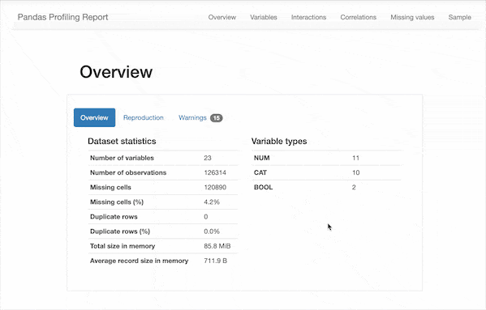

# Pandas数据探索分析，分享两个神器！

<a id="profileBt"></a><a id="js_name"></a>Python程序员 *2021-10-07 08:30*

The following article is from 早起Python Author 刘早起

<a id="copyright_info"></a>[<br>**早起Python** .<br>点击领取pandas数据分析300题](#)

在使用 `pandas` 进行数据分析时，进行一定的数据探索性分析（EDA）是必不可少的一个步骤，例如常见统计指标计算、缺失值、重复值统计等。

使用 `df.describe()` 等函数进行探索当然是常见操作，但若要进行更完整、详细的分析缺则略显不足。

本文就将分享两个用于数据探索的 `pandas` 插件。

## pandas_profiling

首先要介绍的是`pandas_profiling`，它扩展了`pandas DataFrame`的功能，这也是在之前多篇文章中提到的插件。

只需使用`pip install pandas_profiling`即可安装，在导入数据之后使用`df.profile_report()`一行命令即可快速生成描述性分析报告👇



可以看到，除了之前我们需要的一些描述性统计数据，该报告还包含以下信息：

> “
> 
> - 类型推断：检测数据帧中列的数据类型。
>     
> - 要点：类型，唯一值，缺失值
>     
> - 分位数统计信息，例如最小值，Q1，中位数，Q3，最大值，范围，四分位数范围
>     
> - 描述性统计数据，例如均值，众数，标准偏差，总和，中位数绝对偏差，变异系数，峰度，偏度
>     
> - 最常使用的值
>     
> - 直方图
>     
> - 相关性矩阵
>     
> - 缺失值矩阵，计数，热图和缺失值树状图
>     
> - 文本分析：了解文本数据的类别（大写，空格），脚本（拉丁，西里尔字母）和块（ASCII）
>     
> 
> ”

进一步我们还以将该报告保存为`html`格式，方便后续的查看，感兴趣的读者可以自行尝试。

## sweetviz

第二个值得一用的是 `sweetviz`，同样是一个开源 `Python` 库，可生成美观、高密度的可视化，只需两行代码即可启动 `EDA`。

该插件围绕快速可视化目标值和比较数据集而构建。它的目标是帮助快速分析目标特征、训练与测试数据以及其他此类数据特征任务。

安装方法同上，执行`pip install sweetviz`即可。使用方法也是类似，导入数据后只需两行代码即可输出分析报告

```
import sweetviz as sv
report = sv.analyze(df)
report.show_html()

```

和 `pandas_profiling` 不一样的是，现在我们只能得到一个`html`文件，打开即可看到相关 EDA 报告👇


可以看到，自动生成的报告主要有以下几个部分

> “
> 
> 1.  **目标分析**
>     
> 
> - 显示目标值，例如泰坦尼克号数据集中的“幸存”，与其他特征的关系）
>     
> 
> 3.  **可视化和比较**
>     
> 
> - 不同的数据集（例如训练与测试数据）
>     
> - 组内特征（例如男性与女性）
>     
> 
> 5.  **混合型联想**
>     
> 
> - Sweetviz 无缝集成了数值（Pearson 相关）、分类（不确定系数）和分类-数值（相关比）数据类型的关联，为所有数据类型提供最大的信息。
>     
> 
> 7.  **类型推断**
>     
> 
> - 自动检测数字、分类和文本特征，可选择手动覆盖
>     
> 
> 9.  **概要信息**
>     
> 
> - 类型、唯一值、缺失值、重复行、最常见值
>     
> - 数值分析：最小值/最大值/范围、四分位数、平均值、众数、标准偏差、总和、中值绝对偏差、变异系数、峰态、偏度
>     
> 
> ”

从上面的介绍我们也能看出，两个 EDA 的插件侧重点有所不同，我们在实际使用时也应该根据数据特征与分析目标灵活使用！

People who liked this content also liked

建议收藏：12个Pandas数据处理高频操作

简说Python

不看的原因

- 内容质量低
- 不看此公众号

用SQL分析了数据分析岗薪酬待遇，这结果跟我想的不一样！

爱数据LoveData

不看的原因

- 内容质量低
- 不看此公众号

避免 Presto 中的数据孤岛：从 Raptor 到 RaptorX 的旅程

过往记忆大数据

不看的原因

- 内容质量低
- 不看此公众号


Scan to Follow