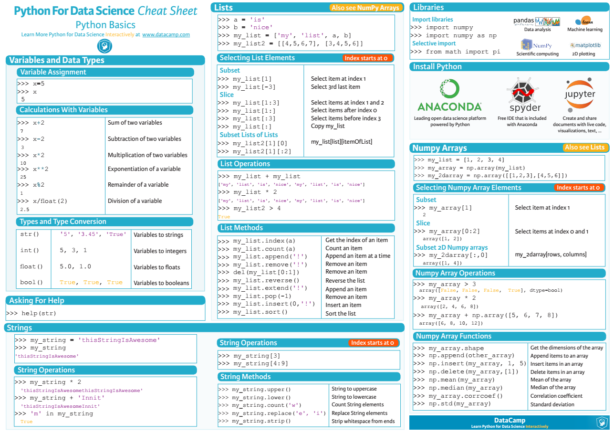
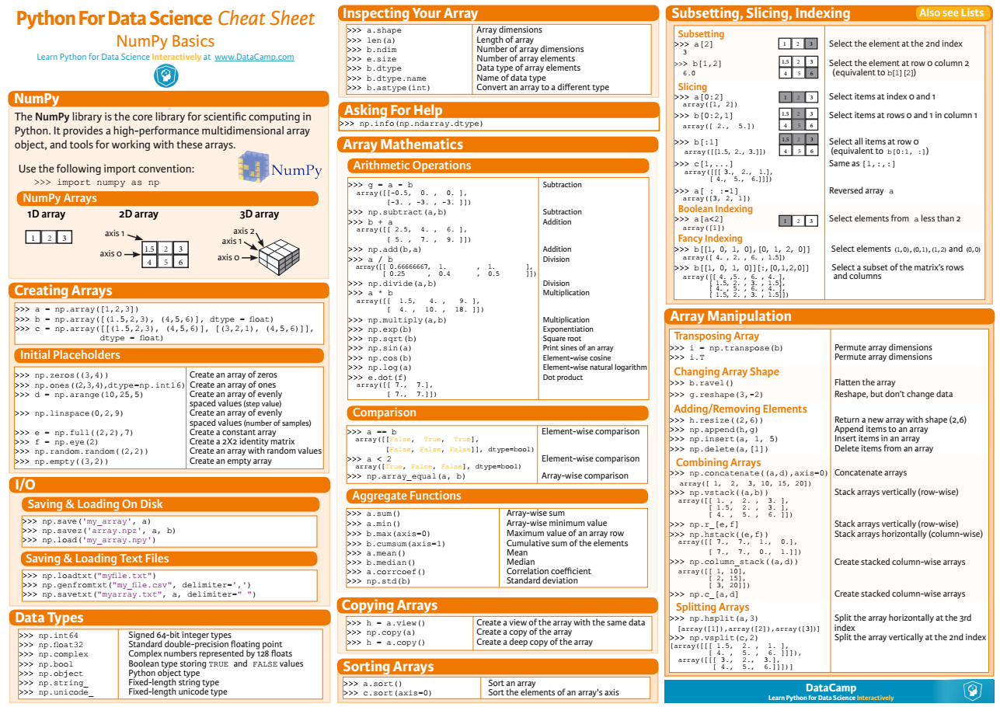
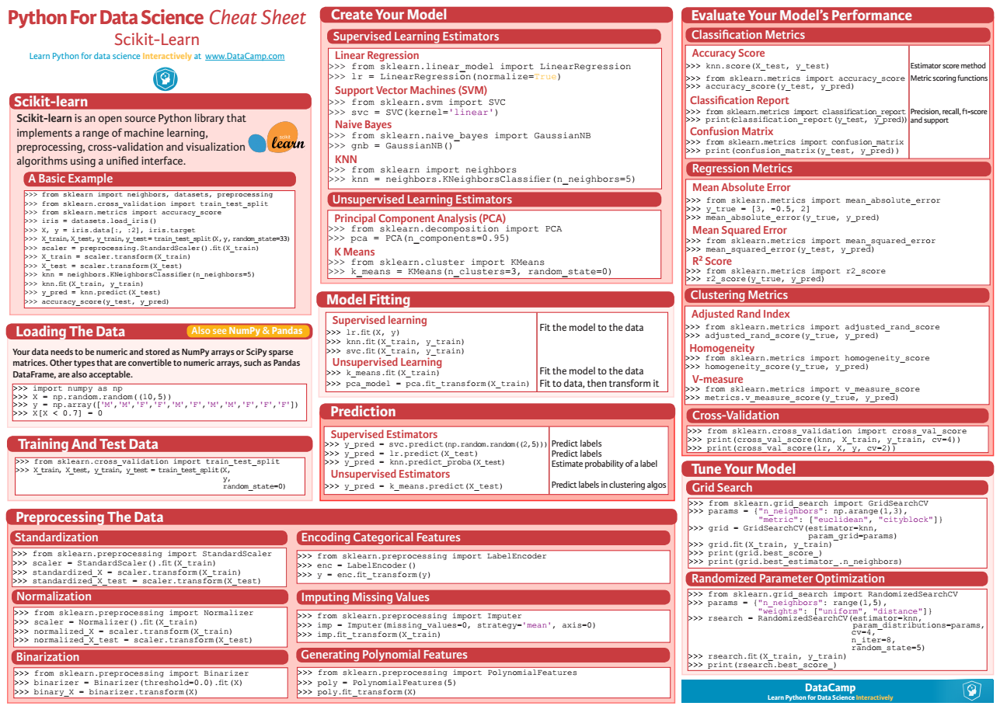
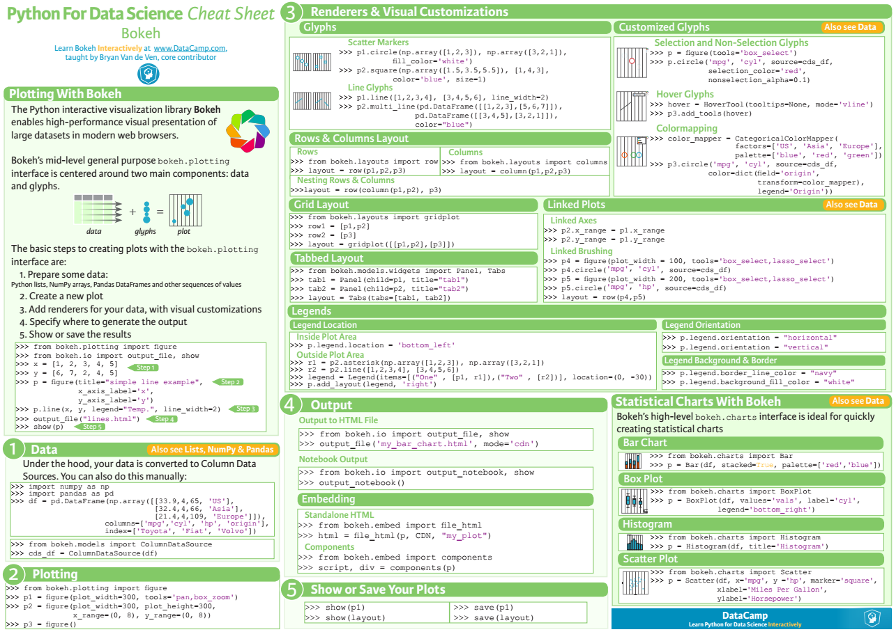
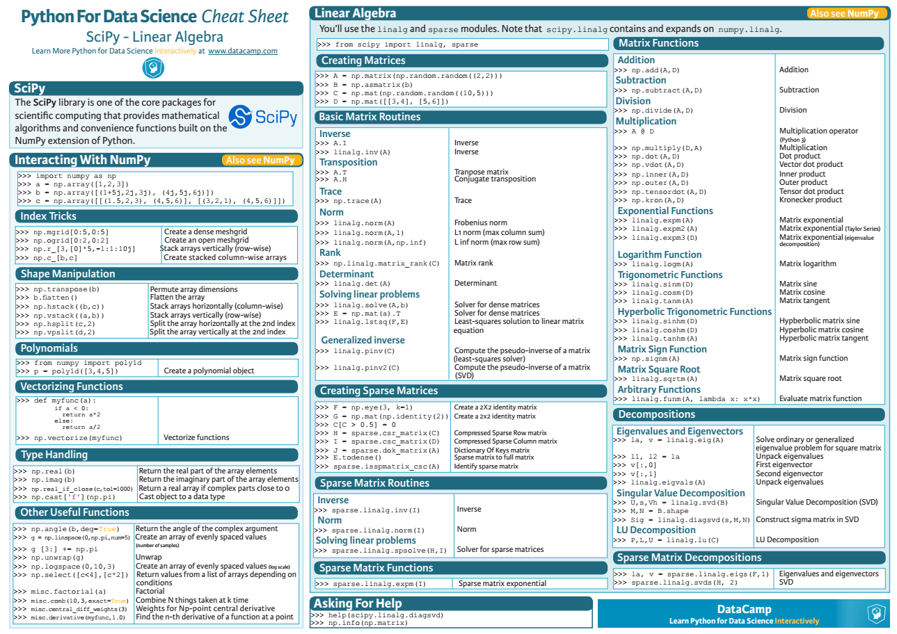
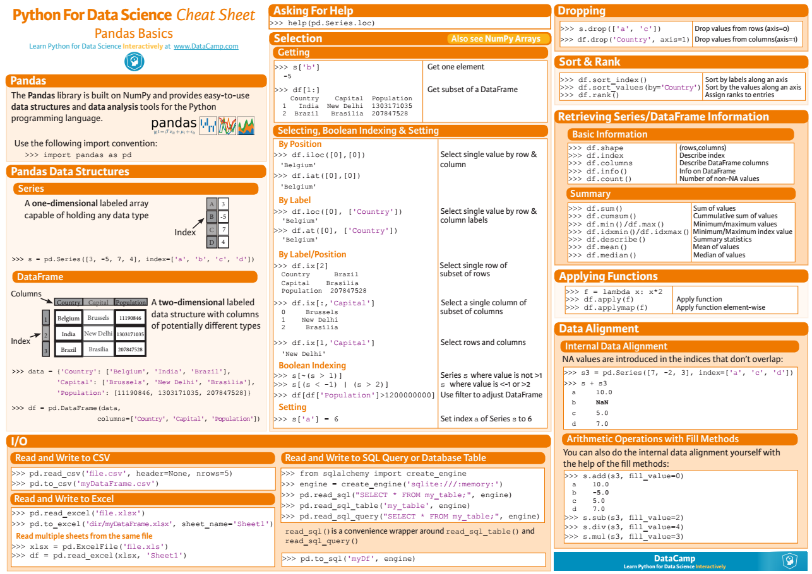

- 
- [首页](https://www.cnblogs.com/)
- [新闻](https://news.cnblogs.com/)
- [博问](https://q.cnblogs.com/)
- [专区](https://brands.cnblogs.com/huawei)
- [闪存](https://ing.cnblogs.com/)
- [班级](https://edu.cnblogs.com/)

- [注册](https://account.cnblogs.com/signup) 登录

[Little_Rookie](https://www.cnblogs.com/nxld/)

- [博客园](https://www.cnblogs.com/)
- [首页](https://www.cnblogs.com/nxld/)
- [新随笔](https://i.cnblogs.com/EditPosts.aspx?opt=1)

- [管理](https://i.cnblogs.com/)

随笔 \- 114  文章 \- 0  评论 \- 70  阅读 \- 334万

# [python数据分析实用小抄](https://www.cnblogs.com/nxld/p/6687253.html)

#### 1. [python数据分析基础](https://s3.amazonaws.com/assets.datacamp.com/blog_assets/PythonForDataScience.pdf)

#### 2. [numpy](https://s3.amazonaws.com/assets.datacamp.com/blog_assets/Numpy_Python_Cheat_Sheet.pdf)

#### 3. [Scikit-Learn](https://s3.amazonaws.com/assets.datacamp.com/blog_assets/Scikit_Learn_Cheat_Sheet_Python.pdf)

#### 4. [Bokeh](https://s3.amazonaws.com/assets.datacamp.com/blog_assets/Python_Bokeh_Cheat_Sheet.pdf)

#### 5. [Scipy](https://s3.amazonaws.com/assets.datacamp.com/blog_assets/Python_SciPy_Cheat_Sheet_Linear_Algebra.pdf)

#### 6. [Pandas](https://s3.amazonaws.com/assets.datacamp.com/blog_assets/PandasPythonForDataScience+%281%29.pdf)

转载于：http://www.jianshu.com/p/7f4945b5d29c

即使只是凡世中一颗小小的尘埃，命运也要由自己主宰，像向日葵般，迎向阳光、勇敢盛开

分类: [python](https://www.cnblogs.com/nxld/category/908516.html)

标签: [python](https://www.cnblogs.com/nxld/tag/python/)

好文要顶 关注我 收藏该文 

[Little_Rookie](https://home.cnblogs.com/u/nxld/)
[关注 \- 1](https://home.cnblogs.com/u/nxld/followees/)
[粉丝 \- 435](https://home.cnblogs.com/u/nxld/followers/)

+加关注

2

0

[«](https://www.cnblogs.com/nxld/p/6624966.html) 上一篇： [Mysql中的定时任务](https://www.cnblogs.com/nxld/p/6624966.html "发布于 2017-03-27 02:26")
[»](https://www.cnblogs.com/nxld/p/6756492.html) 下一篇： [像Excel一样使用python进行数据分析](https://www.cnblogs.com/nxld/p/6756492.html "发布于 2017-04-24 13:44")

posted @ 2017-04-10 01:55  [Little_Rookie](https://www.cnblogs.com/nxld/)  阅读(4662)  评论(0)  [编辑](https://i.cnblogs.com/EditPosts.aspx?postid=6687253)  收藏  举报

刷新评论[刷新页面](#)[返回顶部](#top)

登录后才能查看或发表评论，立即 登录 或者 [逛逛](https://www.cnblogs.com/) 博客园首页

[【推荐】百度智能云开发者赋能计划，云服务器4元起，域名1元起](https://cloud.baidu.com/campaign/2022developer/index.html?track=18708feb6fc4c4db36171b5d7d99f1509444b5c535f8dfc7#person)
[【推荐】华为开发者专区，与开发者一起构建万物互联的智能世界](https://brands.cnblogs.com/huawei)

**编辑推荐：**
· [戏说领域驱动设计（十九）——外验](https://www.cnblogs.com/skevin/p/16035785.html)
· [ASP.NET Core 在 IIS 下的两种部署模式](https://www.cnblogs.com/artech/p/inside-asp-net-core-6-32.html)
· [记我第一次做线下技术分享的那些事](https://www.cnblogs.com/skychen1218/p/16068503.html)
· [换个数据结构，一不小心节约了 591 台机器！](https://www.cnblogs.com/thisiswhy/p/16066548.html)
· [\[ASP.NET Core\] MVC 模型绑定：非规范正文内容的处理](https://www.cnblogs.com/tcjiaan/p/16058491.html)

**最新新闻**：
· [知乎的商业化迷途](https://news.cnblogs.com/n/718066/)
· [清华博士提出「Chiplet精算师」登顶会！越接近摩尔极限，多芯片集成越划算](https://news.cnblogs.com/n/718041/)
· [这届年轻人靠陪伴赚钱：有人陪逛、陪考月入过万，有人忙活一天还捐钱](https://news.cnblogs.com/n/718067/)
· [起底小米生态链：8年投资500+，近30家成功上市，多家排队IPO](https://news.cnblogs.com/n/718065/)
· [董小姐的日子不太好过](https://news.cnblogs.com/n/718064/)
» [更多新闻...](https://news.cnblogs.com/ "IT 新闻")

|     |     |     |
| --- | --- | --- |
| <   | 2022年4月 | >   |

日一二三四五六27282930311234567891011121314151617181920212223242526272829301234567

### 我的标签

- [r(50)](https://www.cnblogs.com/nxld/tag/r/)
- [excel(16)](https://www.cnblogs.com/nxld/tag/excel/)
- [mysql(13)](https://www.cnblogs.com/nxld/tag/mysql/)
- [python(13)](https://www.cnblogs.com/nxld/tag/python/)
- [信用知识(12)](https://www.cnblogs.com/nxld/tag/%E4%BF%A1%E7%94%A8%E7%9F%A5%E8%AF%86/)
- [机器学习(8)](https://www.cnblogs.com/nxld/tag/%E6%9C%BA%E5%99%A8%E5%AD%A6%E4%B9%A0/)
- [tableau(3)](https://www.cnblogs.com/nxld/tag/tableau/)
- [pandas(2)](https://www.cnblogs.com/nxld/tag/pandas/)
- [分类(1)](https://www.cnblogs.com/nxld/tag/%E5%88%86%E7%B1%BB/)
- [回归(1)](https://www.cnblogs.com/nxld/tag/%E5%9B%9E%E5%BD%92/)
- [更多](https://www.cnblogs.com/nxld/tag/)

### 积分与排名

- 积分 \- 310907
- 排名 \- 2359

### 随笔档案

- [2018年10月(1)](https://www.cnblogs.com/nxld/archive/2018/10.html)
- [2017年8月(2)](https://www.cnblogs.com/nxld/archive/2017/08.html)
- [2017年6月(1)](https://www.cnblogs.com/nxld/archive/2017/06.html)
- [2017年4月(2)](https://www.cnblogs.com/nxld/archive/2017/04.html)
- [2017年3月(5)](https://www.cnblogs.com/nxld/archive/2017/03.html)
- [2017年2月(28)](https://www.cnblogs.com/nxld/archive/2017/02.html)
- [2017年1月(2)](https://www.cnblogs.com/nxld/archive/2017/01.html)
- [2016年12月(25)](https://www.cnblogs.com/nxld/archive/2016/12.html)
- [2016年11月(48)](https://www.cnblogs.com/nxld/archive/2016/11.html)

### 最新评论

- [1\. Re:ROC曲线-阈值评价标准](https://www.cnblogs.com/nxld/p/6365637.html)
- 请问“AUC小于0.5的把结果取反就行,”意思是把变量值取倒数吗？
    
- --Kukulcan
- [2\. Re:python－－数据清洗](https://www.cnblogs.com/nxld/p/6085605.html)
- 图都挂了。。
    
- --Mr_Guanghui
- [3\. Re:自己动手写Logistic回归算法](https://www.cnblogs.com/nxld/p/6125809.html)
- 太强了
    
- --不奋斗不青春
- [4\. Re:Mysql中的定时任务](https://www.cnblogs.com/nxld/p/6624966.html)
- 最喜欢这种代码+解释的博客了，感谢分享
    
- --哒哒哒哒崽丶
- [5\. Re:如何在R语言中使用Logistic回归模型](https://www.cnblogs.com/nxld/p/6170690.html)
- 求博主有空更新一下博文，好多图片都失效了，博文真的很有用哎！！！看了好多遍。
    
- --V米兰小铁匠

Copyright © 2022 Little_Rookie
Powered by .NET 6 on Kubernetes