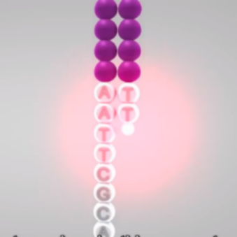

# 【Python】一文学会Seaborn！

<a id="profileBt"></a><a id="js_name"></a>机器学习初学者 *2022-05-30 15:16* *Posted on <a id="js_ip_wording"></a>浙江*

The following article is from pythonic生物人 Author 点击关注👉

<a id="copyright_info"></a>[<br>**pythonic生物人** .<br>分享数据科学干货（涉及Python/R/统计等）](#)

- Matplotlib绘制一张美图需要很多参数调整，于是就出现了high-level版的Seaborn，几行代码即可输出美美的图形，那么Seaborn是如何做到的？
    

- Seaborn主要有两种图形实现方法Figure水平「下图绿色格子中所有方法，如jointplot、JointGrid」、Axes水平「如stripplot、swarmplot等」，**本文梳理Seaborn主要结构，助快速掌控Seaborn**👇
    


Seaborn Overview

Seaborn详细文章👇

* * *

## Figure水平方法

此时，通过`seaborn.axisgrid.FacetGrid`对象作图，以`displot`为例，

- **单个图**
    

```
`import seaborn as sns
import pandas as pd
penguins = sns.load_dataset("penguins")#导入数据
g = sns.displot(data=penguins,
                x="flipper_length_mm",
                hue="species",
                multiple="stack",
                kind="hist")#一行代码出图
sns.set(style='whitegrid', font_scale=1.2)
print(type(g))
`
```

`\<class 'seaborn.axisgrid.FacetGrid'>` # 注意此处g对象类型

- **多子图**
    

Figure水平多子图一行代码搞定，

```
`sns.displot(data=penguins, x="flipper_length_mm", hue="species", col="species")
`
```


- **矩阵图 (pairplot)**
    

```
`sns.pairplot(data=penguins, hue="species")
`
```


- **矩阵图 (PairGrid)**
    

`PairGrid`可使矩阵图更加个性化，

```
`g = sns.PairGrid(penguins, diag_sharey=False)
g.map_upper(sns.scatterplot)  #右上角做散点图
g.map_lower(sns.kdeplot)  #左下角做等高线图
g.map_diag(sns.histplot)  #中间做直方图
`
```


* * *

## Axes水平方法

此时，直接在`matplotlib.axes._subplots.AxesSubplot`对象上作图，以`hisplot`为例，

- **单个图**
    

```
`import seaborn as sns
import pandas as pd
penguins = sns.load_dataset("penguins")
g = sns.histplot(data=penguins,
                 x="flipper_length_mm",
                 hue="species",
                 multiple="stack")
sns.set(style='whitegrid', font_scale=1.2)
print(type(g))
`
```

`\<class matplotlib.axes._subplots.AxesSubplot>` # 注意此处g对象类型


- **多子图**
    

比较繁琐，

```
`import matplotlib.pyplot as plt
f, axs = plt.subplots(1,
                      2,
                      figsize=(8, 4),
                      gridspec_kw=dict(width_ratios=[4, 3]))
sns.scatterplot(data=penguins,
                x="flipper_length_mm",
                y="bill_length_mm",
                hue="species",
                ax=axs[0])
sns.histplot(data=penguins,
             x="species",
             hue="species",
             shrink=.8,
             alpha=.8,
             legend=False,
             ax=axs[1])
f.tight_layout()
`
```


- 从上面实例可知，在简单图形上，Figure方法和Axes方式结果几乎一样，在多子图绘制时，Figure水平优势明显;
    
- 相比于jointplot/pairplot，JointGrid/PairGrid可以更个性化。
    
- 本文简要介绍了Seaborn的主要方法，详细可参考历史文章及官网。
    

致谢：http://seaborn.pydata.org/index.html

-END-

```


```


```


```


```


```


往期精彩回顾

- [适合初学者入门人工智能的路线及资料下载](http://mp.weixin.qq.com/s?__biz=MzIwODI2NDkxNQ==&mid=2247484737&idx=1&sn=27c52b4bc4ca98d3ab817344b84226cc&chksm=97048efda07307eb78d4f4ec0039a386a658404156b051af0cb715fafa8d2ae66cbe49343bf3&scene=21#wechat_redirect)
    
- [(图文+视频)机器学习入门系列下载](https://mp.weixin.qq.com/mp/appmsgalbum?__biz=MzIwODI2NDkxNQ==&action=getalbum&album_id=2259163844755406853#wechat_redirect)
    
- [中国大学慕课《机器学习》（黄海广主讲）](http://mp.weixin.qq.com/s?__biz=MzIwODI2NDkxNQ==&mid=2247502323&idx=1&sn=598d7231681ce2f316503201dd615c86&chksm=9707424fa070cb59f861a47f9eb4218cc5d3b835be49e93e67bb086dcc4c3b555a3546ebe9c5&scene=21#wechat_redirect)
    
- [机器学习及深度学习笔记等资料打印](http://mp.weixin.qq.com/s?__biz=MzIwODI2NDkxNQ==&mid=2247488304&idx=1&sn=581944f63eab1822ca53b9a4eeedad79&chksm=9704988ca073119a38a534adbedd51ca0b5705cdd6a104fed74b265bb092485e97c91bb5b347&scene=21#wechat_redirect)
    
- [《统计学习方法》的代码复现专辑](https://mp.weixin.qq.com/mp/appmsgalbum?action=getalbum&album_id=1337257945842778113&__biz=MzIwODI2NDkxNQ==#wechat_redirect)
    
- 机器学习交流qq群955171419，加入微信群请扫码
    


```


```


```


```


```


```

People who liked this content also liked

编辑推荐 | 多源融合SLAM的现状与挑战

...

中国图象图形学报

不看的原因

- 内容质量低
- 不看此公众号

使用OpenCV进行对象检测

...

计算机视觉life

不看的原因

- 内容质量低
- 不看此公众号

ROS—基于python3实现opencv图像处理任务

...

古月居

不看的原因

- 内容质量低
- 不看此公众号


Scan to Follow