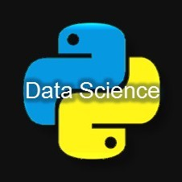

# 一行 Pandas 代码搞定 Excel “条件格式”！

<a id="profileBt"></a><a id="js_name"></a>数据分析与开发 *2021-02-03 11:45*

The following article is from Python数据科学 Author 东哥起飞

<a id="copyright_info"></a>[<br>**Python数据科学** .<br>以Python为核心语言，专攻于「数据科学」领域，文章涵盖数据分析，数据挖掘，机器学习等干货内容，分享大量数据挖掘实战项目分析和讲解，以及海量的学习资源。](#)

条件格式

说实话，Excel的 **“条件格式”** 是东哥非常喜欢的功能之一，通过添加颜色条件可以让表格数据更加清晰的凸显出统计特性。

有的朋友在想，这样的操作在python可能会很复杂。但其实一点不复杂，而且只需一行代码即可。

为什么可以做到一行代码实现 “条件格式”？

一是使用了pandas的`style`方法，二是要得益于pandas的`链式法则`。

下面我们来一起看个例子，体验一下这个组合操作有多骚。

**实例**

首先，我们导入数据集，使用经典的titanic中抽样的部分数据。

```


import pandas as pd
df = pd.read_csv("test.csv")
df


```


可以看到，现在这个dataframe是空白的，什么都没有的，现在要给表格添加一些条件。

1、比如我们想让Fare变量值呈现条形图，以清楚看出各个值得大小比较，那么可直接使用`bar`代码如下。

df.style.bar("Fare",vmin=0)


2、再比如，我们想让Age变量呈现背景颜色的梯度变化，以体验映射的数值大小，那么可直接使用`background_gradient`，深颜色代表数值大，浅颜色代表数值小，代码如下。

df.style.background_gradient("Greens",subset="Age")


3、让所有缺失值都高亮出来，可使用`highlight_null`，表格所有缺失值都会变成高亮。

df.style.highlight_null()


以上就是`pandas`的`style`条件格式，用法非常简单。下面我们用链式法则将以上三个操作串起来，只需将每个方法加到前一个后面即可，代码如下。

df.style.bar("Fare",vmin=0).background_gradient("Greens",subset="Age").highlight_null()


当然，如果你希望加更多的条件格式效果，还可以继续让链式更长，但不论条件怎么多，都只是一行代码。

**其它操作**

上面仅仅是列举了三个`style`中常用的操作，还有很多其他操作比如高亮最大值、给所有负值标红等等，通过参数subset还可以指定某一列或者某几列的小范围内进行条件格式操作。

```


# 负值标为红色
applymap(color_negative_red)
# 高亮最大值
apply(highlight_max)
# 使某一列编程±前缀，小数点保留两位有效数字
format({"Coulumn": lambda x: "±{:.2f}".format(abs(x))})
# 使用subset进行dataframe切片，选择指定的列
applymap(color_negative_red,
                  subset=pd.IndexSlice[2:5, ['B', 'D']])


```

另外，还有很多的效果可以实现，比如结合`seaborn`的各种风格。

```


import seaborn as sns
cm = sns.light_palette("green", as_cmap=True)
df.style.background_gradient(cmap=cm)


```


如果结合`Ipython`的`HTML`还可以实现炫酷的动态效果。

```


from IPython.display import HTML
def hover(hover_color="#ffff99"):
    return dict(selector="tr:hover",
                props=[("background-color", "%s" % hover_color)])
styles = [
    hover(),
    dict(selector="th", props=[("font-size", "150%"),
                               ("text-align", "center")]),
    dict(selector="caption", props=[("caption-side", "bottom")])
]
html = (df.style.set_table_styles(styles)
          .set_caption("Hover to highlight."))
html


```


关于`style`条件格式的所有用法，可以参考pandas的官方文档。

**链接：**https://pandas.pydata.org/pandas-docs/version/0.18/style.html

文中数据集可以在公众号后台回复关键字 条件格式 获取。

\- EOF -

推荐阅读  点击标题可跳转

<ins>1、[Pandas 必知必会的使用技巧，值得收藏！](http://mp.weixin.qq.com/s?__biz=MzA5ODM5MDU3MA==&mid=2650869810&idx=2&sn=cea7c191f87235d091c30191eda28abc&chksm=8b67f777bc107e615e747b266937c032624708209d0339086d0edff9fe69fc843ee1aa696b4d&scene=21#wechat_redirect)</ins>

<ins>2、[Python 数据处理库 pandas 进阶教程](http://mp.weixin.qq.com/s?__biz=MzA5ODM5MDU3MA==&mid=2650863849&idx=1&sn=fa0f58c0dcc172e0bbdd449731d980f5&chksm=8b661facbc1196baa215166eb69db5e831e4b0f4885fefcc15c185401d2b033d6066b2baec46&scene=21#wechat_redirect)</ins>

<ins>3、[Pandas 可视化综合指南：手把手从零教你绘制数据图表](http://mp.weixin.qq.com/s?__biz=MzA5ODM5MDU3MA==&mid=2650865469&idx=1&sn=e6e6ea23a0c0e77586c0eb318e9ecee3&chksm=8b661878bc11916e5eae2ca895ec54d711437d799023c5b9382589b8ddd0e0f8783f09975380&scene=21#wechat_redirect)</ins>

看完本文有收获？请转发分享给更多人

**推荐关注「数据分析与开发」，提升数据技能**


点赞和在看就是最大的支持❤️

People who liked this content also liked

我学习 Python 的三个神级网站

数据分析与开发

不看的原因

- 内容质量低
- 不看此公众号


Scan to Follow