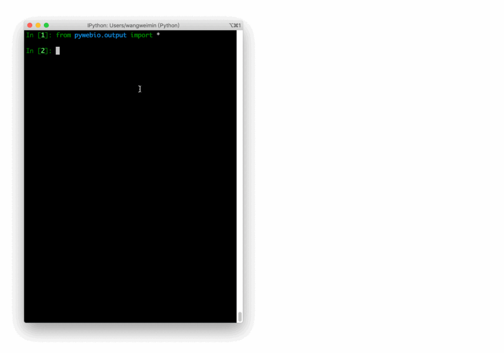

# 像数据分析一样写 Web 页面，这个 Python 库做到了！

<a id="copyright_logo"></a>Original 刘早起 <a id="profileBt"></a><a id="js_name"></a>早起Python *2021-10-30 10:12*

收录于话题

<a id="js_article_tag_name__2112489489896898561"></a>#PyWebIO开发 <a id="js_article_tag_num__2112489489896898561"></a>4 <a id="js_article_tag_tips__2112489489896898561"></a>个

<a id="js_article_tag_name__2125351522912763904"></a>#用服务器做好玩的事儿 <a id="js_article_tag_num__2125351522912763904"></a>5 <a id="js_article_tag_tips__2125351522912763904"></a>个

大家好，我是早起。

提起用 Python 写一个 web 页面，总是会想起`Django/Flask`等这样的大家伙。

他们确实好用，但就是流程繁琐，比如有时就想写一个简单的页面，比如问卷调查，拿 `Django` 来说吧总要经过**安装、启动、配置、创建app、注册路由、写各种 `html/css/js` 文件**，小白的话说不定就卡死在哪一步了。

**尤其对于数据分析相关用户，我就想写个页面展示个报告，有没有更简单的选择？**

恰好最近从一些文章中了解到一个新的 web 开发库 `PyWebIO` ，我也尝试着用他去写一个页面，结果很惊艳，**不用css什么乱七八糟的文件，一个py脚本就能搞定一整个页面！**

**并且写页面的过程就像用pandas进行数据分析一样轻松**！所以我打算拿几篇文章来循序渐进的分享这个库的相关操作，本文是第一篇，主要介绍一下基本流程与常见操作。

01

安装与基本流程

安装 `PyWebIO` 和其他的第三方库一样使用`pip install PyWebIO`就行，没有任何难度，此处不做多讲。

但是在正式讲解一些常见的操作之前，我需要解释一下，为什么说用 `PyWebIO` 写页面就像数据分析一样。

回想一下我们使用Python进行数据分析的流程，启动 `Jupyter Notebook` 导入数据，进行数据预览、筛选、拆分合并等操作，得到自己满意的结果，最后保存方便查看，更重要的是一行代码一个结果，方便调试。

而使用 `PyWebIO` 开发页面流程也是类似，我们不用过分关心`CSS、JS`等文件，**全程我们只需要操作一个py脚本。**

也不用关心数据库配置、前后端交互，就像上面的数据分析一样，创建一个空白页面，然后一行代码添加一部分内容，内容可以实时编译输出，甚至可以在 `ipython` 中进行开发👇

与其说是第一个第三方库，我更愿意称它为一个 `APP` ，因为一行代码对应一个操作，例如可以调用 `put_text()` 、 `put_image()` 、 `put_table()` 等函数输出文本、图片、表格等内容到浏览器！

当然，**之所以能这么便捷高效的开发页面，基于别人封装好的，高度精准定义好的功能，因此使用场景十分有限**，例如问卷调查、表单填写、数据报告展示等简单的、个人使用的，且对样式、特效等不做太高要求的场景。

关于它让人不爽的地方，我会在后面的系列文章中进行讲解，这不影响它确实是一个高效率的web开发库，下面让我对其常见操作进行讲解。

02

来！现在就开发页面！

本节我将介绍使用 `PyWebIO` 开发页面中的一些常见操作。

当然，我深知阅读文档的枯燥与痛苦，所以我将以从 0 实现下面的页面为最终目标进行讲解！


左右滑动查看更多

## 插入文字

平时我们写 `html` 会用类似`<h1>`标签来控制标题，用`<p>``<span>`这样的标签来输出文字。

在 `PyWebIO` 中可以使用 `markdown` 来实现类似效果，语法是`put_markdown()`，将markdown添加进去，就会自动渲染

```
put_markdown(("""# 👏 我的第一个页面
    这是早起Python教我用Python写的第一个页面！
    
    写点什么呢？到底写一点什么好呢？好像真的没什么好写的，到底写什么呢？
    我也不知道该写点什么， 反正有点什么内容就好了！"""), lstrip=True)

```

效果如下

## 插入图片

静态元素是一个网页的重要组成部分，使用 `PyWebIO`  插入也是很简单，使用 `put_image()` 可以插入图片，代码如下

```
put_image(open('iShot2021-10-29 17.14.08.png', 'rb').read()) 

```

随手用手机拍了一张图片，效果如下👇

## 插入表格

传统html使用table插入表格，这里使用类似方法

```
    put_table([
    ['商品', '价格'],
    ['苹果', '5.5'],
    ['香蕉', '7'],
])

```

效果如下，后面如果表格内容需要变化，可以写个函数让他动态更新

## 插入代码

插入代码也是没有问题的

展示效果如下

## 交互 \- 收集信息

上面都是常规的静态元素添加，其他一些库也能做到，甚至手写原生html都行，下面来点更高级的！

首先是简单的交互式输入框，开发者已经写好了，调用命令也很简单

```
name = input("你的名字是什么？?")

```

只用一行代码，效果如下，当然这也意味着样式什么的不支持修改

这里我们选择将接收到消息打印出来，当然也是可以写一个函数，将数据进行保存，这会在后面带大家开发问卷系统讲到

## 交互 \- 隐藏输入

如果我们在开发问卷系统，有些选项希望用户输入时可以隐藏输入，就像输入密码一样

```
password = input("不想让别人看见你的输入？", type=PASSWORD)

```


## 交互 \- 输入代码

通过交互输入框接收代码也是可以的，后面我讲介绍如何让代码执行，下面是可以实现的样式

```
    code = textarea('Code Edit', code={
    'mode': "python",  # code language
    'theme': 'darcula',  #  Codemirror theme
}, value='import something\n# Write your python code')

```


## 交互 \- 按钮功能

其实上面说的存储数据也好，执行代码也好，本质上就是给这个提交按钮添加一个功能，我们来实现最简单的计算器。也就是点击提交，计算两数相加

```
    data = input_group("做个计算器", [
        input('第一个数字', name='num1', type=NUMBER),
        input('第二个数字', name='num2', type=NUMBER)
    ])
    put_text(f"计算结果是{data['num1']} + {data['num2']} = {data['num1'] + data['num2']}  ")

```


因为简单，连函数都不用定义，直接 `f-string` 就解决了，如果需要复杂的功能，就可以定义一个函数，点击按钮就执行这个函数

## 如何渲染页面

从上面的介绍不难看出，用 `PyWebIO` 就好比往一张白纸里面塞东西。

但我还没说，如何创建一张白纸以及如何渲染页面，下面是一个本文用的最简单的框架

```
from pywebio import *
from pywebio.input import *
from pywebio.output import *
def myfirstpage():
    something
    
if __name__ == '__main__':
    start_server(myfirstpage,port=8082,auto_open_webbrowser=True)

```

可以看到，我们只要定义一个函数，然后往里面塞各种内容，最后通过`start_server()`指定端口启动就行！

03

小结

至此，有关  `PyWebIO`  开发页面的基本流程与常见操作就介绍完了。

是不是就像数据分析一样，拿着各种函数对数据一通操作，**我们也是拿着各种写好的功能，需要一个添加一个！** 如果你感兴趣的话，我强烈建议你自己敲一遍代码感受一下。

当然，本文介绍的代码只是最简单的demo，关于这个库我还有很多想说的，最近我用这个库亲自做了一个数据查询页面，**如果你喜欢的话，可以给本文点赞支持一下！**

## 文末福利

以上页面都是在本地写的，**如果想让你的页面让任何人都能访问，就需要有一台服务器了！**就像我写的下面这个页面（后面会分享制作流程）


如果你还没有服务器，恰好双十一来了，**我和阿里云的敖丙申请了 1000 台云服务器送给大家作为福利**，体验一下在云端写代码的感觉！

只要你没有在阿里云买过服务器，咱早起Python的粉丝都可以**无套路直接领取**，扫描下方二维码添加我的微信并备注「**服务器**」即可


收录于话题 #<a id="js_album_keep_read_title"></a>用服务器做好玩的事儿

 <a id="js_album_keep_read_size"></a>5个

<a id="js_album_prev"></a>上一篇 <a id="js_album_keep_read_pre_title"></a>PyWebIO，让 Pandas 原地起飞的神器！ <a id="js_album_next"></a>下一篇 <a id="js_album_keep_read_next_title"></a>再见xx网盘！4 行命令搭建属于你的私人网盘！

People who liked this content also liked

索引的数据结构

奔跑的小梁

不看���原因

- 内容质量低
- 不看此公众号

Python的可视化-legend（）函数

科技小白的唠唠叨叨

不看的原因

- 内容质量低
- 不看此公众号

数据结构与算法--复杂度分析

不爱说话的老王

不看的原因

- 内容质量低
- 不看此公众号


Scan to Follow