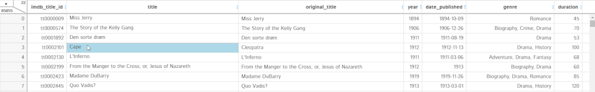
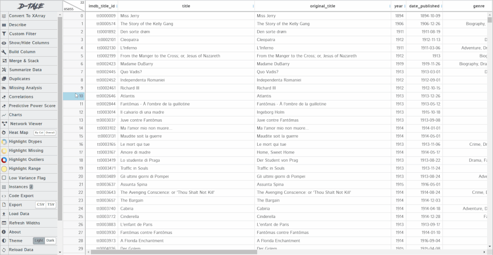

# 吹爆这个 pandas GUI 神器，自动转代码！

<a id="profileBt"></a><a id="js_name"></a>开源前哨 *2021-12-09 11:40*

The following article is from Python数据科学 Author 东哥起飞

<a id="copyright_info"></a>[<br>**Python数据科学** .<br>以Python为核心语言，专攻于「数据科学」领域，文章涵盖数据分析，数据挖掘，机器学习等干货内容，分享大量数据挖掘实战项目分析和讲解，以及海量的学习资源。](#)

关于`pandas`的`GUI`工具，可以说，有了`GUI`可视化界面，操作就和Excel一样简单，本次介绍一款功能更加强大的`GUI`神器：**D-Tale**。

这个库的名字为啥要`D-Tale`呢？还去查了下，它是`detail`的谐音，初衷是要提供数据的所有详细信息。下面介绍下如何使用它。

## 启动、数据加载

`D-Tale`支持多种文件格式，包括`CSV`、`TSV`、`XLS`、`XLSX`。它是一个以`Flask` 为后端，`React` 作为前端构建的，通过`pip`安装即可。

```
pip install dtale

```

两种启动 D-Tale 的方式：

- 将DataFrame对象传递给 D-Tale 函数，在 Jupyter 单元中实例化 GUI。
    
- 不导入DataFrame对象的情况下初始化 D-Tale，显示为一个带有 GUI 的交互菜单来加载数据并提供各种其他选项。
    

为了更好地演示，这里选择第二种。

```
import dtale
dtale.show(open_browser=True)

```

运行代码后，将获得下面的 GUI 菜单：


数据的导入有几种方式，

1.  从文件加载数据
    
2.  从网站加载数据。需要传递网站的链接，可以从中获取 CSV、JSON、TSV 或 Excel 等文件。
    
3.  加载示例数据集。这些数据集可能需要一些后台下载才能从服务器获取数据集。
    

本文以一个电影的示例数据集展示如何使用。加载数据集后，就会像 `pandas`一样呈现一个表格。表里的所有单元格都可以编辑，就像在 `excel` 中一样直接更改值。



## 列菜单功能

当单击列标题时，可以获得一个选项列表，选项的内容取决于该列的数据类型。比如下面3个类型：`datatime64`、`int64`、`str`，3个选项列表的共同点是按升序或降序排序。除此之外，对于不同类型的数据会有不同的过滤方法。


具体探索一下项目里的功能。

### 1\. 冻结

锁定功能类似于`excel`中的首行冻结，将列锁定在最左侧，这样可以自由地滚动表格同时看到锁定的列了。


### 2.隐藏和删除

隐藏选项将会去掉表格中的某列，但它不会从实际地删除。当然，也可以从右上角的条中取消隐藏列。

删除选项将从数据框中永久删除列。它类似于 `pandas` 的 `drop` 函数。


### 3\. 替换和类型转换

替换选项可以替换表中某些固定值或者填充空值。可以`inplace=True`替换某列或者创建一个新列。同时，替换类型可以定义为：特定值、空格或特定字符串的替换。

例如下面，`date_published`列应包含所有日期类型的字符串，但存在了不应存在的文本 `TV Movie 2019`，这时候可以用 `numpy nan` 来替换这个异常值。


现在，我可以使用类型转换选项轻松地将`date_published`列的数据类型从字符串更改为日期时间，同时提供了`inplace`或`new columns`更改的选项：


### 4\. 描述性统计

`pandas` 中的`describe`函数有助于提供列或数据集的统计摘要。这里的 `describe` 一样，并且提供的信息比普通的 `pandas` 函数更多，它为每种数据类型提供了唯一的`describe`摘要。

对于日期时间类型 `column`，它提供以下详细信息：


另外，它还为特征生成了`histogram`和 `value_counts` 图：


对于整数类型的列，它提供了中心性、频率、峰度和偏度。它还表示箱线图、直方图、value_count 图和 QQ 图中的数据。

对于字符串类型的列，它提供最常用的词及其频率、字符的详细摘要、词值计数图和值计数图。

### 5\. 筛选过滤

在 `D-Tale` 中过滤数据非常简单，只需要指定所需的过滤器类型。下面的示例显示按年份 `> 2000` 和年份 `== 2001` 过滤数据集：


在筛选日期时间类型列中的数据时，也可以按日期范围筛选数据。对于字符串类型的列，可以通过以下方式过滤数据：


### 6\. 方差报告

这个选项不适用于字符串类型值。方差报告基于以下两点来决定特征是否具有低方差：

- 特征中的唯一值计数/样本大小 < 10%
    
- 最常用值的计数/第二常用值的计数 \> 20
    

显示计算结果，并用直方图以呈现结果。


### 7\. 文本清洗

这个选项仅适用于字符串类型的值。文本清洗是数据科学项目的主要部分，如果使用正确的类型，它可以提高模型性能。`D-Tale` 提供了可以应用于文本的所有可能的文本清理方法，我们只需选择要应用于文本的方法，工作将在后端即可完成。


## 主菜单选项

在主菜单中，其实包含了列菜单的全部功能，但在主菜单中使用时，更加普适。比如，可以在单个或者多个列，而非手动选择了。下面是几个核心功能介绍。

### 1\. 创建列

可以创建新列或者从已有的列中创建列。像我们建模前的**特征工程**也可以使用它来实现，比如使用两列执行算数运算来创建新列。同时，我们可以给创建的新列提供名称，以及设置数据类型。


### 2\. 汇总数据

在 `pandas` 中，我们通过**分组**或**数据透视表**汇总数据。我们也可以用 `D-Tale` 做同样的事情。我们直接可以选择列、聚合函数以及最终数据集中所需的列即可，无需任何代码。下面是一个例子。



### 3\. 缺失率分析

缺失数据是所有数据集中都会经常出现的问题，因为没有数据集是完美的，它有意或无意地有很多缺失值。`D-Tale` 集成了 `missingno` 库来可视化数据集中存在的缺失值，同时它也提供**矩阵**、**条形图**、**热图**和**树状图**。


### 4\. 绘图

绘图是数据科学EDA探索性分析阶段的重要步骤。`D-Tale` 集成 `plotly` 来创建交互式绘图。它可以提供**折线图、条形图、散点图、饼图、词云图、热图、3D 散点图、表面图、地图、烛台图、树状图和漏斗图**。不同类型的数据支持不同类型的绘图，像下面这样。


### 5\. 高亮功能

用于突出显示数据集的某些部分，就像我们在 `pandas` 中使用 `stylers` 来显示特殊值一样，`highlighters` 也可以完成同样的功能。比如，我们可以高亮缺失值、数据类型、异常值或者范围。下面的示例显示了如何高亮显示缺失值和异常值：


### 6\. 代码导出、数据导出

在 `D-Tale` 中对数据框执行的所有操作都会自动转换为它们的 `python/pandas/plotly` 等效代码。可以通过单击每个操作和图表 GUI 中出现的导出代码选项来查看它们。下面是自动生成的一些代码。

```
import pandas as pd
from dtale.datasets import {dataset}
df = {dataset}()
if isinstance(df, (pd.DatetimeIndex, pd.MultiIndex)):
 df = df.to_frame(index=False)
# remove any pre-existing indices for ease of use in the D-Tale code, but this is not required
df = df.reset_index().drop('index', axis=1, errors='ignore')
df.columns = [str(c) for c in df.columns]  # update columns to strings in case they are numbers
df = df[[c for c in df.columns if c != 'imdb_title_id']]
df = df.rename(columns={'title': 'Movie_title'})
s = df['date_published']
s = df['date_published']
s = s.replace({
 'TV Movie 2019': np.nan})
df.loc[:, 'date_published'] = s
df.loc[:, 'date_published'] = pd.Series(pd.to_datetime(df['date_published'], infer_datetime_format=True), name='date_published', index=df['date_published'].index)

```

最后，我们也可以使用导出选项更改为 `CSV` 或 `TSV` 后导出数据集。

## 结论

`D-Tale` 这个GUI强大功能真的是香，以后不想敲代码的时候可以进行可视化操作了，然后转成代码如果需要的话。和之前介绍过的其他类似工具的比较来看，比如`pandasGUI`、`Mito`，`D-Tale` 的功能更加强大。

GitHub 主页地址：https://github.com/man-group/dtale

参考：

https://www.analyticsvidhya.com/blog/2021/06/exploring-pandas-dataframe-with-d-tale/

- EOF - 

**更多优秀开源项目**（点击下方图片可跳转）

[](http://mp.weixin.qq.com/s?__biz=MzAxMDM0MzQ4Mg==&mid=2451061947&idx=1&sn=247bde6f8c68e5b0a3a8ef33a1592d14&chksm=8cbd59eebbcad0f83dd5706f371789db22557fdfe3571264a4f693cc32e36e32563086eab8dd&scene=21#wechat_redirect)

[](http://mp.weixin.qq.com/s?__biz=MzAxMDM0MzQ4Mg==&mid=2451061966&idx=1&sn=5a63cabd38dc4fa7d2433e8852239810&chksm=8cbd599bbbcad08dd51ed472d4fc1b00dbfa95f664770ae3306a943bb5d48b051a8348092c9e&scene=21#wechat_redirect)

[](http://mp.weixin.qq.com/s?__biz=MzAxMDM0MzQ4Mg==&mid=2451061992&idx=1&sn=70b183cde6f8bd765c20f3722835d2d4&chksm=8cbd59bdbbcad0ab3c9c532fdc79a633e40292256954dbdd50c98a5315ebc95e742e57cfd525&scene=21#wechat_redirect)

* * *

**开源前哨**

日常分享热门、有趣和实用的开源项目。参与维护10万+star 的开源技术资源库，包括：Python, Java, C/C++, Go, JS, CSS, Node.js, PHP, .NET 等


**关注后获取**

回复 资源 获取 10万+ star 开源资源

分享、点赞和在看

支持我们分享更多优秀开源项目，谢谢！

People who liked this content also liked

如何让 Vue、React 代码的调试变得更爽

神光的编程秘籍

不看的原因

- 内容质量低
- 不看此公众号

干货小技巧：如何快速解决Typescript代码标红？

末日码农

不看的原因

- 内容质量低
- 不看此公众号

16条有趣的Python一行代码实现，建议收藏！

AI算法之道

不看的原因

- 内容质量低
- 不看此公众号


Scan to Follow