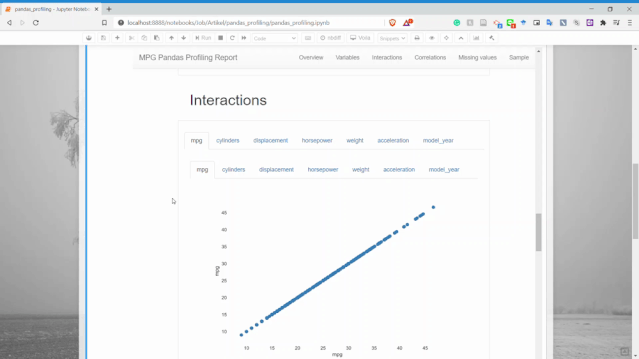
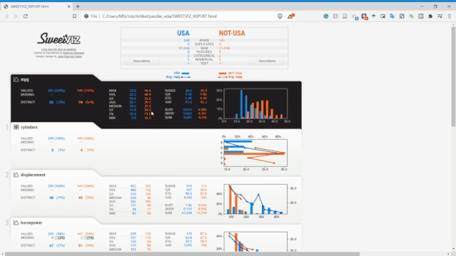
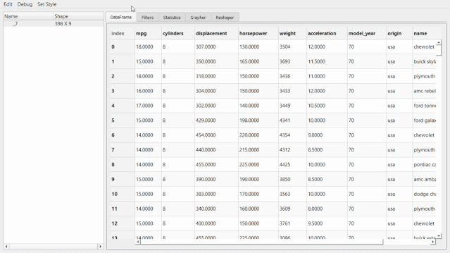
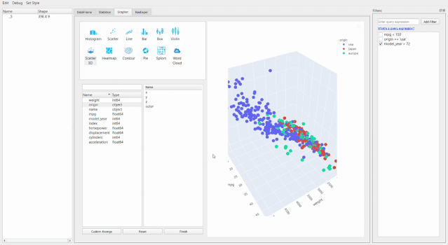

# 安利 3 个 pandas 数据探索分析神器！

<a id="profileBt"></a><a id="js_name"></a>数据分析与开发 *2021-11-27 20:30*

The following article is from Python数据科学 Author 东哥起飞

<a id="copyright_info"></a>[<br>**Python数据科学** .<br>以Python为核心语言，专攻于「数据科学」领域，文章涵盖数据分析，数据挖掘，机器学习等干货内容，分享大量数据挖掘实战项目分析和讲解，以及海量的学习资源。](#)

EDA是数据分析必须的过程，用来查看变量统计特征，可以此为基础尝试做特征工程。这次分享3个EDA神器，其实之前每一个都分享过，这次把这三个工具包汇总到一起来介绍。

## 1\. Pandas_Profiling

这个属于三个中最轻便、简单的了。它可以快速生成报告，一览变量概况。首先，我们需要安装该软件包。

```


# 安装Jupyter扩展widget 
jupyter nbextension enable --py widgetsnbextension
# 或者通过conda安装
conda env create -n pandas-profiling
conda activate pandas-profiling
conda install -c conda-forge pandas-profiling
# 或者直接从源地址安装
pip install https://github.com/pandas-profiling/pandas-profiling/archive/master.zip


```

安装成功后即可导入数据直接生成报告了。

```


import pandas as pd
import seaborn as sns
mpg = sns.load_dataset('mpg')
mpg.head()
from pandas_profiling import ProfileReport
profile = ProfileReport(mpg, title='MPG Pandas Profiling Report', explorative = True)
profile


```


使用Pandas Profiling生成了一个快速的报告，具有很好的可视化效果。报告结果直接显示在notebook中，而不是在单独的文件中打开。


总共提供了六个部分：概述、变量、交互、相关性，缺失值和样本。

Pandas profiling的变量部分是完整的，它为每个变量都生成了详细的报告。


从上图可以看出，仅一个变量就有太多信息，比如可以获得描述性信息和分位数信息。

**交互**



交互部分我们可以获取两个数值变量之间的散点图。

**相关性**

可以获得两个变量之间的关系信息。


**缺失值**

可以获取每个变量的缺失值计数信息。


**样本**

可以显示了数据集中的样本行，用于了解数据。


## 2\. Sweetviz

Sweetviz是另一个Python的开源代码包，仅用一行代码即可生成漂亮的EDA报告。与Pandas Profiling的区别在于它输出的是一个完全独立的HTML应用程序。

使用pip安装该软件包

```


pip install sweetviz


```

安装完成后，我们可以使用Sweetviz生成报告，下面尝试一下。

```


import sweetviz as sv
# 可以选择目标特征
my_report = sv.analyze(mpg, target_feat ='mpg')
my_report.show_html()


```


从上图可以看到，Sweetviz报告生成的内容与之前的Pandas Profiling类似，但具有不同的UI。


Sweetviz不仅可以查看单变量的分布、统计特性，它还可以设置目标标量，将变量和目标变量进行关联分析。如上面报告最右侧，它获得了所有现有变量的数值关联和类别关联的相关性信息。

**Sweetviz的优势不在于单个数据集上的EDA报告，而在于数据集的比较。**

可以通过两种方式比较数据集：将其拆分（例如训练和测试数据集），或者使用一些过滤器对总体进行细分。

比如下面这个例子，有USA和NOT-USA两个数据集。

```


# 设置需要分析的变量
my_report = sv.compare_intra（mpg，mpg [“ origin”] ==“ usa”，[“ USA”，“ NOT-USA”]，target_feat ='mpg'）
my_report.show_html（）


```



不需要敲太多的代码就可以让我们快速分析这些变量，这在EDA环节会减少很多工作量，而把时间留给变量的分析和筛选上。

Sweetviz的一些优势在于：

- 分析有关目标值的数据集的能力
    
- 两个数据集之间的比较能力
    

但也有一些缺点：

- 变量之间没有可视化，例如散点图
    
- 报告在另一个标签中打开
    

个人是比较喜欢Sweetviz的。

## 3\. pandasGUI

PandasGUI与前面的两个不同，PandasGUI不会生成报告，而是生成一个GUI（图形用户界面）的数据框，我们可以使用它来更详细地分析我们的Dataframe。

首先，安装PandasGUI。

```


# pip安装
pip install pandasgui
# 或者通过源下载
pip install git+https://github.com/adamerose/pandasgui.git


```

然后，运行几行代码试一下。

```


from pandasgui import show
# 部署GUI的数据集
gui = show(mpg)


```


在此GUI中，可以做很多事情，比如过滤、统计信息、在变量之间创建图表、以及重塑数据。这些操作可以根据需求拖动选项卡来完成。



比如像下面这个**统计信息**。


最牛X的就是**绘图器**功能了。用它进行拖拽操作简直和excel没有啥区别了，操作难度和门槛几乎为零。



还可以通过创建新的数据透视表或者融合数据集来进行重塑。

然后，处理好的数据集可以直接导出成csv。


pandasGUI的一些优势在于：

- 可以拖拽
    
- 快速过滤数据
    
- 快速绘图
    

缺点在于：

- 没有完整的统计信息
    
- 不能生成报告
    

## 4\. 结论

Pandas Profiling、Sweetviz和PandasGUI都很不错，旨在简化我们的EDA处理。在不同的工作流程中，每个都有自己的优势和适用性，三个工具具体优势如下：

- Pandas Profiling 适用于快速生成单个变量的分析。
    
- Sweetviz 适用于数据集之间和目标变量之间的分析。
    
- PandasGUI适用于具有手动拖放功能的深度分析。
    

参考：

https://github.com/adamerose/pandasgui

https://github.com/pandas-profiling/pandas-profiling

https://github.com/fbdesignpro/sweetviz

https://towardsdatascience.com/

\- EOF -

推荐阅读  点击标题可跳转

<ins>1、[详解 16 个 Pandas 读与写函数](http://mp.weixin.qq.com/s?__biz=MzA5ODM5MDU3MA==&mid=2650875094&idx=2&sn=a25cb9180091612f79ca9fa69426bac3&chksm=8b67c393bc104a85afdfe6b06c8d8f33b772162167fd05dd09c5005cb485f50a62f190716f14&scene=21#wechat_redirect)</ins>

<ins>2、[pandas一行代码绘制 26 种美图](http://mp.weixin.qq.com/s?__biz=MzA5ODM5MDU3MA==&mid=2650874929&idx=2&sn=4499e783c58e24ded35098f1457753be&chksm=8b67c374bc104a6238bc5d3174b00d766d84c6a58f5e396664f8aea93249c0d46f9425399e78&scene=21#wechat_redirect)</ins>

<ins>3、[这 20 个 Pandas 函数，堪称"数据清洗"杀手！](http://mp.weixin.qq.com/s?__biz=MzA5ODM5MDU3MA==&mid=2650874926&idx=2&sn=9e5fe2d3c7c2222bb646a62798617295&chksm=8b67c36bbc104a7dc359a8a8201a76bcd008c0c181cdf609a8d5dde2d2a655189ca2c9348985&scene=21#wechat_redirect)</ins>

看完本文有收获？请转发分享给更多人

**推荐关注「数据分析与开发」，提升数据技能**


**数据分析与开发**

「数据分析与开发」分享数据分析与开发相关技术文章、教程、工具

<a id="js_profile_article"></a>55篇原创内容

Official Account

点赞和在看就是最大的支持❤️

People who liked this content also liked

告诉你怎么创建pandas数据框架（dataframe）

完美Excel

不看的原因

- 内容质量低
- 不看此公众号

pandas 文本处理大全（附代码）

Python数据科学

不看的原因

- 内容质量低
- 不看此公众号

我的Pandas学习经历及动手实践

Datawhale

不看的原因

- 内容质量低
- 不看此公众号


Scan to Follow